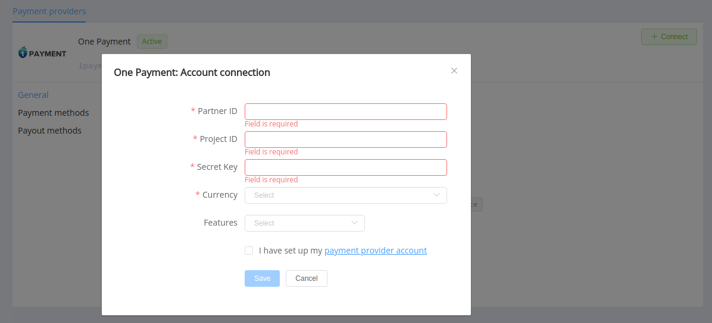

# One Payment

!!! quote ""
    Technological payment solutions for online business

**Website**: [One Payment](https://1payment.com/en/)

**Login**: [One Payment](https://account.1payment.com/personal/login)

Follow the guidance for setting up a connection with One Payment as a payment service provider.

## Set Up Account

### Step 1: Contact One Payment support manager

Register an account in the [back-office](https://account.1payment.com/register). Submit the required documents to verify it and gain access.

### Step 2: Get credentials

Ask the One Payment support manager and obtain the necessary credentials:

- Partner ID (`partner_id`)
- Project ID (`project_id`)
- Secret API key

!!! important
    Be sure to check with the manager if you require to provide a white list of IPs, and if so, specify IP addresses from the [Corefy list](/integration/ips/).

## Connect H2H Merchant Account

### Step 1. Connect H2H account at the {{custom.company_name}} Dashboard

Press **Connect** at [*One Payment Provider Overview*]({{custom.dashboard_base_url}}connect-directory/payment-providers/1payment/general) page in *'New connection'* and choose **H2H Merchant account** option to open Connection form.

Enter credentials:

- Partner ID (`partner_id`)
- Project ID (`project_id`)
- Secret API key (without a *sign* parameter)

Choose Currencies and Features. You can set these parameters according to available currencies and features for your One Payment account, but it's necessary to verify details of the connection with your {{custom.company_name}} account manager.

!!! success
    You have connected **One Payment** H2H merchant account!

!!! question "Still looking for help connecting your One Payment account?"
    <!--email_off-->[Please contact our support team!](mailto:{{custom.support_email}})<!--/email_off-->
