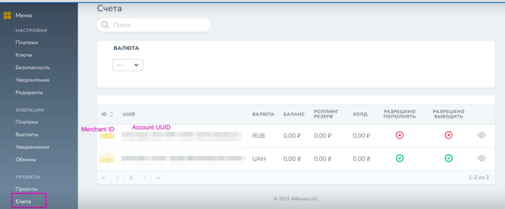
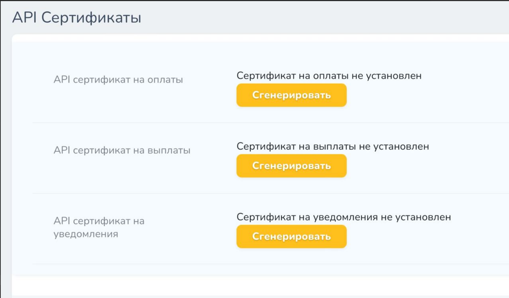
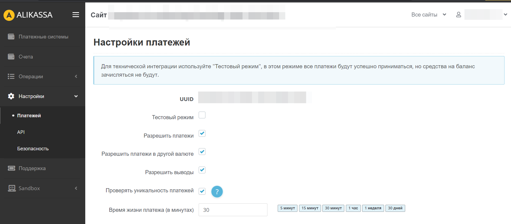
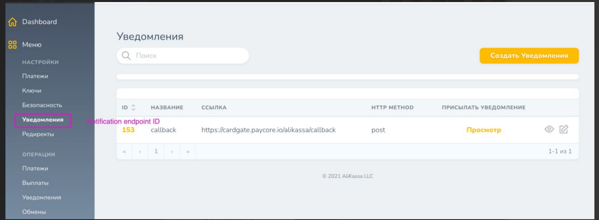
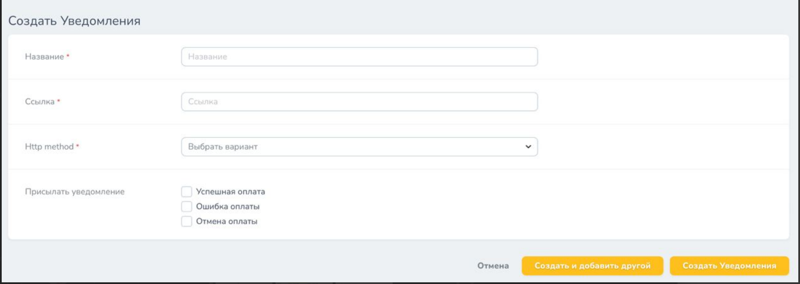
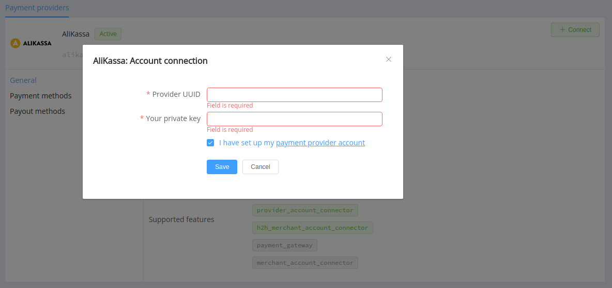
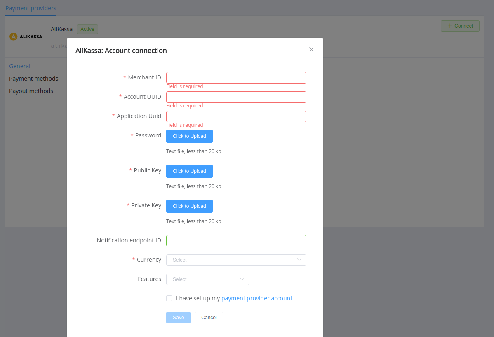

# AliKassa

**Website**: [AliKassa.com](https://alikassa.com/)

Follow the guidance for setting up a connection with the AliKassa payment service provider.

## Set up account

### Step 1: Sign up for the AliKassa account

Send a request on the [website](https://alikassa.com/), verify your account and gain access to the back-office.

### Step 2: Get credentials

In the *Projects* --> *Accounts*, find:

* Merchant ID
* Account UUID

Then, go to the *Settings* --> *Keys*, generate and download:

* Password
* Public key
* Private (Secret) key

!!! note ""

    Make sure you save the received keys in the back-office.

Ask your AliKassa support manager about the related Application UUID.

!!! tip ""
    Be sure to check available options at *'Settings'* --> '*Payments*' and choose those you intend to use.

    

### Step 3: Set up notifications

In the *Settings* --> *Notifications*, create a Notification endpoint ID.

!!! important
    Be sure to check with the manager if you require to provide a white list of IPs, and if so, specify IP addresses from the [{{custom.company_name}} list](/integration/ips/).

## Connect Provider account

### Step 1. Connect account at the {{custom.company_name}} Dashboard

Press **Connect** at [*AliKassa Provider Overview*]({{custom.dashboard_base_url}}connect-dirhttps://payment.alikassa.com/ectory/payment-providers/alikassa/general) page in *'New connection'* and choose **Provider account** option to open Connection form.

Enter credentials:

* UUID --> Provider UUID
* Private Key

!!! success
    You have connected **AliKassa** provider account.

## Connect H2H Merchant Account

### Step 1. Connect H2H account at the {{custom.company_name}} Dashboard

Press **Connect** at [*AliKassa Provider Overview*]({{custom.dashboard_base_url}}connect-directory/payment-providers/alikassa/general) page in *'New connection'* and choose **H2H Merchant account** option to open Connection form.

Enter credentials:

* Merchant ID
* Account UUID
* Application UUID
* Notification endpoint ID (if you set up it in the Alikassa back-office)

Upload the files with your Password, Public key, and Private key.

Choose Currencies and Features. You can set these parameters according to available currencies and features for your AliKassa account, but it's necessary to check details of the connection with your {{custom.company_name}} account manager.

!!! success
    You have connected **AliKassa** H2H merchant account!

!!! question "Still looking for help connecting your AliKassa account?"
    <!--email_off-->[Please contact our support team!](mailto:{{custom.support_email}})<!--/email_off-->
