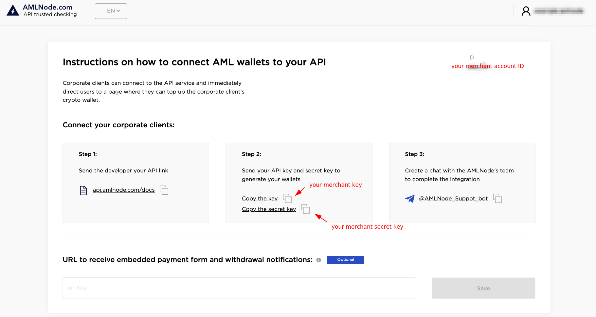
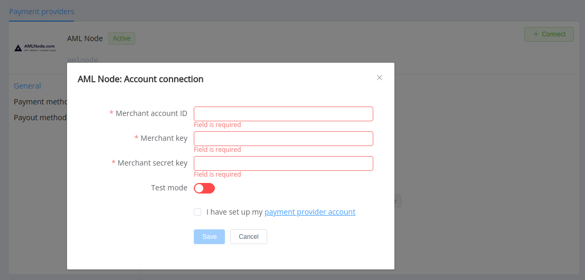

# AMLNode

> AMLNode is more than Trusted way to verify your crypto

**Website**: [amlnode.com](https://amlnode.com/en/home/)

**Login**: [my.amlnode.com](https://my.amlnode.com/auth/login)

Follow the guidance for setting up a connection with AMLNode payment service provider.

## Set up an account

### Step 1: Contact an AMLNode support manager

Send a request on the [website](https://amlnode.com/en/home/) or [register to the back-office](https://my.amlnode.com/auth/registration). Submit the required documents to verify your account and gain full access.

### Step 2: Get credentials

Log into the [back-office](https://my.amlnode.com/login] and find right on the Homepage your required credentials.

- ID
- Key
- Secret key

!!! important
    Be sure to check with the manager if you require to provide a white list of IPs, and if so, specify IP addresses from the [Corefy list](/integration/ips/).

## Connect a provider account

### Step 1. Connect an account at the {{custom.company_name}} Dashboard

Press **Connect** at the [*AMLNode Provider Overview*]({{custom.dashboard_base_url}}connect-directory/payment-providers/amlnode/general) page in *'New connection'*.

Enter credentials:

- ID --> Merchant account ID
- Key --> Merchant key
- Secret key --> Merchant secret key

Select Test or Live mode according to the type of account to connect with AMLNode.

!!! success
    You have connected **AMLNode** account!

!!! question "Still looking for help connecting your AMLNode account?"
    <!--email_off-->[Please contact our support team!](mailto:{{custom.support_email}})<!--/email_off-->
