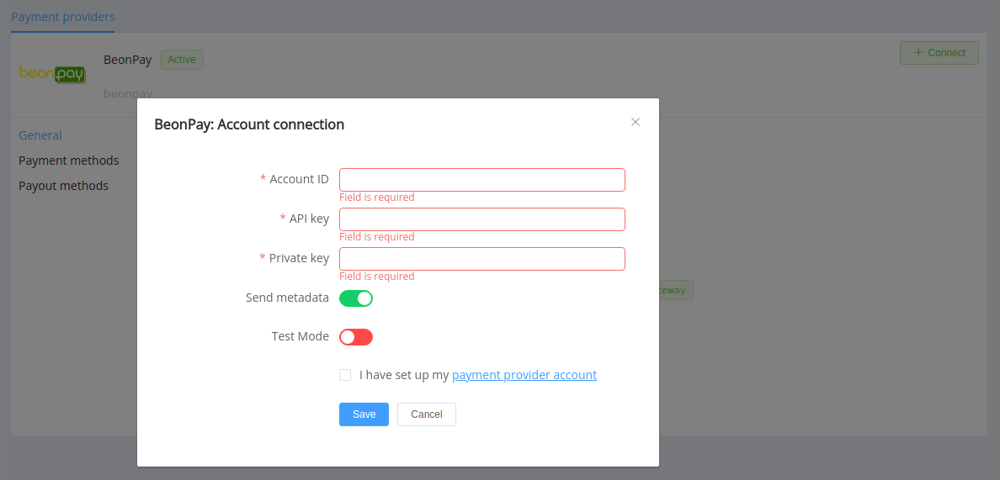
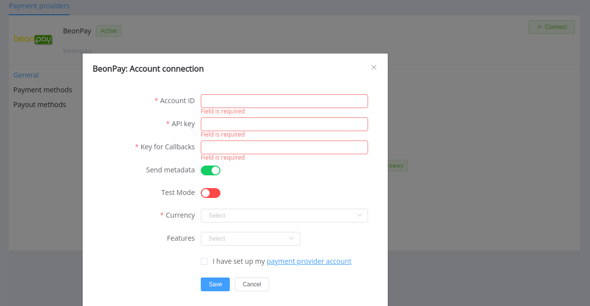

# BeonPay

!!! quote ""

    Borderless payments!

**Website**: [beonpay](https://beonpay.com/)

**Login**: [beonpay](https://beonpay.com/login)

Follow the guidance for setting up a connection with BeonPay as a payment service provider.

## Set up an account

### Step 1: Contact your BeonPay support manager

Send a request on the [website](https://beonpay.com/). Sign up to the [dashboard](https://beonpay.com/login) and set up created account. Then, submit the required documents to verify it and get full access.

### Step 2: Get credentials

Login to the BeonPay merchant [dashboard](https://beonpay.com/login) and copy credentials:

* Account ID
* API key
* Private key

!!! important
    Be sure to check with the manager if you require to provide a white list of IPs, and if so, specify IP addresses from the [Corefy list](/integration/ips/).

## Connect a provider account

### Step 1. Connect an account at the {{custom.company_name}} dashboard

Press **Connect** at the [*BeonPay Provider Overview*]({{custom.dashboard_base_url}}connect-directory/payment-providers/beonpay/general) page in *'New connection'* and choose the **Provider account** option to open a connection form.

Enter credentials:

* Account ID
* API key
* Private key

Select Test or Live mode according to the type of account to connect with BeonPay. Also, choose the *Send metadata* option if you want to use metadata in payment invoices.

!!! success
    You have connected a **BeonPay** provider account!

## Connect a H2H merchant account

### Step 1. Connect a H2H account at the {{custom.company_name}} Dashboard

Press **Connect** at the [*BeonPay Provider Overview*]({{custom.dashboard_base_url}}connect-directory/payment-providers/beonpay/general) page in *'New connection'* and choose the **H2H Merchant account** option to open a connection form.

Enter credentials:

* Account ID
* API key
* Private key as the *Key for Callbacks*

Select Test or Live mode according to the type of account to connect with BeonPay. Also, choose the *Send metadata* option if you want to use metadata in payment invoices.

Choose Currencies and Features. You can set these parameters according to available currencies and features for your BeonPay account, but it's necessary to verify details of the connection with your {{custom.company_name}} account manager.

!!! success
    You have connected the **BeonPay** H2H merchant account!

!!! question "Still looking for help connecting your BeonPay account?"
    <!--email_off-->[Please contact our support team!](mailto:{{custom.support_email}})<!--/email_off-->
