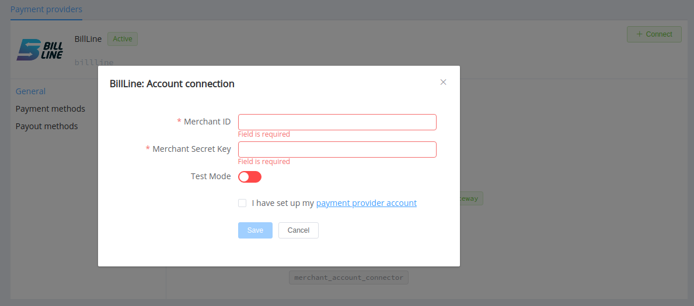
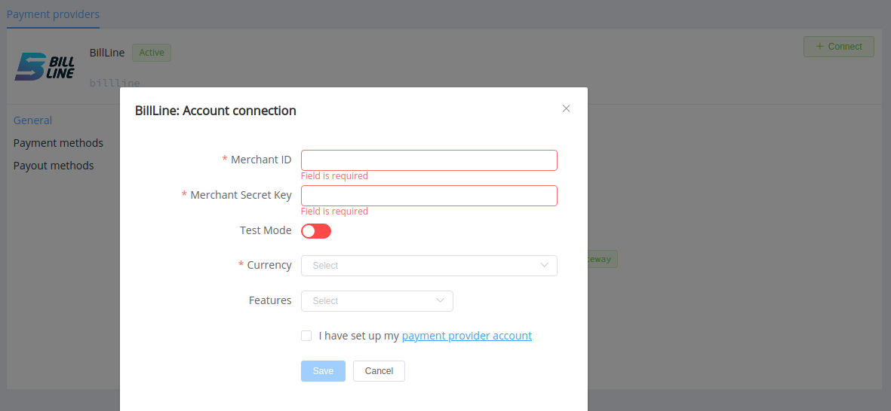

# BillLine

!!! quote ""
    The best solution for acceptance of payments on website

**Website**: [billline.net](https://billline.net/en/)

**Login**: [cabinet.billline.net](https://cabinet.billline.net/login/en)

Follow the guidance for setting up a connection with BillLine payment service provider.

## Set Up Account

### Step 1: Contact BillLine support manager

Register on the [website](https://cabinet.billline.net/register/en).

Contact the BillLine support team to activate your account.

### Step 2: Set up your merchant account and get credentials

Create and set up a merchant account providing the following data:

* the Merchant name
* the Site URL
* the Process, Success, and Fail URLs where the customer is returned depending on transactions' statuses
* the Callback URL

Obtain the Merchant ID and the Secret key.

!!! important

    Be sure to consider if you require to provide a white list of IPs, and if so, specify IP addresses from the [Corefy list](/integration/ips/).
    
    But if you sure you want to skip extra checks on requests, disable the *IP Verify* function in the merchant settings.

## Connect Provider Account

### Step 1. Connect account at the {{custom.company_name}} Dashboard

Press **Connect** at [*BillLine Provider Overview*]({{custom.dashboard_base_url}}connect-directory/payment-providers/billline/general) page in *'New connection'* and choose **Provider account** option to open Connection form.

Enter credentials:

* Merchant ID
* Merchant Secret key

Select Test or Live mode according to the type of account to connect with BillLine.

!!! success
    You have connected **BillLine** account!

## Connect H2H Merchant Account

### Step 1. Connect H2H account at the {{custom.company_name}} Dashboard

Press **Connect** at [*BillLine Provider Overview*]({{custom.dashboard_base_url}}connect-directory/payment-providers/billline/general) page in *'New connection'* and choose **H2H Merchant account** option to open Connection form.

Enter credentials:

* Merchant ID
* Merchant Secret key

Select Test or Live mode according to the type of account to connect with BillLine.

Choose Currencies and Features. You can set these parameters according to available currencies and features for your BillLine account, but it's necessary to verify details of the connection with your {{custom.company_name}} account manager.

!!! success
    You have connected **BillLine** H2H merchant account!

!!! question "Still looking for help connecting your BillLine account?"
    <!--email_off-->[Please contact our support team!](mailto:{{custom.support_email}})<!--/email_off-->
