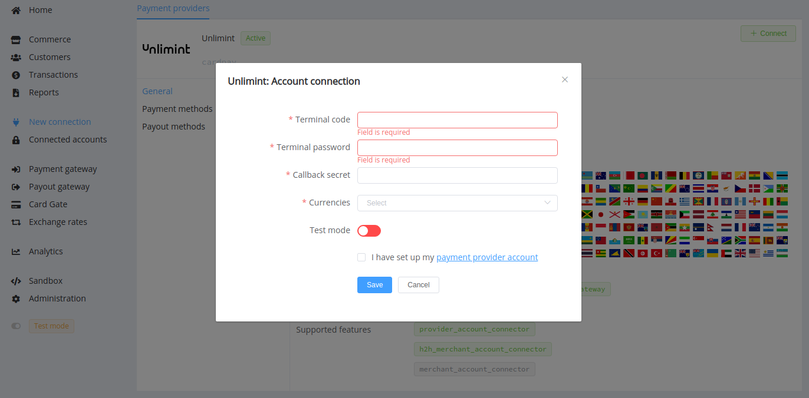

# Unlimint (CardPay)

!!! quote ""
    Is your business ready for tomorrow?

**Website**: [Unlimint.com](https://www.unlimint.com/)

**Login**: [cardpay.com](https://cardpay.com/ma/)

Follow the guidance for setting up a connection with Unlimint as a payment service provider.

## Set Up Account

### Step 1: Contact Unlimint support manager

Send a request on the [website](https://www.unlimint.com/). Submit the required documents to verify your account. Provide them with contact details of your integration specialist and gain access to the sandbox.

The test API integration parameters will be available in the Sandbox Merchant Account firstly. Please check the integration status along with your Unlimint and {{custom.company_name}} account managers.

### Step 2: Get live credentials

Then, the Unlimint support team will prepare a live account and send you login credentials (login and link) and instructions for the first entering to the live administrative interface (Merchant Account). Set a personal permanent passwords to the account.

Go to the *Settings* --> *Wallet settings* --> *Show credentials function* and copy live credentials:

* Wallet ID
* Terminal password
* Callback secret

### Step 3: Set up your account

Set up all necessary parameters. Make sure to specify `https://psp-ext.paycore.io/cardpay/callback` as the Callback URL for the provider account connection.


!!! important
    Be sure to check with the manager if you require to provide a white list of IPs, and if so, specify IP addresses from the [Corefy list](/integration/ips/).

#### Optional: Get ApplePay registration

If you need to connect ApplePay with Fondy, get your Apple Merchant ID [completing the requirements](https://developer.apple.com/documentation/passkit/apple_pay/setting_up_apple_pay_requirements) at Apple Developer site. Fill in related Description and Identifier.

Then, generate the Apple Pay certificate by yourself, or apply the {{custom.company_name}} support team for doing it for you.

1. Generate keys and CSR (Certificate Signing Requests)

    ??? example "The example sequence of console commands"

        ``` bash
        # Generate key pair in a key file
        openssl req -new -newkey rsa:2048 -nodes -out rsacertreq.csr -keyout rsakey.key -subj /CN=www.mydomain.com
        # Generate key pair in a pkcs12 file
        keytool -genkeypair -keyalg RSA -keystore rsakeystore.p12 -storetype pkcs12 -keysize 2048 -alias rsakeyname -dname CN=www.mydomain.com
        # Generate CSR from key pair in pkcs12 file
        keytool -certreq -alias rsakeyname -file rsacertreq.csr -keystore rsakeystore.p12 -storetype pkcs12
        ```

2. Use the obtained CSR files to generate certificates to complete registration at [developer.apple.com](https://developer.apple.com/account/resources/identifiers/merchant/add). Download (and backup) the Apple signed Merchant Identity Certificate, `merchant_id.cer`.

3. Install the merchant_id.cer for use in securing the 2-way TLS handshake

    ??? example "The example sequence of console commands"

        ``` bash
        # convert merchant_id.cer to PEM
        openssl x509 -inform DER -in merchant_id.cer -out merchant_id.pem
        # import merchant certificate and private key to generate P12
        openssl pkcs12 -export -out Certificates.p12 -inkey rsakey.key -in merchant_id.pem
        #keytool (ensure relevant Apple Root and Intermediate certificates are installed in your truststore)
        keytool -import -keystore rsakeystore.p12 -storetype pkcs12 -alias rsakeyname -trustcacerts -file merchant_id.cer
        ```

4. Validate your Merchant domain . Provide your Corefy HPP URL to your Apple Pay developer account manager, obtain a domain association file ([see the requirements](https://developer.apple.com/documentation/applepaywebmerchantregistrationapi/preparing_merchant_domains_for_verification)), and share it with your {{custom.company_name}} account manager.

!!! warning ""

    You should preliminarily determine the verification details with your {{custom.company_name}} account manager if you plan to use a white-label domain.

## Connect Provider Account

### Step 1. Connect account at the {{custom.company_name}} Dashboard

Press **Connect** at [*CardPay (Unlimint) Provider Overview*]({{custom.dashboard_base_url}}connect-directory/payment-providers/cardpay/general) page in *'New connection'* and choose **Provider account** option to open Connection form.



Enter credentials:

* Terminal code <-- Wallet ID
* Terminal password
* Callback secret

Choose currencies according to available currencies for your Unlimint account. Also, select Test or Live mode according to the type of account to connect.

!!! success
    You have connected **Unlimint** account!

## Connect H2H Merchant Account

### Step 1. Connect H2H account at the {{custom.company_name}} Dashboard

Press **Connect** at [*Unlimint Provider Overview*]({{custom.dashboard_base_url}}connect-directory/payment-providers/Unlimint/general) page in *'New connection'* and choose **H2H Merchant account** option to open Connection form.


Enter credentials:

* Terminal code <-- Wallet ID
* Terminal password
* Callback secret

Select Test or Live mode according to the type of account to connect with Unlimint.

Also, toggle the 'Save Instant token' option if you plan to use instant payments.

If you need to connect ApplePay with Unlimint, receive the Merchant ID and generate certificates [in advance](#optional-get-applepay-registration). Enter the related credentials:

* Apple Merchant ID
* Apple Certificate password (if you set it)

Upload the certificate files:

* Apple Certificate
* Apple Certificate Key

Choose Currencies and Features. You can set these parameters according to available currencies and features for your Unlimint account, but it's necessary to verify details of the connection with your {{custom.company_name}} account manager.

!!! warning ""

    Please ensure that you select the `apple_pay` from the features drop-down list if you connect it.

!!! success
    You have connected **Unlimint** H2H merchant account!

!!! question "Still looking for help connecting your Unlimint account?"
    <!--email_off-->[Please contact our support team!](mailto:{{custom.support_email}})<!--/email_off-->
