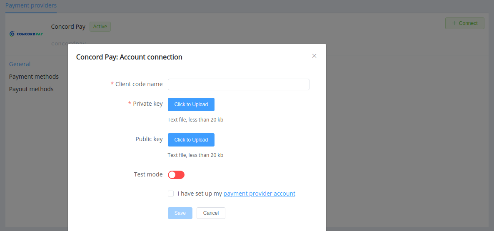
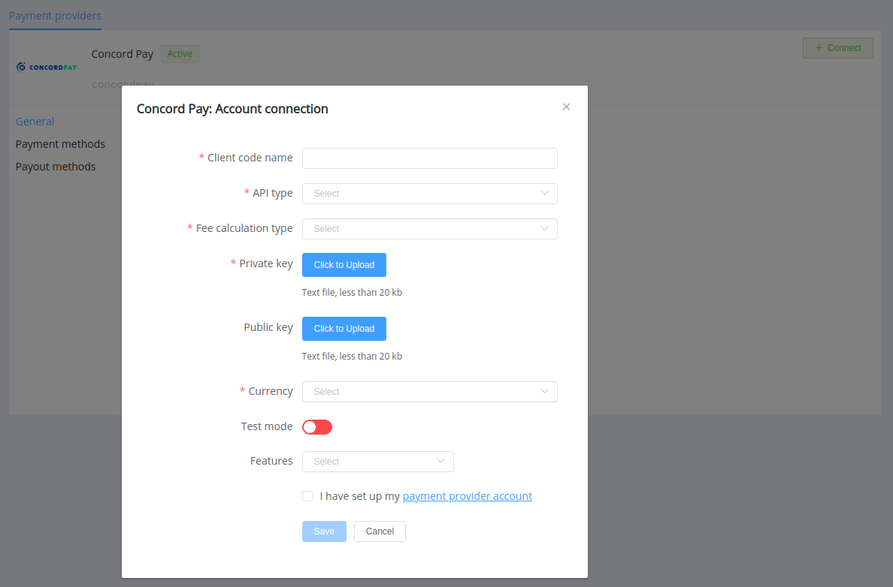

# ConcordPay

!!! quote ""
    ConcordPay internet acquiring

**Website**: [pay.concord.ua](https://pay.concord.ua/)

**Login**: [pay.concord.ua](https://pay.concord.ua/cabinet/default/login)

Follow the guidance for setting up a connection with ConcordPay as a payment service provider.

## Set up an account

### Step 1: Register at ConcordPay

Sign up on the ConcordPay portal using the [authorisation form](https://pay.concord.ua/cabinet/default/signup). Set up your account and contact the ConcordPay support team.

### Step 2: Get credentials

After registration, you obtain a unique client code name (`clientCodeName`) and also generate on your side a pair of RSA keys: public and private in the PEM (pkcs8) format. Contact your ConcordPay support manager if you have any complications with obtaining credentials.

!!! important
    Be sure to check with the manager if you require to provide a white list of IPs, and if so, specify IP addresses from the [Corefy list](/integration/ips/).

### Optional: Get additional credentials

Suppose you plan to check balance statuses or process p2p transactions. In that case, you should request a `clientAccountId`, your account for payment within the ConcordPay system, and `terminalCode`, your terminal access pointer.

!!! tip ""

    You can get several account IDs and terminal codes bound to a single client code name for different business purposes; thus, you should connect them in the Corefy dashboard separately. 

For the H2H connection, you also should know an API type and decide how ConcordPay and {{custom.company_name}} will calculate the payment fee (by inner or outer methods).

## Connect a provider account

### Step 1. Connect an account at the {{custom.company_name}} dashboard

Press **Connect** at [*ConcordPay Provider Overview*]({{custom.dashboard_base_url}}connect-directory/payment-providers/concordpay/general) page in *'New connection'* and choose **Provider account** option to open the Connection form.

Enter `clientCodeName` as a Client code name. Upload:

* Private key
* Public key (optional: required only for **wholly new** accounts; if you entirely set up your account at the provider side, you shouldn't specify its Public key at the *{{custom.company_name}} Dashboard*)

In case you have [additional credentials](#optional-get-additional-credentials), enter:

* `terminalCode` --> Terminal ID
* `clientAccountId` --> Account ID 

Select Test or Live mode according to the type of account to connect with ConcordPay.

!!! success
    You have connected **ConcordPay** account!

## Connect H2H Merchant Account

### Step 1. Connect H2H account at the {{custom.company_name}} Dashboard

Press **Connect** at [*ConcordPay Provider Overview*]({{custom.dashboard_base_url}}connect-directory/payment-providers/concordpay/general) page in *'New connection'* and choose **H2H Merchant account** option to open Connection form.

Enter `clientCodeName` as a Client code name. Upload:

* Private key
* Public key (optional: required only for **wholly new** accounts; if you entirely set up your account at the provider side, you shouldn't specify its Public key at the *{{custom.company_name}} Dashboard*).

Choose your API type and Fee calculation type.

In case you have [additional credentials](#optional-get-additional-credentials), enter:

* `terminalCode` --> Terminal ID
* `clientAccountId` --> Account ID 

Select Test or Live mode according to the type of account to connect with ConcordPay.

Choose Currency and Features. You can set these parameters according to available currencies and features for your Concord account, but it's necessary to check details of the connection with your {{custom.company_name}} account manager.

!!! success
    You have connected the **ConcordPay** H2H merchant account!

!!! question "Still looking for help connecting your ConcordPay account?"
    <!--email_off-->[Please contact our support team!](mailto:{{custom.support_email}})<!--/email_off-->
