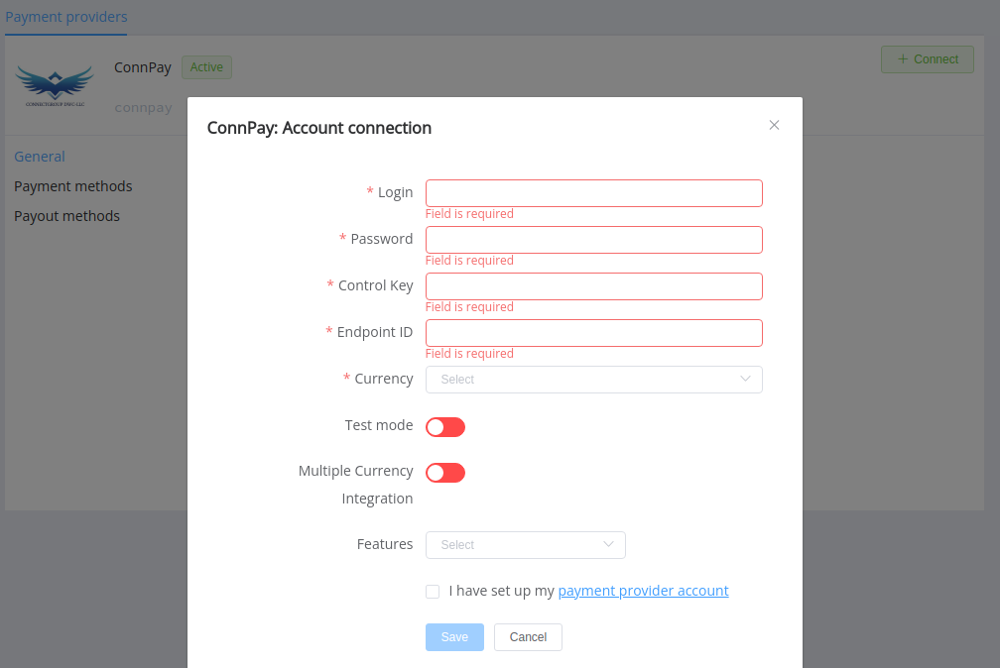

# ConnPay

**Website**: [connpay.com](http://www.connpay.com/)

Follow the guidance for setting up a connection with ConnPay as a payment service provider.

## Set up an account

### Step 1: Contact your ConnPay support manager

Send a request to the ConnPay support team. Submit the required documents to verify your account and gain access.

### Step 2: Get credentials

Get from the ConnPay support team required credentials:

- Merchant login,
- Merchant password,
- Merchant control key (Consumer secret),
- End point ID—that's an entry point for incoming Merchant’s transactions for single currency integration, or End point group ID—that's an entry point for incoming Merchant’s transactions for multi currency integration.

!!! important
    Be sure to check with the manager if you require to provide a white list of IPs, and if so, specify IP addresses from the [Corefy list](/integration/ips/).

## Connect a H2H merchant account

### Step 1. Connect a H2H account at the {{custom.company_name}} Dashboard

Press **Connect** at [*ConnPay Provider Overview*]({{custom.dashboard_base_url}}connect-directory/payment-providers/connpay/general) page in *'New connection'* and open Connection form.

Enter credentials:

- Merchant login --> Login
- Merchant password --> Password
- Merchant control key (Consumer secret) --> Control key
- End point ID, or End point group ID --> Endpoint ID

Select Test or Live mode according to the type of account to connect with ConnPay. Also, please toggle *Multiple currency integration* if you enter End point group ID as *Endpoint ID*.

Choose Currencies and Features. You can set these parameters according to available currencies and features for your ConnPay account, but it's necessary to verify details of the connection with your {{custom.company_name}} account manager.

!!! success
    You have connected the **ConnPay** H2H merchant account!

!!! question "Still looking for help connecting your ConnPay account?"
    <!--email_off-->[Please contact our support team!](mailto:{{custom.support_email}})<!--/email_off-->
