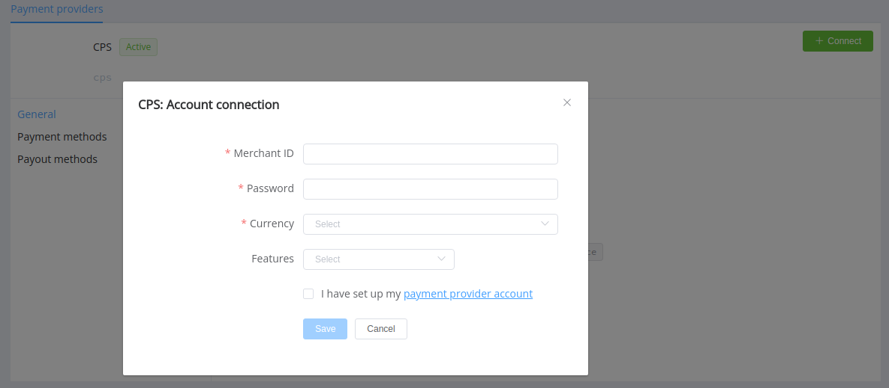

# CPS

Follow the guidance for setting up a connect with CPS as a payment service provider.

## Set up an account

### Step 1: Contact your CPS administrator

Send a request to the CPS support team. Submit your contact e-mail and the required documents to verify your account and also provide the following information:

- the list of your IP addresses, from which requests to CPS Payment Platform will be sent, including the [Corefy list](/integration/ips/),
- `https://psp-ext.paycore.io/cps/callback` as Notification URL which will receive the notifications of the  processing results of your request to CPS Payment Platform.

### Step 2: Get credentials

Get from the CPS administrator required credentials:

- `CLIENT_KEY` that's a unique key to identify the account for CPS Payment Platform (in the CPS administration platform, this parameter corresponds to the *Public key* field)
- `CLIENT_PASS` that's a password for the Client authentication in CPS Payment Platform (in the administration platform, this parameter corresponds to the *Public secret* field).

## Connect a H2H merchant account

### Step 1. Connect a H2H account at the {{custom.company_name}} Dashboard

Press **Connect** at [*CPS Provider Overview*]({{custom.dashboard_base_url}}connect-directory/payment-providers/cps/general) page in *'New connection'* and open Connection form.

Enter credentials:

- Merchant ID,
- Password.

Choose Currencies and Features. You can set these parameters according to available currencies and features for your CPS account, but it's necessary to verify details of the connection with your {{custom.company_name}} account manager.

!!! success
    You have connected the **CPS** H2H merchant account!

!!! question "Still looking for help connecting your CPS account?"
    <!--email_off-->[Please contact our support team!](mailto:{{custom.support_email}})<!--/email_off-->
