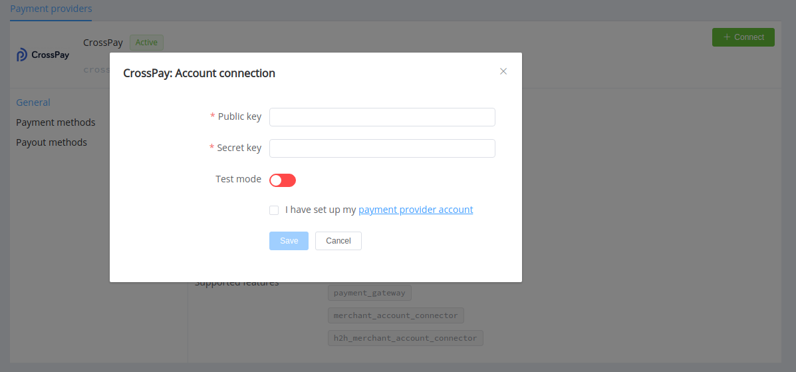
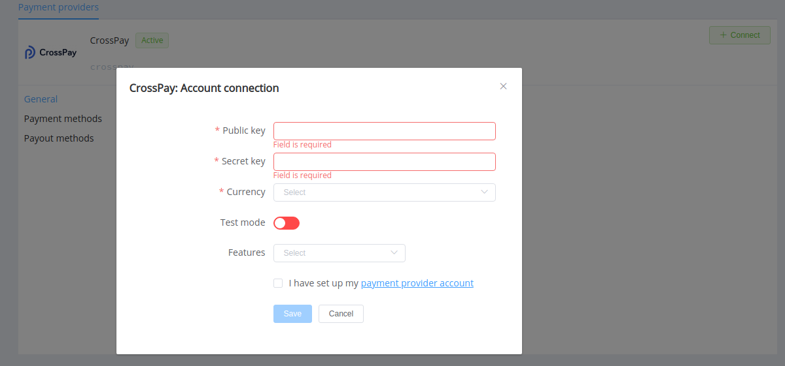

# CrossPay

!!! quote ""
    Universal Payment System

**Website**: [crosspay.net](https://crosspay.net/)

Follow the guidance for setting up a connection with CrossPay payment service provider.

## Set Up Account

### Step 1: Contact CrossPay support manager

Send a request on the [website](https://crosspay.net/). Submit the required documents to verify your account and gain access.

### Step 2: Get credentials

Credentials that have to be issued:

* Public Key
* Secret Key

## Connect Provider Account

### Step 1. Connect account at the {{custom.company_name}} Dashboard

Press **Connect** at [*CrossPay Provider Overview*]({{custom.dashboard_base_url}}connect-directory/payment-providers/crosspay/general) page in *'New connection'* and choose **Provider account** option to open Connection form.

Enter credentials:

* Public Key
* Secret Key

Also, choose Test Mode for test connection with CrossPay.

!!! success
    You have connected **CrossPay** account!

<!--

## Connect H2H Merchant Account

### Step 1. Connect H2H account at the {{custom.company_name}} Dashboard

Press **Connect** at [*CrossPay Provider Overview*]({{custom.dashboard_base_url}}connect-directory/payment-providers/CrossPay/general) page in *'New connection'* and choose **H2H Merchant account** option to open Connection form.

Enter credentials:

[//]: # (Choose Test Mode for test connection with CrossPay.)

Choose Currency and Features. You can set these parameters according to available currencies and features for your CrossPay account, but it is necessary to check details of the connection with your {{custom.company_name}} account manager.

!!! success
    You have connected **CrossPay** H2H merchant account!

-->

!!! question "Still looking for help connecting your CrossPay account?"
    <!--email_off-->[Please contact our support team!](mailto:{{custom.support_email}})<!--/email_off-->
