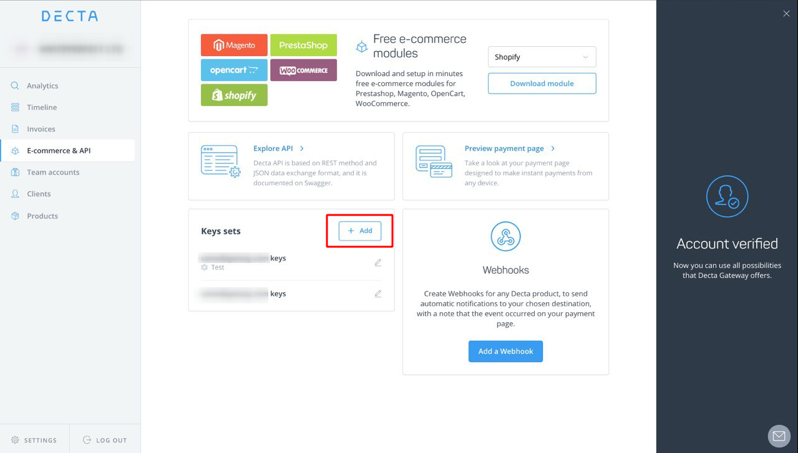
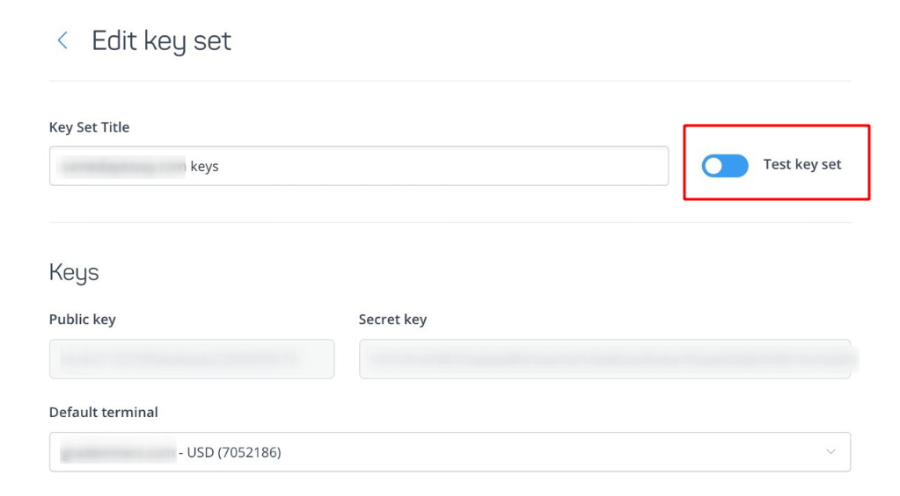
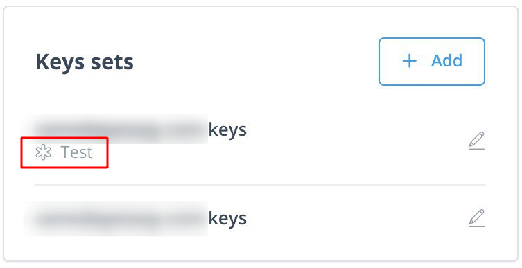
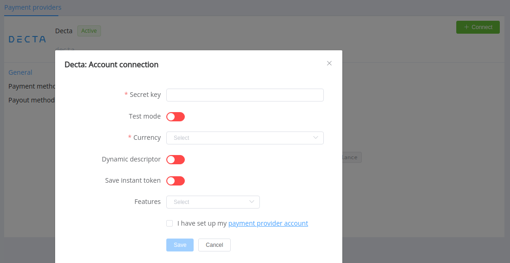

# Decta

!!! quote ""
    Scalable payment solutions for growing online business.

**Website**: [decta.com](https://www.decta.com/)

**Login**: [gate.decta.com](https://gate.decta.com/merchants/en/login?_ga=2.58711082.183697795.1642429373-1381968436.1642429373)

Follow the guidance for setting up a connection with Decta as a payment service provider.

## Set up account

### Step 1: Contact Decta support manager

Send a request on the [website](https://www.decta.com/). Submit the required documents to verify your account and gain access.

### Step 2:  Generate key(s)

Go to the 'e-Commerce & API' section, choose a terminal and generate keys for the account connection. Pay attention that you need different sets for the live and test connection.

To generate a test key set, turn on the toggle near the 'Title' input.

The test key set will be marked by 'Test' label under the title in the common list (the screenshot shows the correct toggle position to generate test keys).

## Connect H2H merchant account

### Step 1: Connect account at the {{custom.company_name}} Dashboard

Press *Connect* at the [*Decta provider overview*]({{custom.dashboard_base_url}}connect-directory/payment-providers/decta/general) page in *'New connection'* section to open the connection form.

Enter the secret key selecting Test or Live mode according to the type of key.

Choose *Currencies* and *Features* according to available currencies and features for your Decta account, but it's necessary to verify details of the connection with your {{custom.company_name}} account manager.

Additionally, you can turn on the generation of dynamic descriptor and then setup its content in the *'Commerce account'* settings. Also, toggle 'Save Instant token' for instant payments use.

!!! success
    You have connected **Decta** account!

!!! question "Still looking for help connecting your Decta account?"
    <!--email_off-->[Please contact our support team!](mailto:{{custom.support_email}})<!--/email_off-->