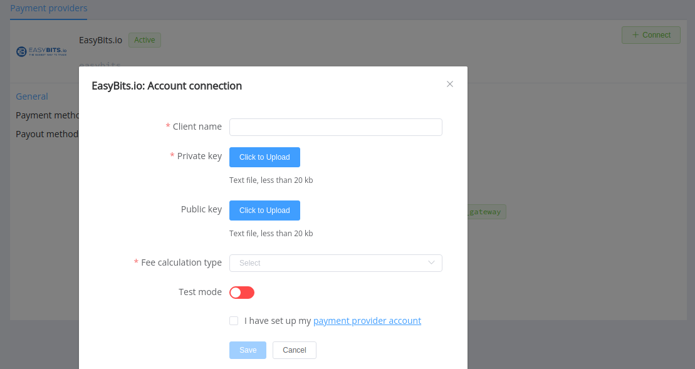

# EasyBits.io

!!! quote ""
    Integrated cryptocurrency solutions for your business

**Website**: [EasyBits.io](https://easybits.io)

**Login**: [EasyBits.io](https://easybits.io/trade/signin/)

Follow the guidance for setting up a connection with EasyBits.io payment service provider.

## Set Up Account

### Step 1: Contact EasyBits.io support manager

Send a request via the email. Submit the required documents to verify your account and gain access.

### Step 2: Get credentials

After registration, you obtain a unique client code name and also generate on your side a pair of RSA keys: public and private in the PEM (pkcs8) format. Contact your EasyBits.io support manager if you have any complications with obtaining credentials.

## Connect Provider Account

### Step 1. Connect account at the {{custom.company_name}} Dashboard

Press **Connect** at [*EasyBits.io Provider Overview*]({{custom.dashboard_base_url}}connect-directory/payment-providers/easybits/general) page in *'New connection'* and choose **Provider account** option to open Connection form.

Enter your `clientCodeName` as the *Client code name* and upload:

* *Private Key*
* *Public key* (optional: only for **wholly new** accounts; if you entirely set up your account at the provider side, you shouldn't specify its *Public key* at the Corefy dashboard)

Select Test or Live mode according to the type of account to connect with EasyBits.io.

!!! success
    You have connected **EasyBits.io** account!

!!! question "Still looking for help connecting your EasyBits.io account?"
    <!--email_off-->[Please contact our support team!](mailto:{{custom.support_email}})<!--/email_off-->
