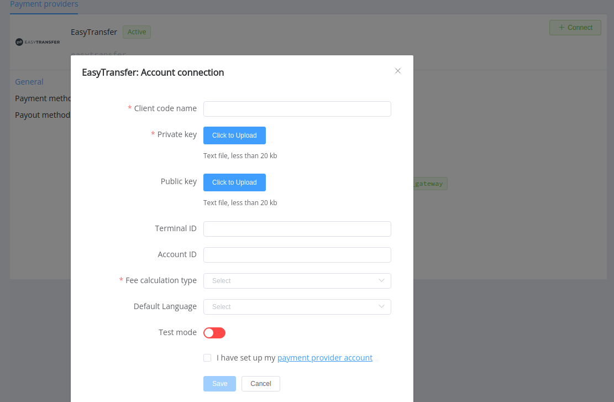

# EasyTransfer

**Website**: [EasyTransfer](https://easytransfer.com.ua/)

Follow the guidance for setting up a connection with EasyTransfer as a payment service provider.

## Set Up Account

### Step 1: Contact EasyTransfer support manager

Contact the EasyTransfer support team via [email](mailto:info@easytransfer.com.ua). Submit the required documents to verify your account and gain access.

### Step 2: Get credentials

After registration, you obtain a unique client code name and also generate on your side a pair of RSA keys: public and private in the PEM (pkcs8) format. Contact your EasyTransfer support manager if you have any complications with obtaining credentials.

For the H2H connection, you also should know an API type and decide how the EasyTransfer and {{custom.company_name}} will calculate the payment fee.

!!! important
    Be sure to check with the manager if you require to provide a white list of IPs, and if so, specify IP addresses from the [Corefy list](/integration/ips/).

## Connect Provider Account

### Step 1. Connect account at the {{custom.company_name}} Dashboard

Press **Connect** at [*EasyTransfer Provider Overview*]({{custom.dashboard_base_url}}connect-directory/payment-providers/EasyTransfer/general) page in *'New connection'* and choose **Provider account** option to open Connection form.

Enter credentials:

* Client code name
* Private Key
* Public key (optional: only for **wholly new** accounts; if you entirely set up your account at the provider side, you shouldn't specify its Public key at the *{{custom.company_name}} Dashboard*)

Select Test or Live mode according to the type of account to connect with EasyTransfer.

!!! success
    You have connected **EasyTransfer** account!

## Connect H2H Merchant Account

### Step 1. Connect H2H account at the {{custom.company_name}} Dashboard

Press **Connect** at [*EasyTransfer Provider Overview*]({{custom.dashboard_base_url}}connect-directory/payment-providers/EasyTransfer/general) page in *'New connection'* and choose **H2H Merchant account** option to open Connection form.

Enter credentials:

* Client code name
* Private Key
* Public key (optional: only for **wholly new** accounts; if you entirely set up your account at the provider side, you shouldn't specify its Public key at the *{{custom.company_name}} Dashboard*)

Choose your API type and Fee calculation type.

Select Test or Live mode according to the type of account to connect with EasyTransfer.

Choose Currency and Features. You can set these parameters according to available currencies and features for your Concord account, but it's necessary to check details of the connection with your {{custom.company_name}} account manager.

!!! success
    You have connected **EasyTransfer** H2H merchant account!

!!! question "Still looking for help connecting your EasyTransfer account?"
    <!--email_off-->[Please contact our support team!](mailto:{{custom.support_email}})<!--/email_off-->
