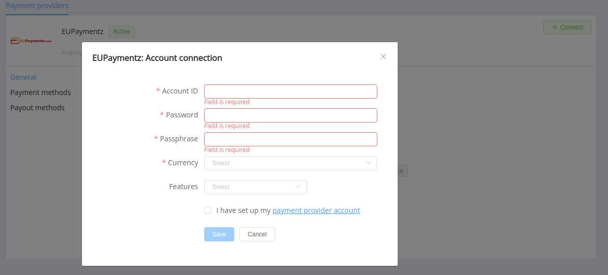

# EU Paymentz

!!! quote ""
    One of the largest offshore high risk payment processors

**Website**: [eupaymentz.com](https://www.eupaymentz.com/)

Follow the guidance for setting up a connection with EU Paymentz payment service provider.

## Set Up Account

### Step 1: Contact EU Paymentz support manager

Send a request on the [website](https://www.eupaymentz.com/). Submit the required documents to verify your account and gain access.

### Step 2: Get credentials

Credentials that have to be issued:

- Account ID (`account_id`)
- Account password (`account_password`)
- Passphrase (`m_account_passphrase`)

!!! important
    Be sure to check with the manager if you require to provide a white list of IPs, and if so, specify IP addresses from the [Corefy list](/integration/ips/).

## Connect H2H Merchant Account

### Step 1. Connect H2H account at the {{custom.company_name}} Dashboard

Press **Connect** at [*EU Paymentz Provider Overview*]({{custom.dashboard_base_url}}connect-directory/payment-providers/eupaymentz/general) page in *'New connection'* and choose **H2H Merchant account** option to open Connection form.

Enter credentials:

- Account ID (`account_id`)
- Account password (`account_password`)
- Passphrase (`m_account_passphrase`)

Choose Currencies and Features. You can set these parameters according to available currencies and features for your EU Paymentz account, but it's necessary to verify details of the connection with your {{custom.company_name}} account manager.

!!! success
    You have connected **EU Paymentz** H2H merchant account!

!!! question "Still looking for help connecting your EU Paymentz account?"
    <!--email_off-->[Please contact our support team!](mailto:{{custom.support_email}})<!--/email_off-->
