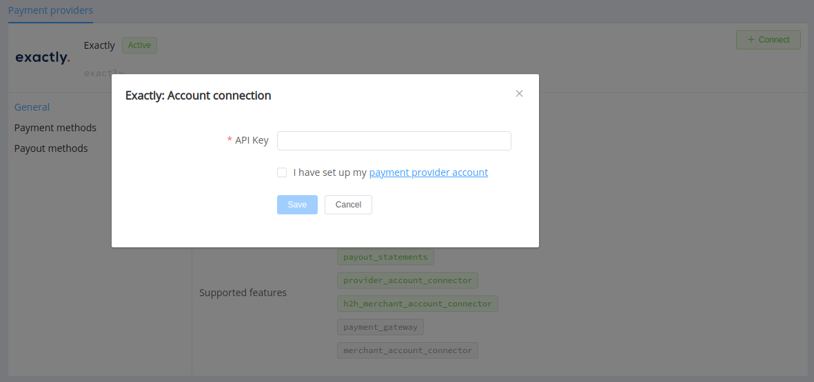
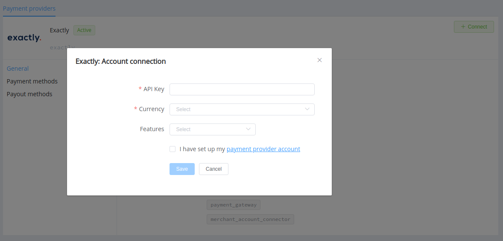

# Exactly

!!! quote ""
    Payment acceptance for your business

**Website**: [exactly.com](https://exactly.com/)

**Login**: [dash.exactly.com](https://dash.exactly.com/auth/login)

Follow the guidance for setting up a connection with Exactly payment service provider.

## Set Up Account

### Step 1: Contact Exactly support manager

Send a request on the [website](https://exactly.com/application). Submit the required documents to verify your account and gain access.

Create a shop and provide to Exactly: 

* the name of your store (Shop name) and the actual shop's URL
* the list of IP addresses, from which you perform requests to the Exactly API (ensure to specify IP addresses from the [Corefy list](/integration/ips/)
* the Success and Failed Return URLs where the customer is returned depending on transactions' results
* the Callback URL

If you plan using dynamic URIs, you must contact Exactly support and specify the domain names of the hosts different from the default ones.

### Step 2: Get credentials

After the shop's setup, you obtain the secret token for the API calls (API Key).

## Connect Provider Account

### Step 1. Connect account at the {{custom.company_name}} Dashboard

Press **Connect** at [*Exactly Provider Overview*]({{custom.dashboard_base_url}}connect-directory/payment-providers/exactly/general) page in *'New connection'* and choose **Provider account** option to open Connection form.

Enter the API key (`api_token`).

!!! success "Just right!"
    You have connected **Exactly** account!

## Connect H2H Merchant Account

### Step 1. Connect H2H account at the {{custom.company_name}} Dashboard

Press **Connect** at [*Exactly Provider Overview*]({{custom.dashboard_base_url}}connect-directory/payment-providers/exactly/general) page in *'New connection'* and choose **H2H Merchant account** option to open Connection form.

Enter the API Key (`api_token`).

Choose Currencies and Features. You can set these parameters according to available currencies and features for your Exactly account, but it's necessary to verify details of the connection with your {{custom.company_name}} account manager.

!!! success
    You have connected **Exactly** H2H merchant account!

!!! question "Still looking for help connecting your Exactly account?"
    <!--email_off-->[Please contact our support team!](mailto:{{custom.support_email}})<!--/email_off-->
