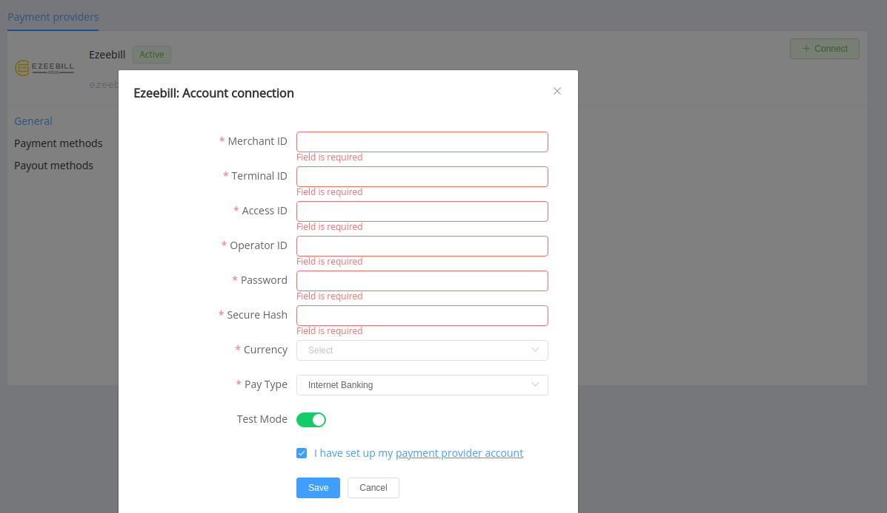

# Ezeebill

!!! quote ""
    Your trusted Payment Service Provider with nearly 10 years of experience in the Pan-Asian online

**Website**: [Ezeebill Asia](https://ezeebillasia.com/)

Follow the guidance for setting up a connection with Ezeebill as a payment service provider.

## Set Up Account

### Step 1: Contact Ezeebill support manager

Send a request on the [website](https://ezeebillasia.com/). Submit the required documents to verify your account and gain access.

### Step 2: Get credentials

Ask the Ezeebill support manager and obtain the necessary credentials:

- Merchant ID
- Terminal ID
- Access ID
- Operator ID
- Password (for the merchant account)
- Default hash key

Find out what types of payment methods are available for you.

!!! important
    Be sure to check with the manager if you require to provide a white list of IPs, and if so, specify IP addresses from the [Corefy list](/integration/ips/).

## Connect Provider Account

### Step 1. Connect account at the {{custom.company_name}} Dashboard

Press **Connect** at [*Ezeebill Provider Overview*]({{custom.dashboard_base_url}}connect-directory/payment-providers/ezeebill/general) page in *'New connection'* and choose **Provider account** option to open Connection form.

Enter credentials:

- Merchant ID
- Terminal ID
- Access ID
- Operator ID
- Password
- Default hash key as a Secure hash

Select your currency and payment type according to available currencies and payment types for your Ezeebill account. 

Also, select Test or Live mode according to the type of account to connect with Ezeebill.

!!! success
    You have connected **Ezeebill** account!

!!! question "Still looking for help connecting your Ezeebill account?"
    <!--email_off-->[Please contact our support team!](mailto:{{custom.support_email}})<!--/email_off-->
