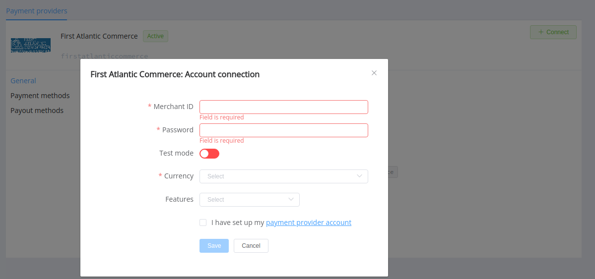

# First Atlantic Commerce

!!! quote ""

    International Payment Solutions

**Website**: [firstatlanticcommerce.com](https://www.firstatlanticcommerce.com/)

Follow the guidance for setting up a connection with First Atlantic Commerce as a payment service provider.

## Set up an account

### Step 1: Contact your First Atlantic Commerce support manager

[Apply your request to the First Atlantic Commerce](https://firstatlanticcommerce.com/apply-now/).  Complete integration steps, submit the required documents, test and verify your account, and gain an access to go live.

### Step 2: Get credentials

Get from the First Atlantic Commerce support team required credentials:

- Merchant ID,
- Password.

!!! note

    Please pay attention that you will obtain test credentials firstly, and only after complete testing and verification you will be able to switch to the go-live credentials. And once you get it, you'll need to reconnect your account in the Corefy dashboard.

!!! important
    Be sure to check with the manager if you require to provide a white list of IPs, and if so, specify IP addresses from the [Corefy list](/integration/ips/).

## Connect a H2H merchant account

### Step 1. Connect a H2H account at the {{custom.company_name}} Dashboard

Press **Connect** at the [*First Atlantic Commerce Provider Overview*]({{custom.dashboard_base_url}}connect-directory/payment-providers/firstatlanticcommerce/general) page in *'New connection'* and open a connection form.

Enter credentials:

- Merchant ID,
- Password.

Select Test or Live mode according to the type of account to connect with First Atlantic Commerce.

Choose Currencies and Features. You can set these parameters according to available currencies and features for your First Atlantic Commerce account, but it's necessary to verify details of the connection with your {{custom.company_name}} account manager.

!!! success
    You have connected the **First Atlantic Commerce** H2H merchant account!

!!! question "Still looking for help connecting your First Atlantic Commerce account?"
    <!--email_off-->[Please contact our support team!](mailto:{{custom.support_email}})<!--/email_off-->
