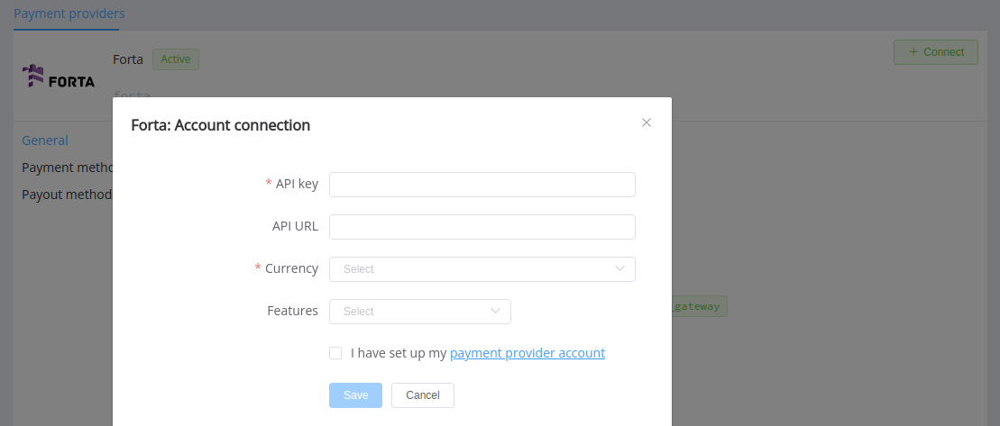

# Forta

!!! quote ""

    With Forta you can manage your finances hassle-free.

**Website**: [fortapayments.com](https://fortapayments.com/)

Follow the guidance for setting up a connection with Forta as a payment service provider.

## Set up account

### Step 1: Contact Forta support manager

Send a request on the [website](https://fortapayments.com/) or call the hotline. Submit the required documents to verify your account and gain access.

### Step 2: Get credentials

Ask the Forta support team to obtain the project API key and API URL.

Separately, you should generate the key pair for provider account authentication:

!!! example ""

    ``` bash
    openssl genpkey -outform PEM -algorithm RSA -pkeyopt rsa_keygen_bits:2048 -out private_key.pem
    openssl pkey -inform PEM -in private_key.pem -pubout -out public_key.pem
    ```

Share the public key you've got with your Forta support manager.

!!! important
    Be sure to check with the manager if you require to provide a white list of IPs, and if so, specify IP addresses from the [Corefy list](/integration/ips/).

## Connect Provider account

### Step 1. Connect Provider account at the {{custom.company_Forta}} Dashboard

Press **Connect** at [*Forta Provider Overview*]({{custom.dashboard_base_url}}connect-directory/payment-providers/forta/general) page in *'New connection'* and choose **Provider account** option to open Connection form.


Enter credentials:

* API key
* API URL

Upload the Private key file.

Choose currencies according to available currencies for your Forta account and check details of the connection with your {{custom.company_name}} account manager.

!!! success
    You have connected the **Forta** provider account!

## Connect H2H merchant account

### Step 1. Connect H2H account at the {{custom.company_name}} Dashboard

Press **Connect** at [*Forta Provider Overview*]({{custom.dashboard_base_url}}connect-directory/payment-providers/forta/general) page in *'New connection'* and choose **H2H Merchant account** option to open Connection form.



Enter credentials:

* API key
* API URL

Choose Currencies and Features. You can set these parameters according to available currencies and features for your Forta account, but it's necessary to verify details of the connection with your {{custom.company_name}} account manager.

!!! success
    You have connected the **Forta** H2H merchant account!

!!! question "Still looking for help connecting your Forta account?"
    <!--email_off-->[Please contact our support team!](mailto:{{custom.support_email}})<!--/email_off-->
