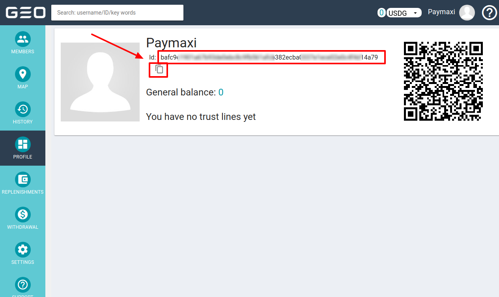
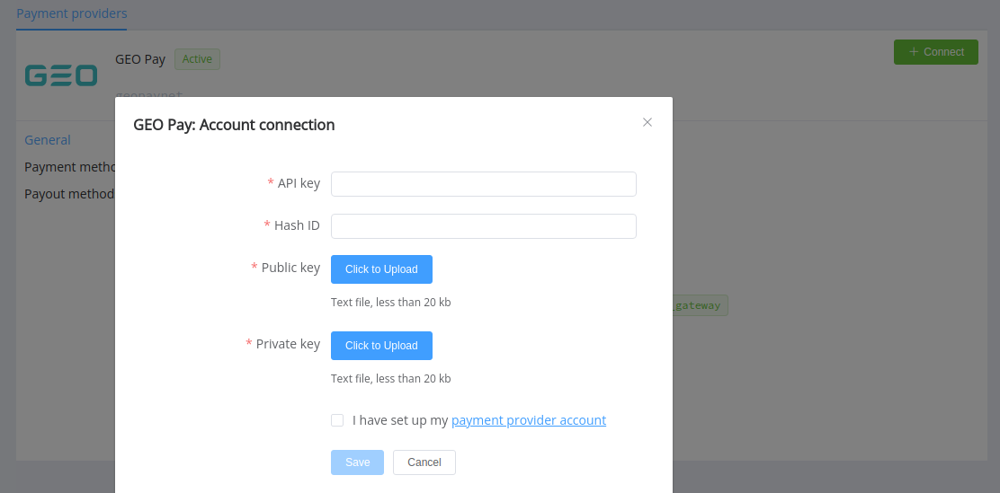

# GeoPay

!!! quote ""
    Manage your online assets with GEO Pay

**Website**: [geo-pay.net](https://geo-pay.net/)

**Login**: [partners.geo-pay.net](https://partners.geo-pay.net/)

Follow the guidance for setting up a connection with GeoPay as a payment service provider.

## Set up an account

### Step 1: Create an account

Create an account on the [website](https://geo-pay.net/login/#!/sign-up/) or message the GeoPay support team. Submit the required documents to verify and gain access.

### Step 2: Get credentials

Go to the *Profile* section and copy User ID (Hash ID). Then, contact the GeoPay support team to request API key.



Generate a key pair in the format P521 / secp521r1.

!!! example "Key generation example using openssl"

    ``` bash
    #to generate a private key
    openssl genrsa -out key.pem 1024

    #to get a public key from a private one
    openssl rsa -in key.pem -outform PEM -pubout -out public.pem
    ```

Share your public key with the GeoPay support team. You will then receive the GeoPay public key for responses verification.

!!! important
    Be sure to check with the manager if you require to provide a white list of IPs, and if so, specify IP addresses from the [Corefy list](/integration/ips/).

## Connect a provider account

### Step 1. Connect the account at the {{custom.company_name}} Dashboard

Press **Connect** at the [*GeoPay Provider Overview*]({{custom.dashboard_base_url}}connect-directory/payment-providers/geopaynet/general) page in *'New connection'* and choose the **Provider account** option to open the connection form.



Enter credentials:

* API key
* Hash ID

Upload your private key and the **GeoPay** public key.

!!! success
    You have connected the **GeoPay** account!

!!! question "Still looking for help connecting your GeoPay account?"
    <!--email_off-->[Please contact our support team!](mailto:{{custom.support_email}})<!--/email_off-->
