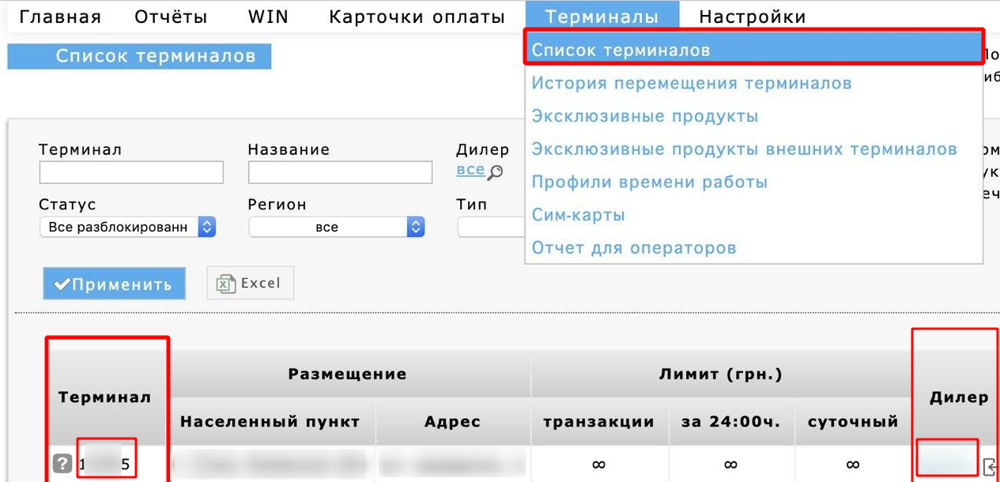
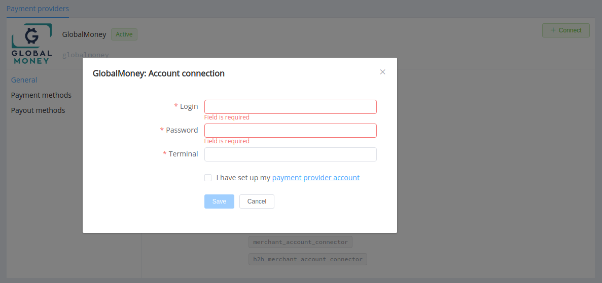

# GlobalMoney

!!! quote ""
    Payment solution provider

**Website**: [GlobalMoney.ua](https://globalmoney.ua/ua/kontakty/)

Follow the guidance for setting up a connection with GlobalMoney payment service provider.

## Set Up Account

### Step 1: Contact GlobalMoney support manager

Send a request on the [website](https://globalmoney.ua/ua/kontakty/) or call the hotline. Submit the required documents to verify your account and gain access to the back office.

Create and activate your payout terminal.

### Step 2: Get credentials

Go to the 'Terminals' --> 'Terminals' list. Copy the 'Dealer' parameter value for *Login* and the 'Terminal' parameter value for *Terminal*.

Contact the GlobalMoney support to obtain the *Password* value.

!!! important
    Be sure to check with the manager if you require to provide a white list of IPs, and if so, specify IP addresses from the [Corefy list](/integration/ips/).

## Connect Provider Account

### Step 1. Connect account at the {{custom.company_name}} Dashboard

Press **Connect** at [*GlobalMoney Provider Overview*]({{custom.dashboard_base_url}}connect-directory/payment-providers/globalmoney/general) page in *'New connection'* and choose **Provider account** option to open Connection form.

Enter credentials:

* Login
* Password
* Terminal

!!! success
    You have connected **GlobalMoney** account!

!!! question "Still looking for help connecting your GlobalMoney account?"
    <!--email_off-->[Please contact our support team!](mailto:{{custom.support_email}})<!--/email_off-->
