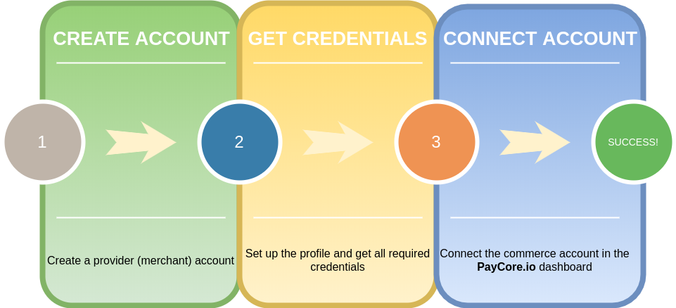

# Payment providers

??? info "What we include under the term "Payment Service Provider (PSP)""

    **Payment Service Provider (PSP)** is a third party that helps [merchants](/getting-started/glossary/#merchant) accept and facilitate payments.

    PSPs partner with [acquiring banks](/getting-started/glossary/#acquiring-bank) to offer merchants the capability to accept payments. They often offer services in addition to processing transactions. These services include [Payment Card Industry Data Security Standard (PCI)](/getting-started/glossary/#payment-card-industry-data-security-standard-pci) compliance, fraud protection, and the ability to process different currencies and translate different languages.

## Connectors

This section explains how to connect your payment providers' accounts and the {{custom.company_name}} platform. It describes setup processes and helps you to put in place new services that can relay requests to the payment or payout gateways.

Click on the name of the desired connector and follow the link to the step-by-step guide.

## List of ready-made connections

<!-- 16/11/2021: 141 connectors + test, external, manual, cardgate -->

| Name | Payments | Payouts | Supported currencies[^1] | Featured&nbsp;methods |
|:--:|:----:|:----:|:----|:----|
|  [Direct card payments](cardgate/) | ✅ |  ✅ | AMD, AUD, AZN, BGN, BRL, BYN, CAD, CHF, CNY, CZK, DKK, EUR, GBP, GEL, GIP, HKD, IDR, INR, JPY, KGS, KZT, MDL, MXN, NGN, NOK, NZD, PHP, PLN, RUB, SEK, SGD, TJS, TMT, TRY, TZS, UAH, USD, UZS, VND, ZAR | |
|  [External&nbsp;provider protocol](externalprovider/) | | ✅ | [according to the protocol settings] | |
|  [Manual](manual/) | ✅ | ✅ | [according to the transfer parameters] | Swift, cash, bank transfers |
|  [4bill](4bill/) | ✅ |  ✅  |  AUD, CAD, EUR, GBP, RUB, UAH, USD | |
|  [Accentpay](accentpay/) | ✅ |  ✅  | EUR, PLN, RUB, UAH, USD | |
|  [ADgroup](adgroup/)  |  ✅ |  ✅  | EUR, RUB, USD | |
|  [AdvCash](advcash/) |  ✅ |   ✅  | [according to the provider account settings] | |
|  [Alfa Bank](alfabank/) | ✅  |  ✅  | UAH | |
|  [AliKassa](alikassa/) |  ✅  |  ✅  | EUR, RUB, UAH, USD | |
|  [AML Node](amlnode/) | ✅ | | BCH, BTC, LTC, USDT | |
|  [any.cash](anycash/) | ✅ | ✅ | [according to the provider account settings] | |
|  [Any.Money](anymoney/) | ✅ | ✅ | BCH, BTC, ETH, LTC, USDT, | |
|  [appexmoney](appexmoney/) | | ✅ | [according to the provider account settings] | |
|  [Axcess Merchant Services](axcessmerchantservices/) | ✅ | | EUR, RUB, UAH, USD | |
|  [Bank Onego](bankonego/) | ✅ | ✅ | RUB | |
|  [BetaTransfer](betatransfer/) | ✅ | | EUR, RUB, USD | |
|  [BillLine](billline/) | ✅ | ✅ | RUB, UAH | |
|  [BlackRabbit](blackrabbit/) | ✅ | ✅ | EUR, KZT, RUB, UAH, USD | |
|  [Unlimint](cardpay/) *(ex: CardPay)* | ✅ | ✅ | AUD, CAD, CZK, EUR, GBP, INR, MXN, NZD, PHP, PLN, RUB, SGD, UAH, USD, VND | |
|  [Cashfree](cashfree/) | | ✅ | [according to the provider account settings] | |
|  [Cauri](cauri/) | ✅ | | EUR, RUB, USD | |
|  [Certus Finance](certusfinance/) | | ✅ | [according to the provider account settings] | |
|  [ChangeCoins](changcoinspay/) | ✅ | | BNB, BTC, DOGE, ETH, USDT | |
|  [Commercial Industrial Bank](cib/) | ✅ | ✅ | UAH | |
|  [CoinGate](coingate/) |  ✅ | |  BCH, BTC, ETH, EUR, LTC, USD | |
|  [CoinsPaid](coinspaid/) | ✅ | ✅ | [according to the provider account settings] | |
|  [Concord Bank](concord/) | ✅ | ✅ | UAH | ApplePay, GooglePay, Masterpass |
|  [Concordpay](concordpay/) | ✅ | ✅ | RUB, UAH | |
|  [Connectum](connectum/) | ✅ | ✅ | AUD, CAD, EUR, GBP, UAH, USD | |
|  [CrossPay](crosspay/) | ✅ | ✅ | UAH | |
|  [Cypix](cypix/) | ✅ | ✅ | EUR, KZT, RUB, UAH, USD | |
|  [Decard](decard/) | ✅ | |  RUB | |
|  [Decta](decta/) | ✅ | | AUD, CAD, CHF, EUR, GBP, PLN, USD | |
|  [Dialup](dialup/) | | ✅ | | [according to the provider account settings] |
|  [DixonPay](dixonpay/) | ✅ | | AED, AUD, CAD, CHF, DKK, EUR, GBP, HKD, ILS, INR, JPY, KRW, MYR, NOK, NZD, PHP, RUB, SEK, SGD, THB, TRY, TWD, USD, ZAR | |
|  [dLocal](dlocal/) | | ✅ | ARS, BOB, BRL, CLP, COP, INR, MXN, PEN, PYG || |
|  [dotpay](dotpay/) | | ✅ | [according to the provider account settings] | |
|  [EasyBits.io](easybits/) | ✅ | ✅ | [according to the provider account settings] | |
|  [EasyPayRU](easypayru/) | ✅ | ✅ | RUB | |
|  [EasyTransfer](easytransfer/) | ✅ | ✅ | RUB, UAH | |
|  [Ecobanq](ecobanq/) | ✅ | ✅ | [according to the provider account settings] | |
|  [ECommPay](ecommpay/) | | ✅ | [according to the provider account settings] | |
|   [ecoPayz](ecopayz/) | ✅ | ✅ | AUD, BRL, CAD, EUR, GBP, IDR, INR, MDL, MXN, MYR, NGN, PLN, RUB, THB, UAH, USD, UZS, VND | |
|  [Emerald24](emerald24/) | ✅ | |  EUR, USD | |
|  [ePay](epay/) | ✅ | ✅ | UAH | |
|  [exactly.](exactly/) | ✅ | ✅ | EUR, UAH, USD | |
|  [FlashPay](flashpay/) | | ✅ | [according to the provider account settings] | |
|   [Fondy](fondy/) | ✅ | ✅ | AUD, CAD, CZK, EUR, GBP, PLN, RUB, UAH, USD | ApplePay |
|  [Forta](forta/) | ✅ | ✅ | RUB | |
|  [Forward Bank](forwardbank/) | ✅ | ✅ | UAH | |
|  [Genome](genome/) | ✅ | ✅ | AUD, CAD, EUR, GBP, UAH, USD | |
|   [GEO pay](geopaynet/) | ✅ | ✅ | [according to the provider account settings] | |
|  [Getapay](getapay/) | ✅ | | EUR, RUB, UAH | |
|  [Global Money](globalmoney/) | | ✅ | [according to the provider account settings] | |
|   [GumBallPay](gumballpay/) |  ✅ | | CAD, EUR, NOK, NZD, ZAR | |
|  [Hashconnect](hashconnect/) | ✅ | ✅ | RUB | |
|  [Ibox Bank](iboxbank/) | ✅ | ✅ | EUR, RUB, UAH, USD | ApplePay, GooglePay |
|  [Ikajo](ikajo/) | ✅ | | RUB, EUR, USD | |
|  [ING Bank Poland](ingbankpl/) | ✅ | | [according to the provider account settings] | |
|  [Interkassa](interkassa/) | ✅ | ✅ | EUR, INR, KZT, RUB, UAH, USD | |
|  [Kassa](/connectors/kassa/) | ✅ | ✅ | BYN, EUR, KZT, RUB, UAH, USD | |
|  [Klarna](klarna/) | ✅ | | [according to the provider account settings] | |
|  [Kuna](kuna/) | ✅ | ✅ | [according to the provider account settings] | |
|  [Kuna Pay](kunapay/) | ✅ | ✅ | EUR, RUB, UAH, USD | |
|  [LeoGaming](leogaming/) | | ✅ | RUB, UAH | |
|  [LiqPay](liqpay/) | ✅ | ✅ | EUR, RUB, UAH, USD | Masterpass |
|  [Maxpay](maxpay/) | ✅ | ✅ | EUR, RUB, UAH, USD | |
|  [mercuryo](mercuryo/) | ✅ | | [according to the provider account settings] | |
|  [Mine.Exchange](mineexchange/) | ✅ | ✅ | [according to the provider account settings] | |  
|  [MoneyPay](moneypay/) | ✅ | | AUD, CNY, EUR, JPY, USD | |
|  [MuchBetter](muchbetter/) | ✅ | ✅ | [according to the provider account settings] | |
|  [Neteller](neteller/) | | ✅ | [according to the provider account settings] | |
|  [NixMoney](nixmoney/) | | ✅ | [according to the provider account settings] | |
|  [Octopayz](octopayz/) | | ✅ | [according to the provider account settings] | |
|  [Odysseq](odysseq/) | ✅ | ✅ | [according to the provider account settings] | |
|  [OffsetPay](offsetpay/) | ✅ | | EUR, RUB, USD | |
|  [OPay](opay/) | ✅ | | EUR, GBP, USD | |
|  [Parimatch](parimatch/) | | ✅ | [according to the provider account settings] | |
|  [pay2kassa](pay2kassa/) | ✅ | ✅ | [according to the account settings] | |
|  [Paybox](paybox/) | ✅ | ✅ | KZT | |
|  [Paydoo](paydoo/) | ✅ | | CHF, EUR, GBP, PLN, RUB, USD | |
|  [Payeer](payeer/) | ✅ | ✅ | BCH, BTC, DASH, ETH, EUR, LTC, RUB, USD | |
|  [Paylink](paylink/) | ✅ | ✅ | UAH | Masterpass |
|  [Pay-logic](paylogic/) | | ✅ | [according to the provider account settings] | |
|  [Paymega.io](paymegaio/) | ✅ | ✅ | EUR, RUB, UAH, USD | |
|  [Payment Center](paymentcenter/) | ✅ | ✅ | EUR, RUB, USD | |
|  [Payments Trust](paymentstrust/) | ✅ | ✅ | EUR, RUB, UAH, USD | |
|  [Paymentwall](paymentwall/) | ✅ | | USD | |
|  [PayPal](paypal/) | ✅ | ✅ | [according to the provider account settings] | |
|  [PayPound](paypound/) | ✅ | | EUR, GBP, INR, JPY, RUB, USD | |
|  [Paysafe](paysafe/) | ✅ | ✅ | AZN, BRL, EUR, INR, NGN, PKR, USD, UZS | |
|  [paysafecard](paysafecard/) | ✅ | ✅ | [according to the provider account settings] | |
|  [PaySage.io](paysage/) | ✅ | ✅ | EUR, RUB | |
|  [PaySoft Inc.](paysoft/) | | ✅ | [according to the provider account settings] | |
|  [Perfect Money](perfectmoney/) | ✅ | ✅ | [according to the provider account settings] | |
|  [Piastrix](piastrix/) | ✅ | ✅ | BCH, ETH, EUR, KZT, RUB, UAH, USD | ApplePay |
|  [Pivdenny Bank](pivdennybank/) | ✅ | ✅ | UAH | |
|  [Platio](platio/) | ✅ | ✅ | RUB | 
|  [PMSolutions](pmsolutions/) | ✅ | ✅ | EUR, RUB, UAH, USD | |
|  [Portmone.com](portmone/) | ✅ | | UAH | GooglePay |
|  [Procard](procard/) | ✅ | | EUR, UAH | |
|  [PSPGate](pspgate/) | ✅ | | CNY, EUR, GBP, RUB, UAH, USD | |
|  [PUMB (FUIB)](pumb/) | ✅ | ✅ | UAH | |
|   [Qiwi](qiwi/) | ✅ | | EUR, RUB, USD | |
|  [Raiffeisen Bank](raiffeisenbank/) | ✅ | ✅ | UAH | |
|  [Rapyd.net](rapyd/) | | ✅ | [according to the provider account settings] | |
  [RBK Money](rbkmoney/) | ✅ | ✅ | EUR, RUB, USD | |
|  [REEL](reel/) | | ✅ | [according to the provider account settings] | |
|  [Royal Pay](royalpay/) | ✅ | ✅ | RUB | |
|  [Rubikon Soft](rubikonsoft/) | | ✅ | [according to the provider account settings] | |
|   [Russian Standard Bank](russianstandardbank/) | ✅ | |
|  [Nuvei](safecharge/) *(ex: SafeCharge)* | ✅ | ✅ | AUD, CAD, CHF, EUR, GBP, PLN, USD |
|  [SatchelPay](satchelpay/) | | ✅ | [according to the provider account settings] | |
|  [Selcom](selcom/) | ✅ | ✅ | [according to the provider account settings] | |
|  [Skrill](skrill/) | ✅ | ✅ | AUD, BDT, BGN, CHF, CZK, DKK, EUR, GBP, HRK, HUF, LKR, MDL, MYR, NOK, NPR, PLN, RON, SEK, THB, USD | |
|  [Solid](solidgate/) | ✅ | | AUD, CAD, EUR, GBP, NZD, SGD, USD | |
|  [Spoynt](spoynt/) | ✅ | ✅ | EUR, RUB, UAH, USD | |
|  [Square](square/) | ✅ | | [according to the provider account settings] | |
|  [Stripe](stripe/) | ✅ | | AUD, CAD, EUR, GBP, USD | | ApplePay |
|  [Tinkoff](tinkoff/) | ✅ | | EUR, RUB, USD | |
|  [TKB Pay](tkbpay/) | ✅ | ✅ | RUB | |
|   [tome](tome/) | ✅ | ✅ | BYN, EUR, KZT, RUB, UAH, USD | |
|   [Transact World](transactworld/) | ✅ | ✅ | GBP, EUR, USD | |
|  [Tranzzo](tranzzo/) | ✅ | | [according to the provider account settings] | | 
|  [TrustPay](trustpay/) | ✅ | | AZN, CAD, IDR, KGS, KZT, MDL, MYR, PLN, PLN, RUB, THB, TJS, TMT, UZS, VND | |
|  [Trust Payments](trustpayments/) | ✅ | | AUD, CAD, EUR, NZD, SEK, SGD | |
|  [2click](twoclick/) | | ✅ | [according to the provider account settings] | |
|  [UAPay](uapay/) | ✅ | ✅ | UAH | |
|  [UKRGASBANK](ukrgasbank/) | ✅ | ✅ | UAH | |  
|  [Unlimco](unlimco/) | ✅ |  | CNY, RUB, USD | |
|  [VCreditos](vcreditos/) | ✅ | ✅ | [according to the provider account settings] | |
|  [VOLT](volt/) | ✅ | | [according to the provider account settings] | |
|  [WhiteBIT](whitebit/) | ✅ | ✅ | EUR, RUB, UAH, USD | |
|  [Globalfin](winpay/) (ex: WinPay)* | ✅ | ✅ | EUR, GBP, KZT, RUB, UAH, USD | |
|  [Wirecapital](wirecapital/) | ✅ | ✅ | AZN, EUR, INR, KGS, MDL, PLN, RUB, TJS, UAH, USD, UZS | |
|  [wirecard](wirecard/) | ✅ | ✅ | AZN, BYN, EUR, KGS, KZT, MDL, RUB, TJS, TMT, UAH, USD, UZS | |
|  [WlandPay](wlandpay/) | ✅ | | AED, AUD, CAD, CHF, DKK, EUR, GBP, HKD, ILS, INR, KRW, MYR, NOK, NZD, PHP, RUB, SEK, SGD, THB, TRL, TWD, USD, ZAR | |
|  [WPayments](wpayments/) | ✅ | ✅ | EUR, RUB | |
|  [xpate](xpate/) | ✅ | ✅ | EUR, KZT, PLN, RUB, USD | |
|  [XPAY](xpayua/) | ✅ | ✅ | [according to the provider account settings] | |
|  [Zotapay](zotapay/) | ✅ | ✅ | EUR, GHS, IDR, KES, MYR, NGN, THB, TZS, USD, VND, ZAR | |

You can also send a request about a new connection by clicking the appropriate button on the [dashboard]({{custom.dashboard_base_url}}connect-directory/payment-providers) or <!--email_off-->[emailing our support team](mailto:{{custom.support_email}}).<!--/email_off-->

## How to Connect to the Payment Provider

Usually, the connection algorithm includes the following steps:

1. Create an account on the side of the payment provider
2. Set up your provider or merchant account and get credentials for the further connection
3. Connect the account in the [{{custom.company_name}} Dashboard]({{custom.dashboard_base_url}})

!!! attention "Please note"
    - Sub-steps can be different, since methods of data storage, delivery and organisation are unique for each provider.

    - The credential parameters format must be appropriate to the connection form's requirements.

!!! question "Contact us"
    If you have any questions, feature suggestions or ideas, feel free to contact our support team via <!--email_off-->[email](mailto:{{custom.support_email}})<!--/email_off--> or [Jira service desk]({{custom.support_url}}).

[^1]: You can find the complete list of currencies {{custom.company_name}} support [here](/products/currency-rates/supported-currencies/).

--8<-- "includes/abbr.md"
