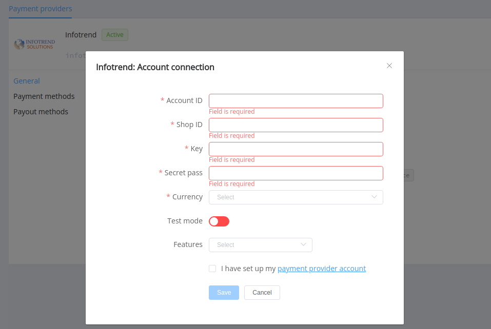

# Infotrend Solutions

!!! quote ""
    MERCHANT PROCESSING SOLUTIONS

**Website**: [Infotrend Solutions](http://www.infotrend-solutions.com/)

Follow the guidance for setting up a connection with Infotrend Soutions as a payment service provider.

## Set Up Account

### Step 1: Contact Infotrend Soutions

Send a request on the [website](http://www.infotrend-solutions.com/) or call the hotline. Submit the required documents to verify your account and gain access.

### Step 2: Get credentials

Ask the support manager about obtaining credentials:

* `AccountId`
* `ShopId`
* `Key` for generating signature
* `Secret Pass`

!!! important
    Be sure to check with the manager if you require to provide a white list of IPs, and if so, specify IP addresses from the [Corefy list](/integration/ips/).

## Connect H2H Merchant Account

### Step 1. Connect H2H account at the {{custom.company_name}} Dashboard

Press **Connect** at [*Infotrend Soutions Provider Overview*]({{custom.dashboard_base_url}}connect-directory/payment-providers/infotrend/general) page in *'New connection'* and choose **H2H Merchant account** option to open Connection form.

Enter credentials:

* `AccountId` --> Account ID
* `ShopId` --> Shop ID
* `Key` --> Key
* `Secret Pass` --> Secret Pass

Select Test or Live mode according to the type of account credentials to connect with Infotrend Soutions.

Choose Currencies and Features. You can set these parameters according to available currencies and features for your Infotrend Soutions account, but it's necessary to verify details of the connection with your {{custom.company_name}} account manager.

!!! success
    You have connected **Infotrend Soutions** H2H merchant account!

!!! question "Still looking for help connecting your Infotrend Soutions account?"
    <!--email_off-->[Please contact our support team!](mailto:{{custom.support_email}})<!--/email_off-->
