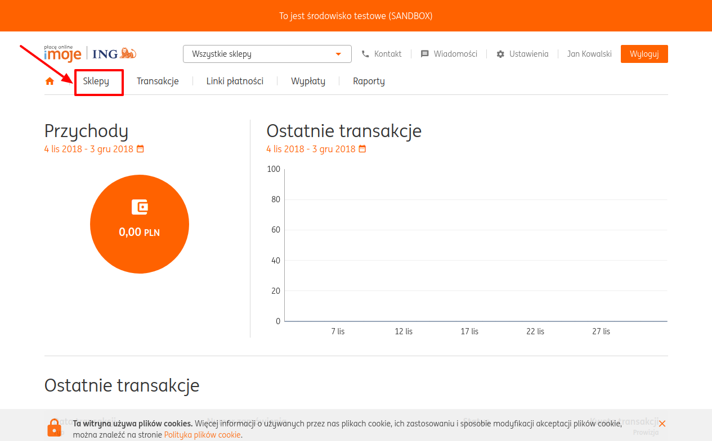
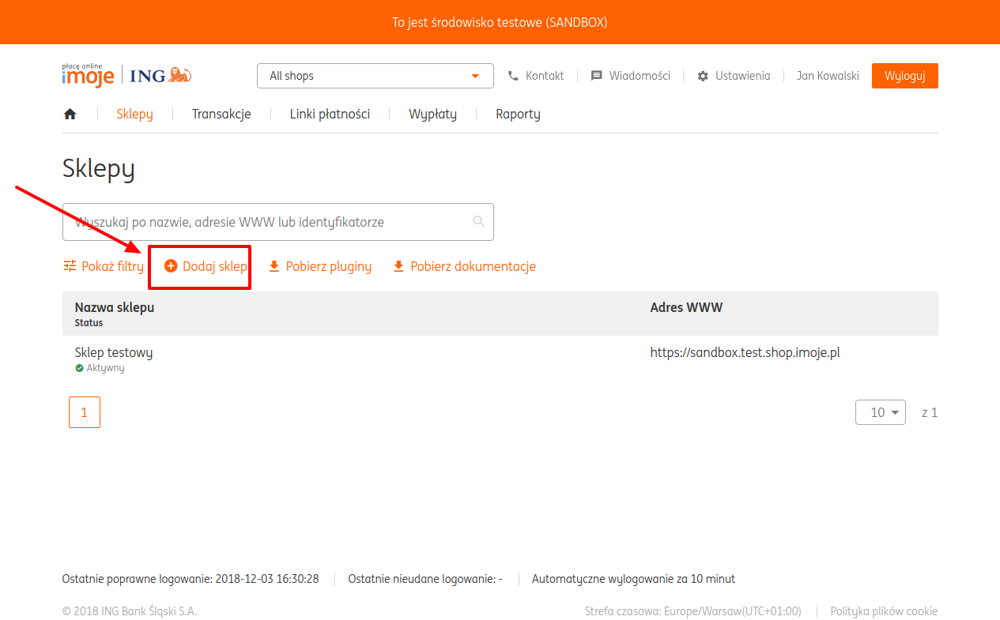
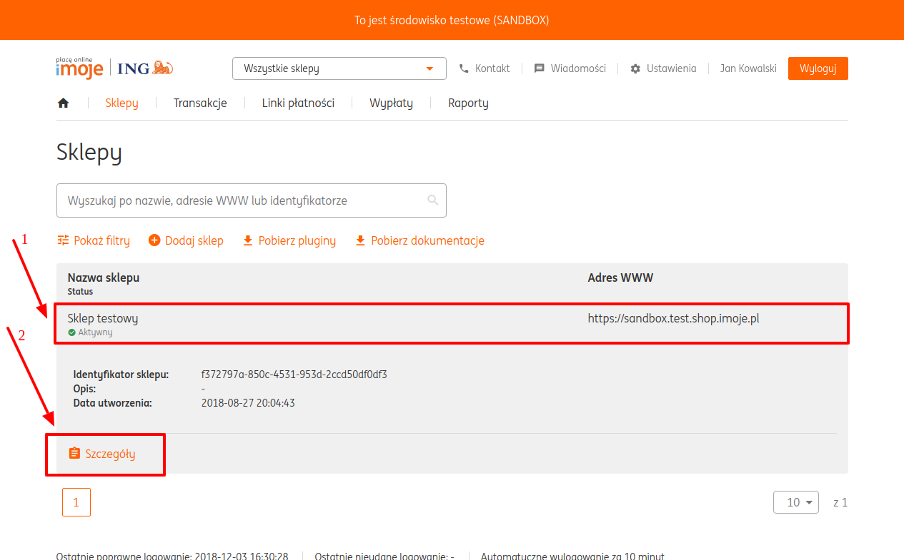
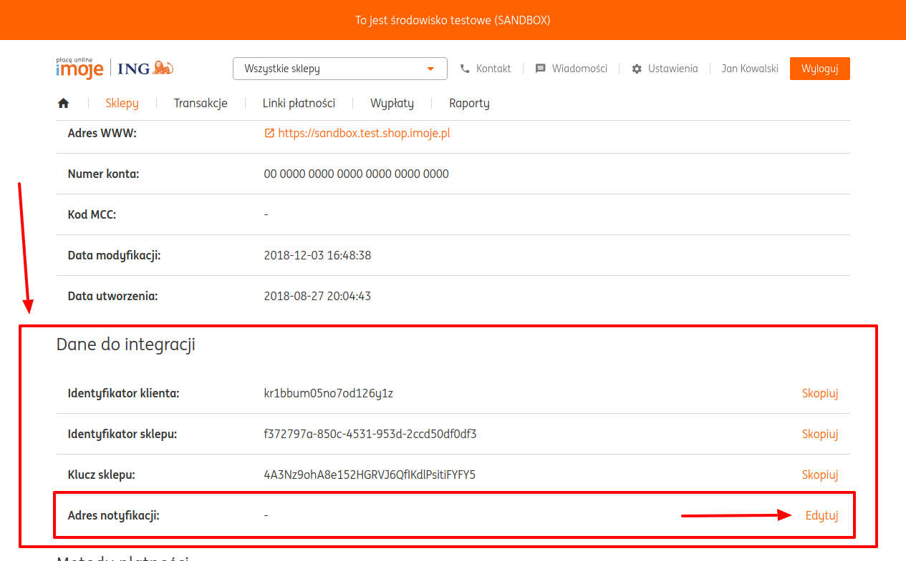
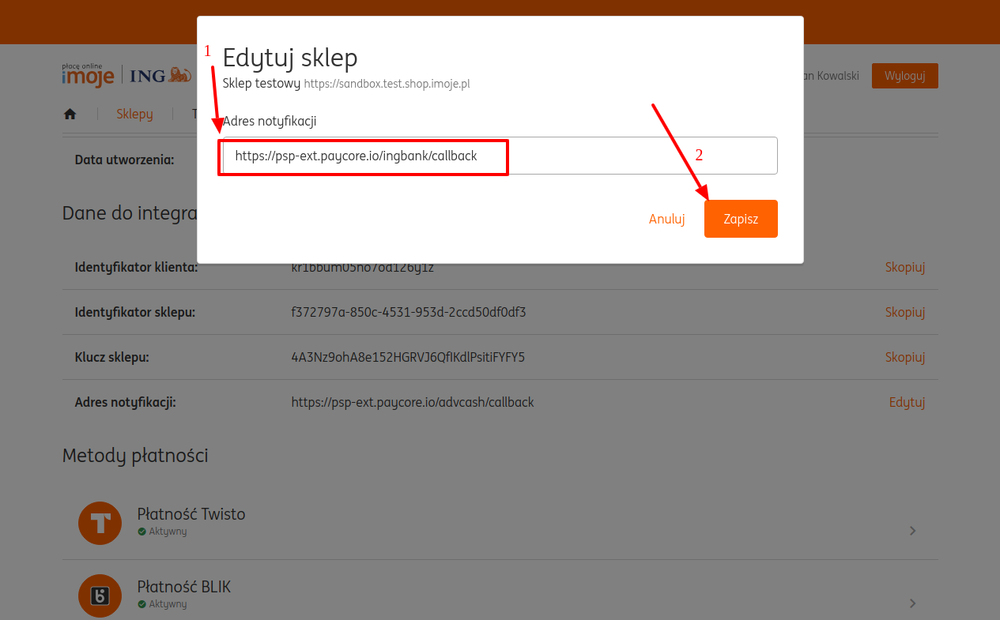
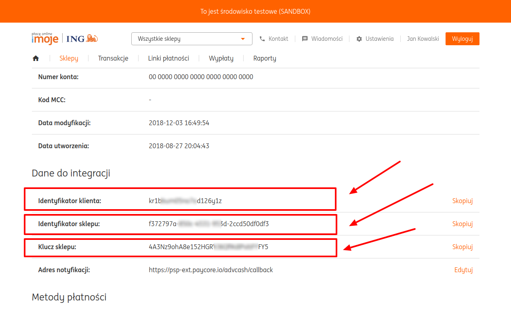
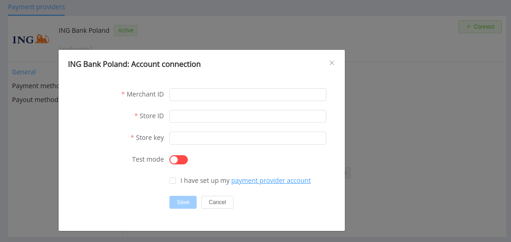

# ING Bank Poland

**Website**: [ing.pl](https://www.ing.pl/)

**Login**: [ingbusiness.pl](https://login.ingbank.pl/mojeing/app/#login)

Follow the guidance for setting up a connection with ING Bank Poland as a payment service provider.

## Set up an account

### Step 1: Activate online banking

Contact your ING Bank account manager or fill in the [activation form](https://forms.ing.pl/DETeWniosekWormsExt/wizardwfb.aspx?path=T6_DT-EndUserWormsExt-S10-NPH&FieldString25=a&lang=en-GB&bankId=6&profileId=4&c=1) on the website.

### Step 2: Create a new shop

Log in to your internet banking and go to "Shops" (Sklepy) section. Add a new shop.

### Step 3: Configure

Open the shop's details (*Szczegóły*).

In the integration data (*Dane do integracji*), set `https://psp-ext.paycore.io/ingbank/callback` as a notification address (*Adres notyfikacji*).

### Step 4: Get required parameters

- Merchant ID (*Identyfikator klienta*)
- Store ID (*Identyfikator sklepu*)
- Store key (*Klucz sklepu*) 

    
## Connect a provider account

#### Step 1. Connect account at the {{custom.company_name}} dashboard

Press **Connect** at the [*ING Bank Poland Provider Overview*]({{custom.dashboard_base_url}}connect-directory/payment-providers/ingbankpl/general) page in *'New connection'* to open the connection form.

Enter credentials:

- Merchant ID (*Identyfikator klienta*)
- Store ID (*Identyfikator sklepu*)
- Store key (*Klucz sklepu*)

Select Test or Live mode according to the type of account to connect with ING Bank Poland.

!!! success
    You have connected the **ING Bank Poland** provider account!

!!! question "Still looking for help connecting your **ING Bank Poland** account?"
    <!--email_off-->[Please contact our support team!](mailto:{{custom.support_email}})<!--/email_off-->
