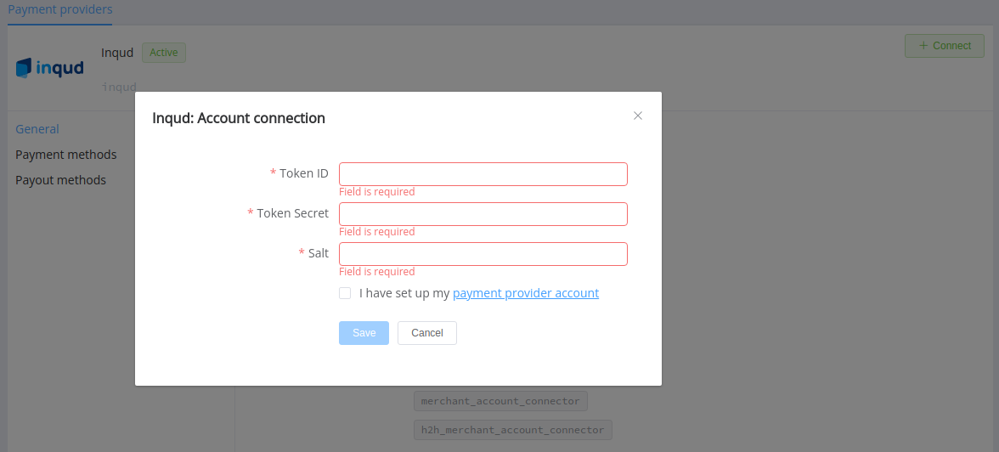

# inqud

!!! quote ""

    Payments without borders

**Website**: [inqud.com](https://www.inqud.com/)

Follow the guidance for setting up a connection with inqud as a payment service provider.

## Set up Account

### Step 1: Contact inqud support manager

Sign up to the [Merchant Account](https://cabinet.inqud.com/#/signup). Submit the required documents to verify it and gain full access.

### Step 2: Get credentials

Get from the inqud support team required credentials:

- X-Token-API-Id - Identifier of the token (started with TKN- prefix)
- X-Token-API-Secret - Token secret
- X-Salt - Salt for HmacSHA256 function

!!! important
    Be sure to check with the manager if you require to provide a white list of IPs, and if so, specify IP addresses from the [Corefy list](/integration/ips/).

## Connect a provider account

### Step 1. Connect an account at the {{custom.company_name}} dashboard

Press **Connect** at [*inqud Provider Overview*]({{custom.dashboard_base_url}}connect-directory/payment-providers/inqud/general) page in *'New connection'* and open Connection form.

Enter credentials:

- X-Token-API-Id --> Token ID
- X-Token-API-Secret --> Token secret
- X-Salt --> Salt

!!! success
    You have connected the **inqud** provider account!

!!! question "Still looking for help connecting your inqud account?"
    <!--email_off-->[Please contact our support team!](mailto:{{custom.support_email}})<!--/email_off-->
