# Interkassa

!!! quote ""
    Accept online payments from customers worldwide

**Website**: [interkassa.com](https://www.interkassa.com/ua/)

**Login**: [interkassa.com/login](https://www.interkassa.com/login)

Follow the guidance for setting up a connection with Interkassa payment service provider.

## Set Up Account

### Step 1: Contact Interkassa support manager

Register an account on the [website](https://www.interkassa.com/registration) or send a request to the support team. Submit the required documents to verify your account and gain access.

### Step 2: Set up API parameters

Configure API parameters in the 'Personal cabinet' settings --> 'Personal Data' --> 'API' Settings:

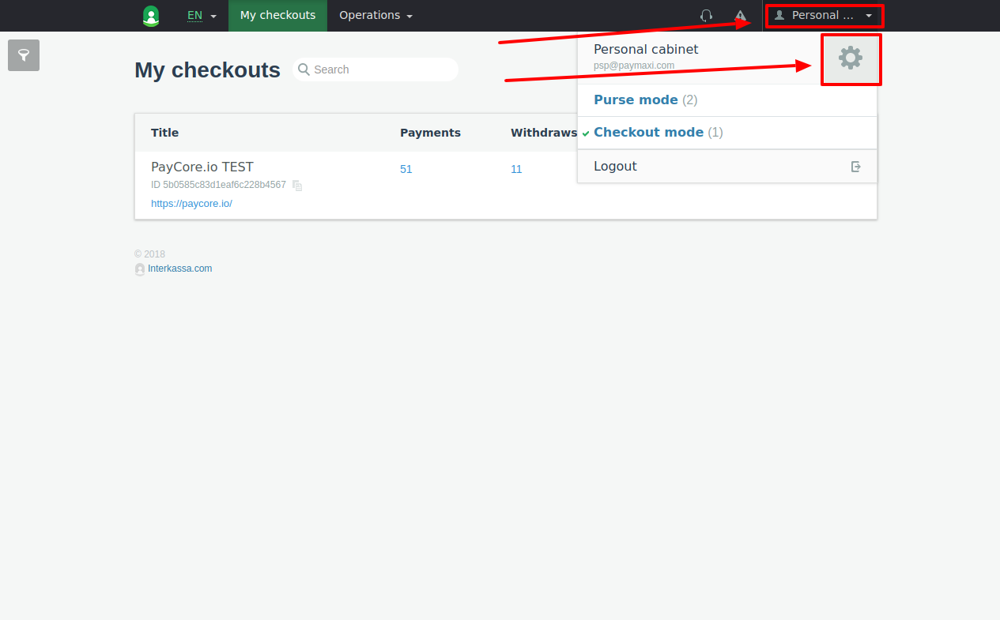

* Specify to 'IP filter' all necessary IP addresses including the [Corefy IP list](/integration/ips/)
* Turn on API usage

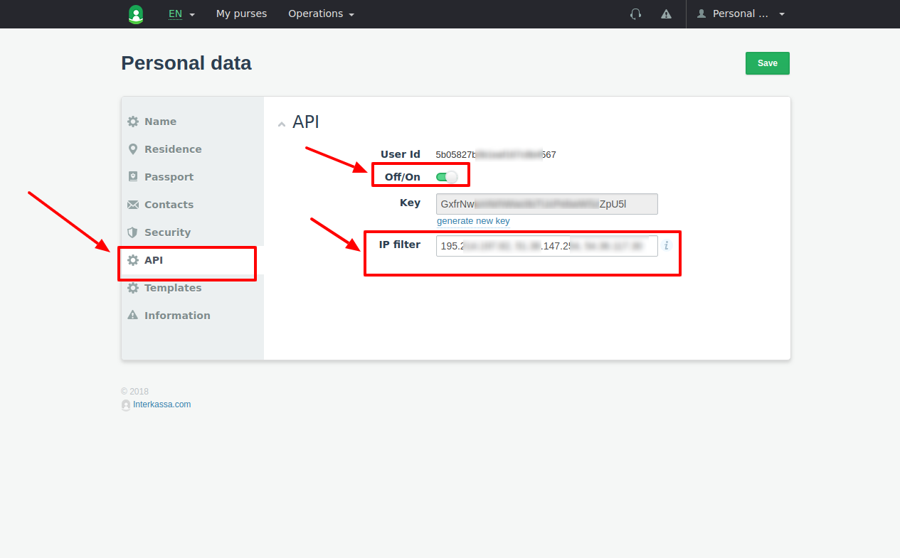

Get the API credentials:

* User ID
* API key

!!! warning ""
    Generate a new key if necessary but previously, make sure you don't use the existing one for another integration.

### Step 3: Create and configure your Checkout

Select 'Checkout mode' in the 'Personal cabinet' settings and create a new Checkout.

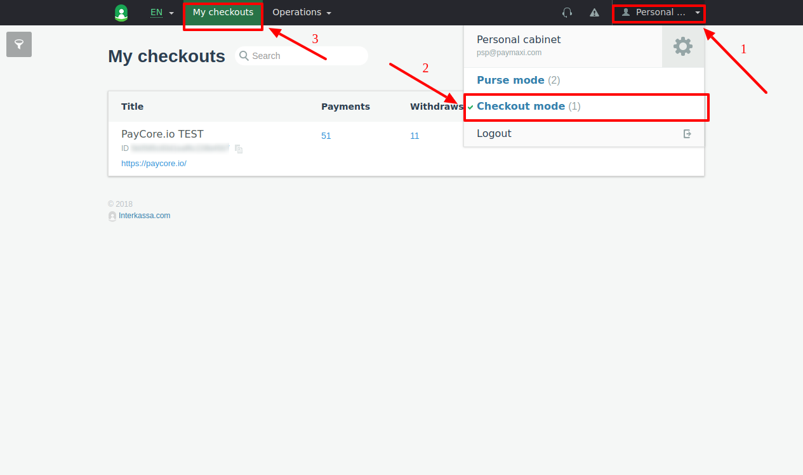
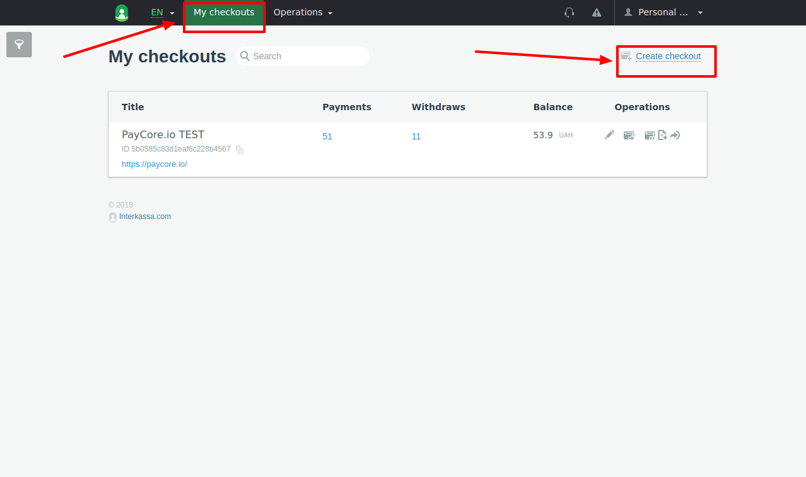

Set up 'Site URL' as `https://paycore.io`.

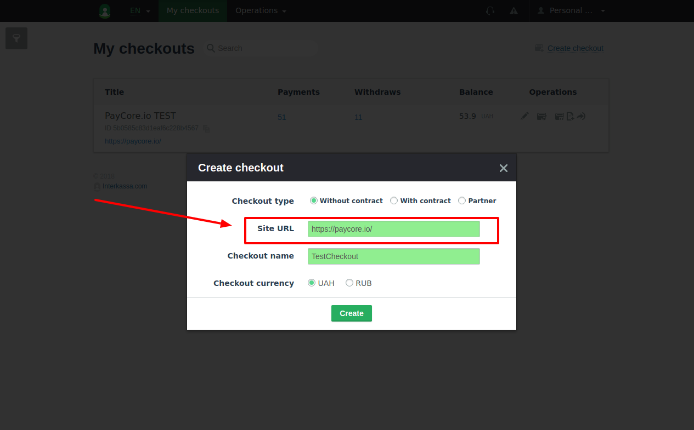

In the Checkout's settings, find 'Payment settings' and enable '*Check the uniqueness of payments*'.

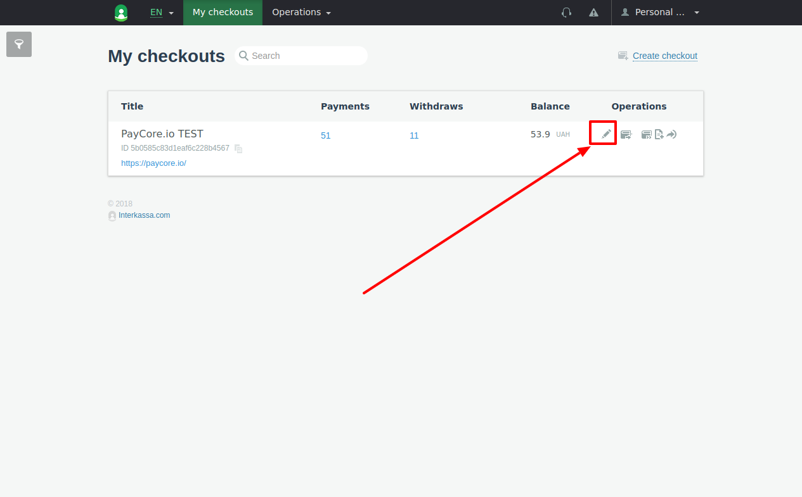
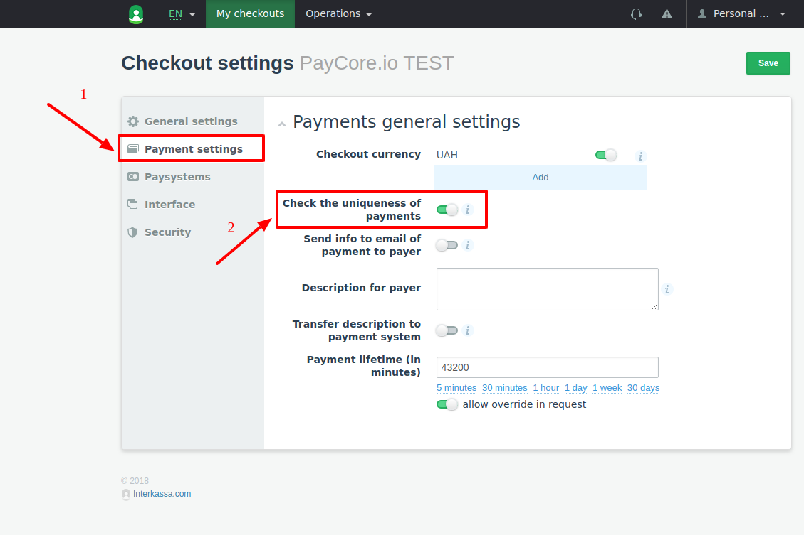

In the 'Paysystems' section, activate at least one payment method.

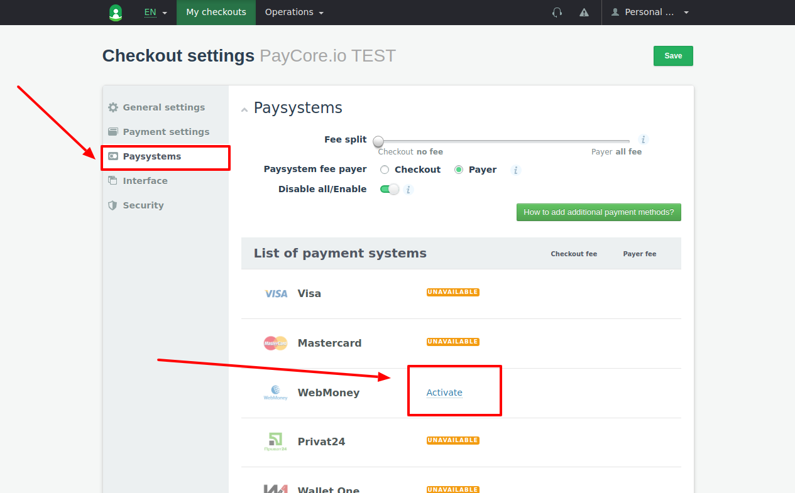

In the 'Interface' section, enable the '*allow override in request*' option for Interaction URL.

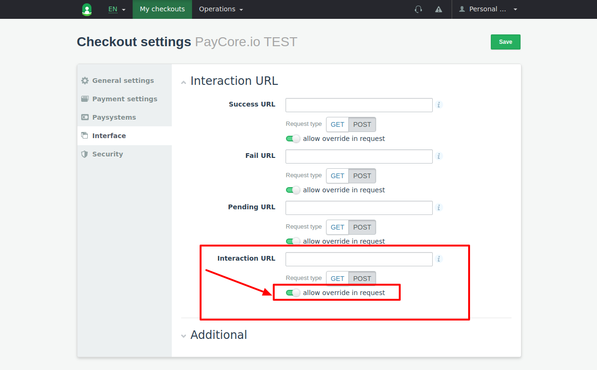

In the '*Security*', set up parameters:

* Choose *SHA256* as Sign algorithm
* Turn on *'Require sign in payment form'*

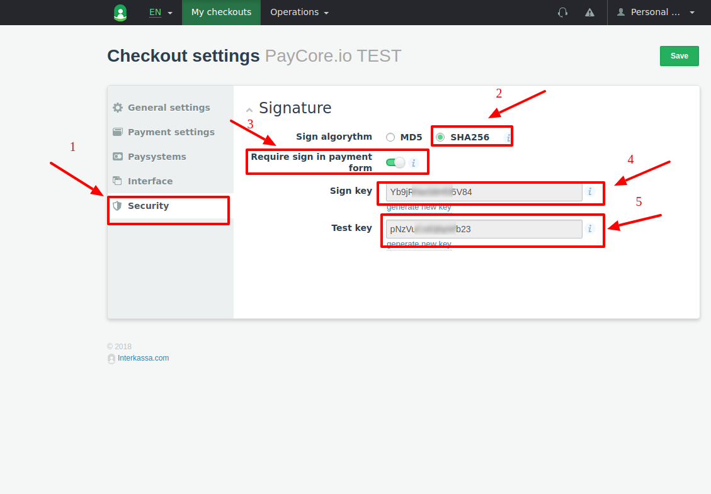

Finally, copy required checkout parameters:

* Checkout ID

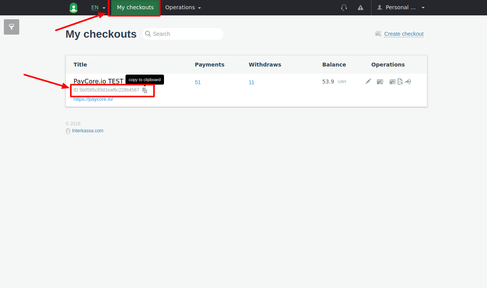

* Sign key
* Test key

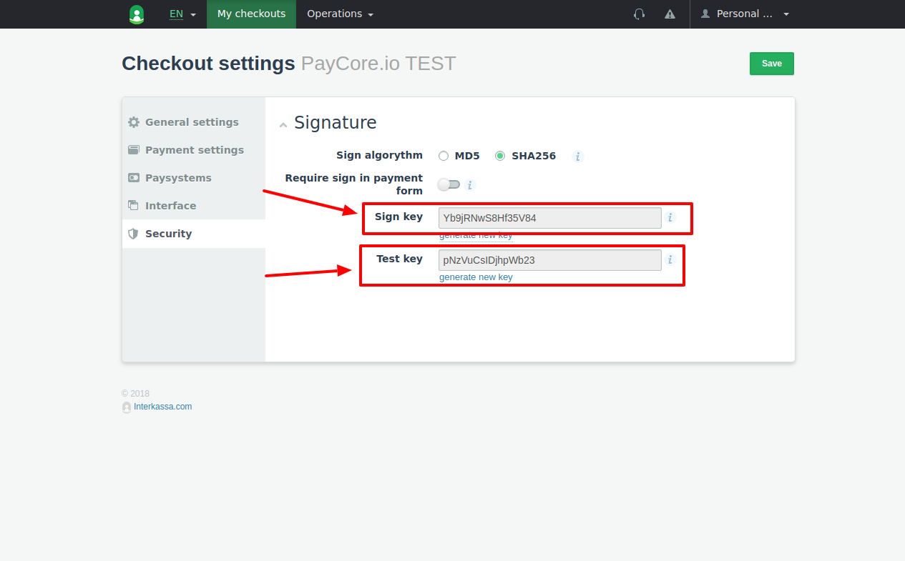

## Connect Provider Account

### Step 1. Connect account at the {{custom.company_name}} Dashboard

Press **Connect** at [*Interkassa Provider Overview*]({{custom.dashboard_base_url}}connect-directory/payment-providers/interkassa/general) page in *'New connection'* and choose **Provider account** option to open Connection form.

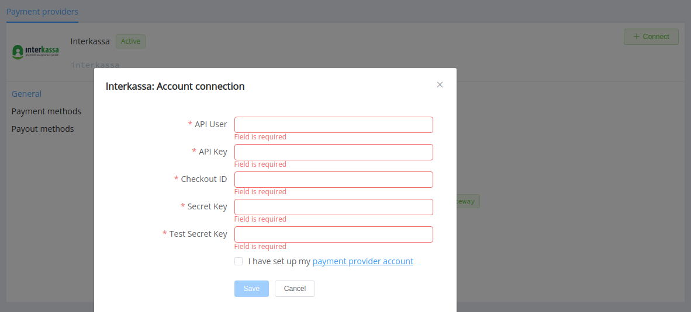

Enter credentials:

* User ID --> API User
* API key
* Checkout ID
* Sign key --> Secret key
* Test key --> Test secret key

!!! success
    You have connected **Interkassa** account!

## Connect H2H Merchant Account

### Step 1. Connect H2H account at the {{custom.company_name}} Dashboard

Press **Connect** at [*Interkassa Provider Overview*]({{custom.dashboard_base_url}}connect-directory/payment-providers/interkassa/general) page in *'New connection'* and choose **H2H Merchant account** option to open Connection form.

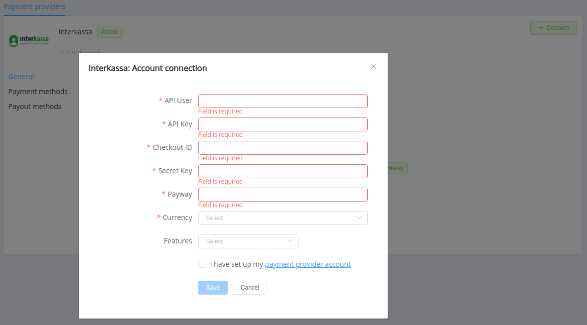

Enter credentials:

* User ID --> API User
* API key
* Checkout ID
* Sign key --> Secret key
* Payway — Payment directions code's alias (for example, `mastercard_cpaytrz_merchant_usd`). You can find the complete list of actual codes in the [Interkassa documentation](https://docs.interkassa.com/#section/7.-Spravochnik) and select the payway you want to connect.

Choose currency related to the selected payway. Choose features: `only_3ds`, `required_3ds_v1`,`required_3ds_v2`, but verify their availability with your {{custom.company_name}} account manager.

!!! success
    You have connected **Interkassa** H2H merchant account!

!!! question "Still looking for help connecting your Interkassa account?"
    <!--email_off-->[Please contact our support team!](mailto:{{custom.support_email}})<!--/email_off-->
