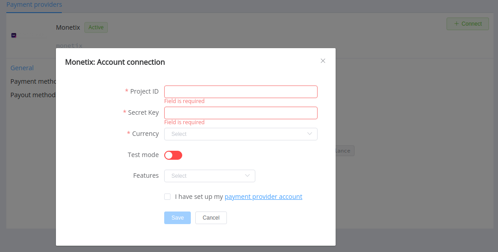

# Monetix

!!! quote ""

    Extend your payments perception

**Website**: [monetix.pro](https://www.monetix.pro/)

Follow the guidance for setting up a connection with Monetix as a payment service provider.

## Set up an account

### Step 1: Contact your Monetix support manager

Send a request to the Monetix support team. Submit the required documents to verify your account and gain access.

### Step 2: Get credentials

Get from the Monetix support team required credentials:

- Project ID,
- Secret key.

!!! important
    Be sure to check with the manager if you require to provide a white list of IPs, and if so, specify IP addresses from the [Corefy list](/integration/ips/).

## Connect a H2H merchant account

### Step 1. Connect a H2H account at the {{custom.company_name}} Dashboard

Press **Connect** at [*Monetix Provider Overview*]({{custom.dashboard_base_url}}connect-directory/payment-providers/monetix/general) page in *'New connection'* and open Connection form.

Enter credentials:

- Project ID,
- Secret key.

Select Test or Live mode according to the type of account to connect with Monetix.

Choose Currencies and Features. You can set these parameters according to available currencies and features for your Monetix account, but it's necessary to verify details of the connection with your {{custom.company_name}} account manager.

!!! success
    You have connected the **Monetix** H2H merchant account!

!!! question "Still looking for help connecting your Monetix account?"
    <!--email_off-->[Please contact our support team!](mailto:{{custom.support_email}})<!--/email_off-->
