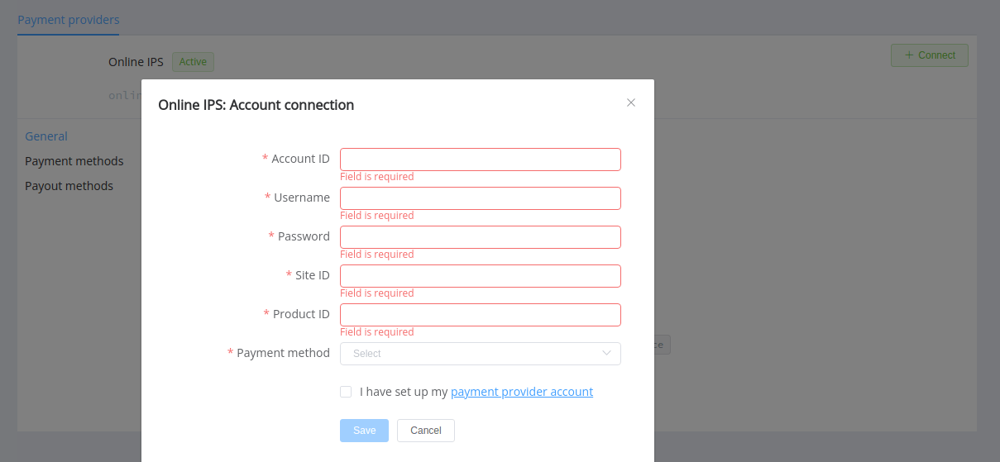
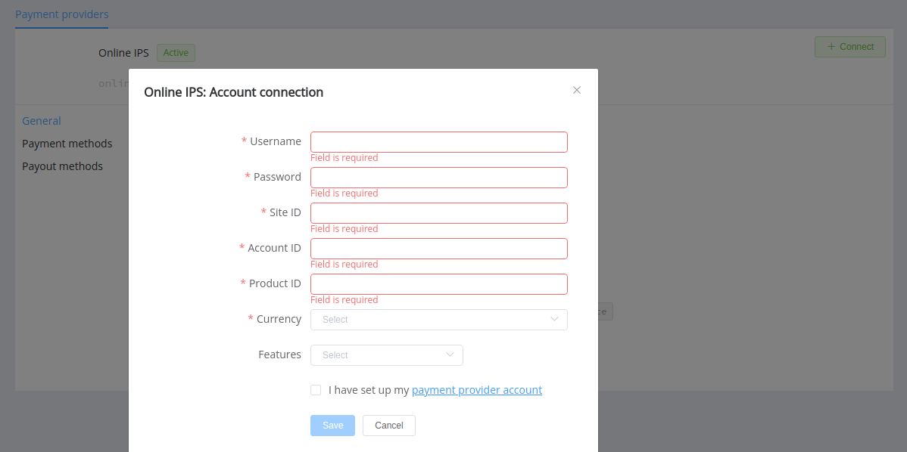

# IPS

Follow the guidance for setting up a connection with IPS as a payment service provider.

## Set up an account

### Step 1: Contact your IPS support manager

Submit the required documents to verify your account and gain access.

### Step 2: Get credentials

Get from the IPS support team required credentials:

- Account ID
- Username
- Password
- Site ID
- Product ID

!!! important
    Be sure to check with the manager if you require to provide a white list of IPs, and if so, specify IP addresses from the [Corefy list](/integration/ips/).

    And if you plan to connect an IPS provider account, choose, what a payment method (PIX or Boleto) you'll use for payment redirect.

## Connect a provider account

### Step 1: Connect an account at the {{custom.company_name}} dashboard

Press **Connect** at [*Online IPS Provider Overview*]({{custom.dashboard_base_url}}connect-directory/payment-providers/onlineips/general) page in *'New connection'* and choose the **Provider account** option to open a connection form.

Enter credentials:

- Account ID
- Username
- Password
- Site ID
- Product ID

Choose, what a payment method (PIX or Boleto) you'll use for payments. If you plan to use both methods, you need to connect second one as another account in the Corefy dashboard.

!!! success
    You have connected the **IPS** provider account!

## Connect a H2H merchant account

### Step 1: Connect a H2H account at the {{custom.company_name}} dashboard

Press **Connect** at [*Online IPS Provider Overview*]({{custom.dashboard_base_url}}connect-directory/payment-providers/onlineips/general) page in *'New connection'* and choose the **H2H Merchant account** option to open a connection form.

Enter credentials:

- Username
- Password
- Site ID
- Account ID
- Product ID

Choose Currencies and Features. You can set these parameters according to available currencies and features for your IPS account, but it's necessary to verify details of the connection with your {{custom.company_name}} account manager.

!!! success
    You have connected the **IPS** H2H merchant account!

!!! question "Still looking for help connecting your IPS account?"
    <!--email_off-->[Please contact our support team!](mailto:{{custom.support_email}})<!--/email_off-->
