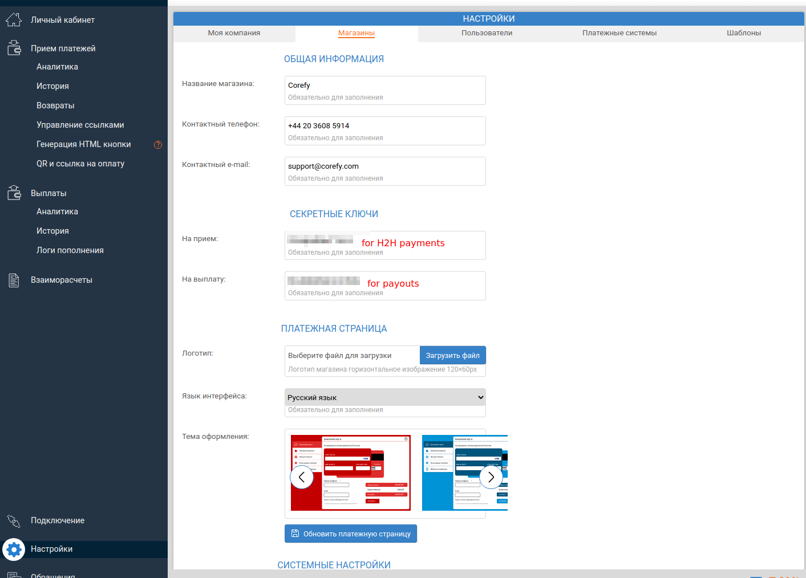
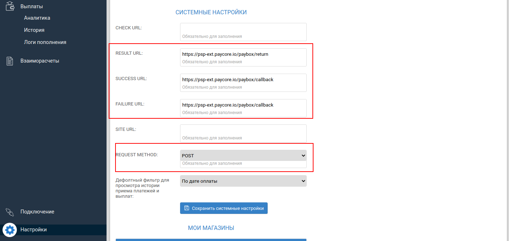
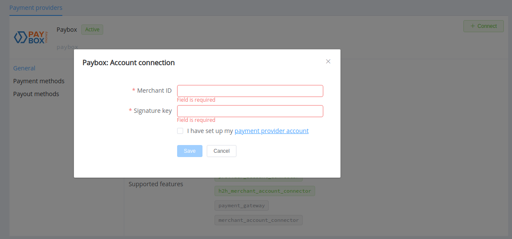
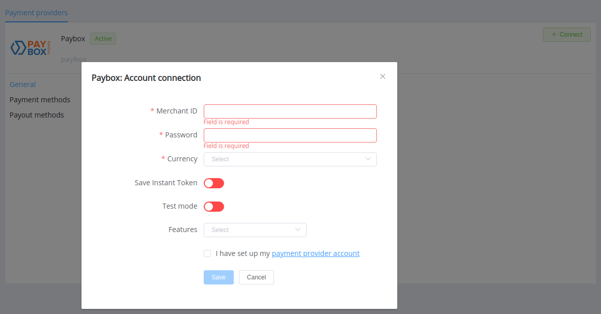

# PayBox

!!! quote ""
    Accept payments on your website with PayBox.money: free connection and free of charge

**Website**: [paybox.money](https://paybox.money/kz_ru)

**Login**: [my.paybox.money](https://my.paybox.money/)

Follow the guidance for setting up a connection with PayBox payment service provider.

## Set up account

### Step 1: Contact PayBox support manager

Send a request on the [website](https://paybox.money/kz_ru/contacts) or call the hotline. Submit the required documents to verify your account and gain access.

### Step 2: Set up your shop and get credentials

Go to the 'Settings' section --> 'Shops'. Set up general data about the Shop you connect in the {{custom.company_name}} platform.

Set up secret keys for payments and payouts.

In the 'System settings' block, configure integration URLs:

* *RESULT URL* `https://psp-ext.paycore.io/paybox/callback`
* *SUCCESS URL* `https://psp-ext.paycore.io/paybox/return`
* *FAILURE URL* `https://psp-ext.paycore.io/paybox/return`

Set *REQUEST METHOD* as `POST`.

!!! important
    Be sure to check with the manager if you require to provide a white list of IPs, and if so, specify IP addresses from the [Corefy list](/integration/ips/).

## Connect Provider Account

### Step 1. Connect account at the {{custom.company_name}} Dashboard

Press **Connect** at [*PayBox Provider Overview*]({{custom.dashboard_base_url}}connect-directory/payment-providers/paybox/general) page in *'New connection'* and choose **Provider account** option to open Connection form.

Enter credentials:

* your Shop merchant ID
* Signature key (for payouts)

!!! success
    You have connected **PayBox** account!

## Connect H2H Merchant Account

### Step 1. Connect H2H account at the {{custom.company_name}} Dashboard

Press **Connect** at [*PayBox Provider Overview*]({{custom.dashboard_base_url}}connect-directory/payment-providers/paybox/general) page in *'New connection'* and choose **H2H Merchant account** option to open Connection form.

Enter credentials:

* your Shop merchant ID
* Signature key for payments

Select Test or Live mode according to the type of account to connect with PayBox. Also, choose the *Save Instant Token* option if you plan to use the account for instant payments.

Choose Currencies and Features. You can set these parameters according to available currencies and features for your PayBox account, but it's necessary to verify details of the connection with your {{custom.company_name}} account manager.

!!! success
    You have connected **PayBox** H2H merchant account!

!!! question "Still looking for help connecting your PayBox account?"
    <!--email_off-->[Please contact our support team!](mailto:{{custom.support_email}})<!--/email_off-->
