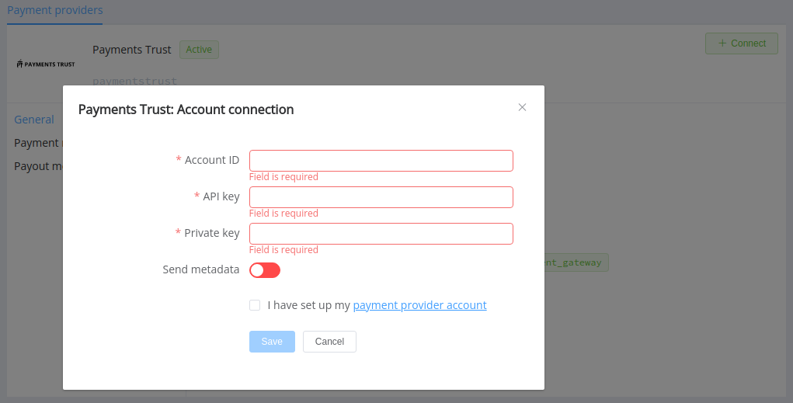
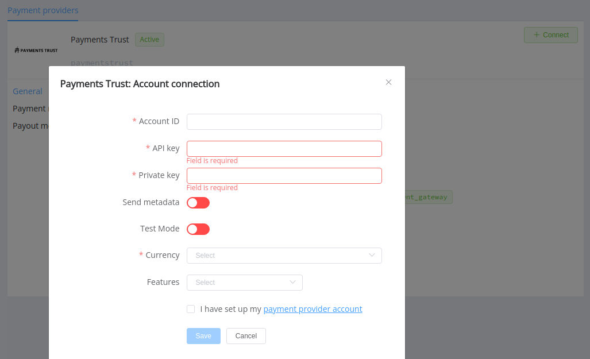

# Payments Trust

!!! quote ""
    Save your time and increase your sales

**Website**: [Payments Trust](https://paymentstrust.com/en/)

**Login**: [Portal Payments Trust](https://portal.paymentstrust.com/login)

Follow the guidance for setting up a connection with Payments Trust as a payment service provider.

## Set Up Account

### Step 1: Contact Payments Trust support manager

Send a request on the [website](https://paymentstrust.com/en/podkljuchenie-k-payments-trust/). Make sure your site meets all necessary requirements, submit the documents to verify your account and gain access.

### Step 2: Get credentials

Credentials that have to be issued :

- Account ID
- API key 
- Private key (test and live)

!!! important
    Be sure to check with the manager if you require to provide a white list of IPs, and if so, specify IP addresses from the [Corefy list](/integration/ips/).

## Connect Provider Account

### Step 1. Connect account at the {{custom.company_name}} Dashboard

Press **Connect** at [*Payments Trust Provider Overview*]({{custom.dashboard_base_url}}connect-directory/payment-providers/Payments Trust/general) page in *'New connection'* and choose **Provider account** option to open Connection form.

Enter credentials:

- Account ID
- API key
- Private key (test or live, depending on chosen type of connection)

Also, if you want to use metadata in payment and payout invoices, choose the *Send metadata* option.

!!! success
    You have connected the **Payments Trust** account!

## Connect H2H Merchant Account

### Step 1. Connect H2H account at the {{custom.company_name}} Dashboard

Press **Connect** at [*Payments Trust Provider Overview*]({{custom.dashboard_base_url}}connect-directory/payment-providers/Payments Trust/general) page in *'New connection'* and choose **H2H Merchant account** option to open Connection form.

Enter credentials:

- Account ID
- API key
- Private key (test or live, depending on chosen type of connection)

Select *Test* or *Live mode* according to chosen type of connection with Payments Trust. Choose the *Send metadata* option if you want to use metadata in payment invoices.

Choose Currencies and Features. You can set these parameters according to available currencies and features for your Payments Trust account, but it's necessary to verify details of the connection with your {{custom.company_name}} account manager.

!!! success
    You have connected the **Payments Trust** H2H merchant account!

!!! question "Still looking for help connecting your Payments Trust account?"
    <!--email_off-->[Please contact our support team!](mailto:{{custom.support_email}})<!--/email_off-->
