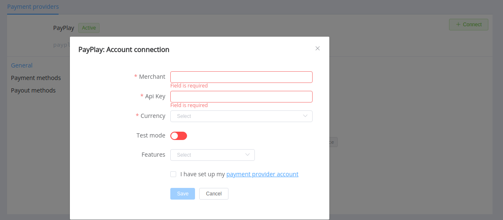

# PayPlay

Follow the guidance for setting up a connection with PayPlay payment service provider.

## Set Up Account

### Step 1: Contact PayPlay support manager

Submit the required documents to verify your account and gain access.

### Step 2: Get credentials

Ask the PayPlay support manager and obtain the necessary credentials::

- Merchant ID
- API key 

You can generate an API key pair on your side and share the public key with PayPlay support.

!!! example "Example of key generating commands"

    ```
    openssl genrsa -des3 -out private.pem 2048
    openssl rsa -in private.pem -outform PEM -pubout -out public.pem
    ```

!!! important
    Be sure to check with the manager if you require to provide a white list of IPs, and if so, specify IP addresses from the [Corefy list](/integration/ips/).

## Connect H2H Merchant Account

### Step 1. Connect H2H account at the {{custom.company_name}} Dashboard

Press **Connect** at [*PayPlay Provider Overview*]({{custom.dashboard_base_url}}connect-directory/payment-providers/payplay/general) page in *'New connection'* and choose **H2H Merchant account** option to open Connection form.



Enter credentials:

- Merchant ID
- API key (private key)

Select Test or Live mode according to the type of account to connect with PayPlay.

Choose Currencies and Features. You can set these parameters according to available currencies and features for your PayPlay account, but it's necessary to verify details of the connection with your {{custom.company_name}} account manager.

!!! success
    You have connected **PayPlay** H2H merchant account!

!!! question "Still looking for help connecting your PayPlay account?"
    <!--email_off-->[Please contact our support team!](mailto:{{custom.support_email}})<!--/email_off-->
