# Perfect Money

> Fast, easy, comfortable way to develop your money

**Website**: [perfectmoney.com](https://perfectmoney.com/?welcome=1)

**Login**: [perfectmoney.com/login](https://perfectmoney.com/login.html)

Follow the guidance for setting up a connection with Perfect Money payment service provider.

## Setup account

### Step 1: Open Commerce settings

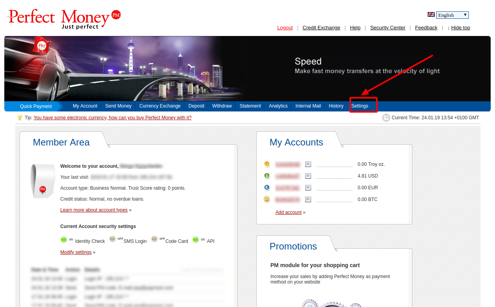

### Step 2: Verify your business account

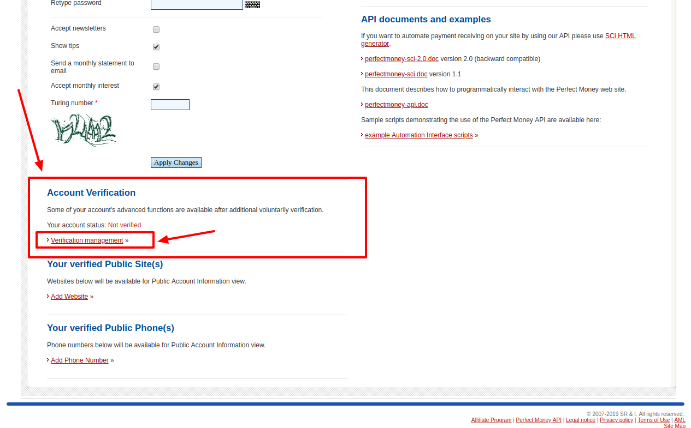

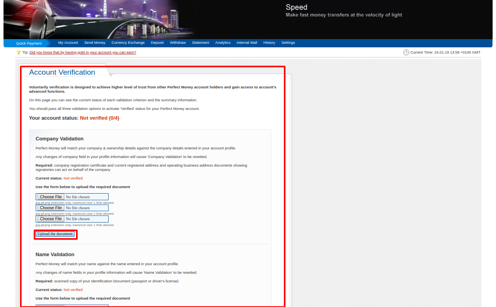

!!! tip
    You should verify all documents and additional info that is necessary for the successful account setup.

### Step 3: Set up API access

- Go to the **`Settings`**
- Find **`Security`**  section
- Enable **`API access`**
- Add all necessary IP addresses to the White list including [{{custom.company_name}} white-list IP addresses](/integration/ips/)
    
    !!! tip

        IP list should contain IP addresses separated with **`;`**.

        *For example*: `3.126.246.226; 3.127.19.165; 3.126.219.223`

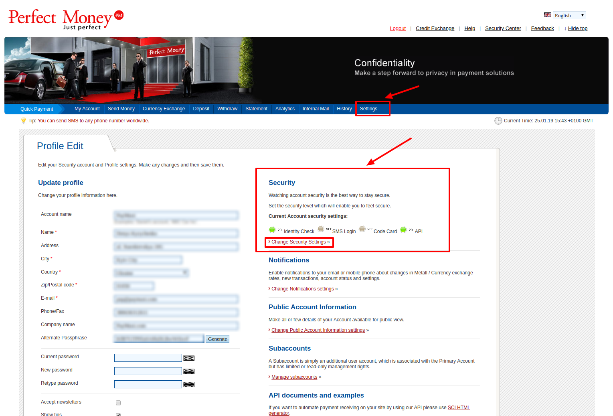

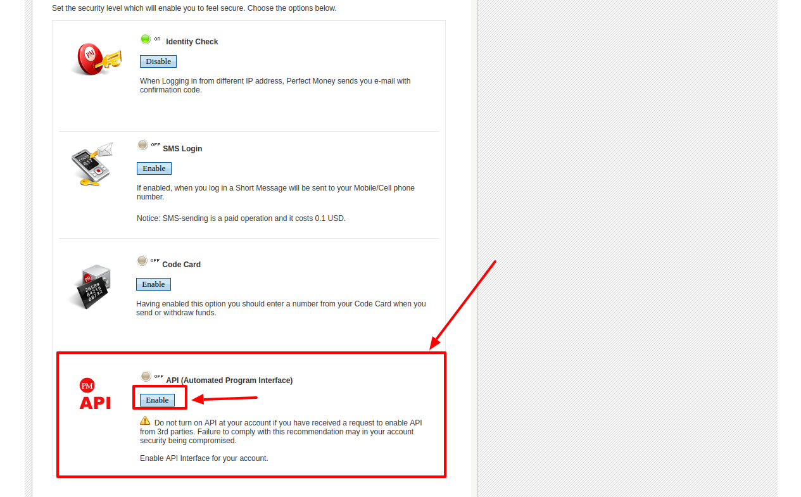

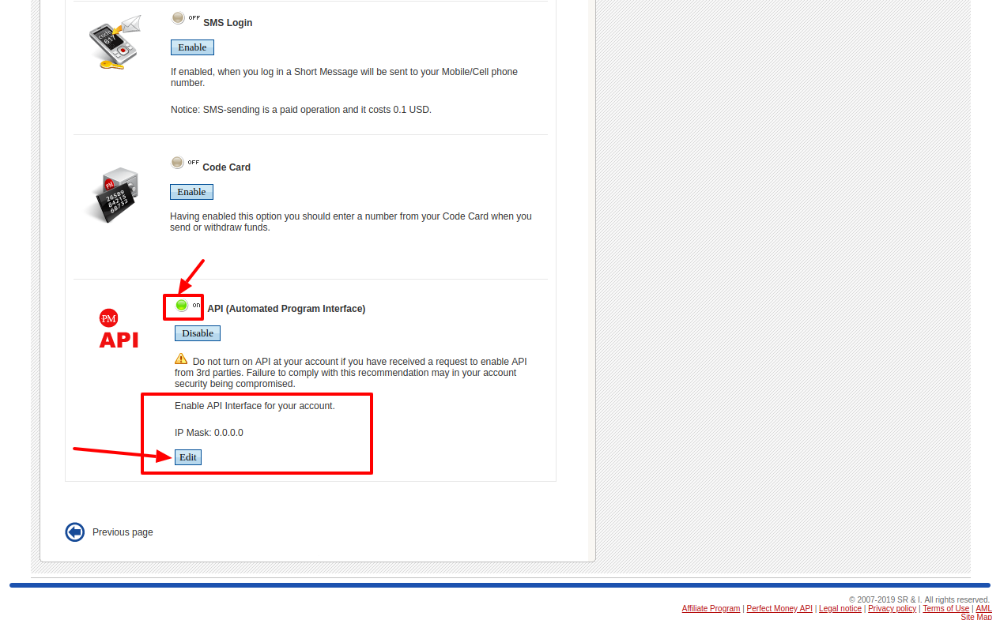

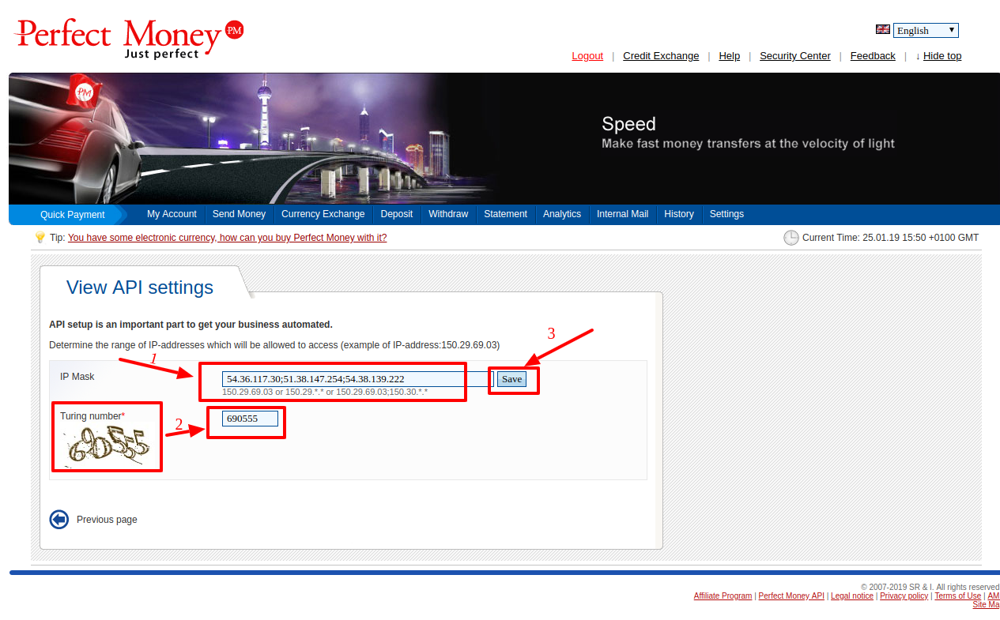

### Step 3: Get required credentials

- Return to the *Settings*, find and copy Alternate Passphrase (Passphrase)

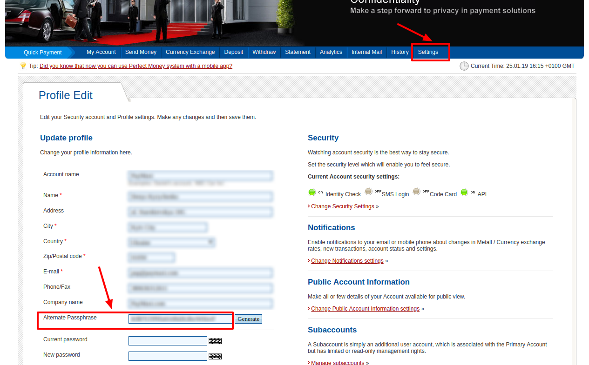

- Go to the *Public Account Information*

- Press *Change Public Account Information settings* --> find and copy *Member ID* (*Account ID*)

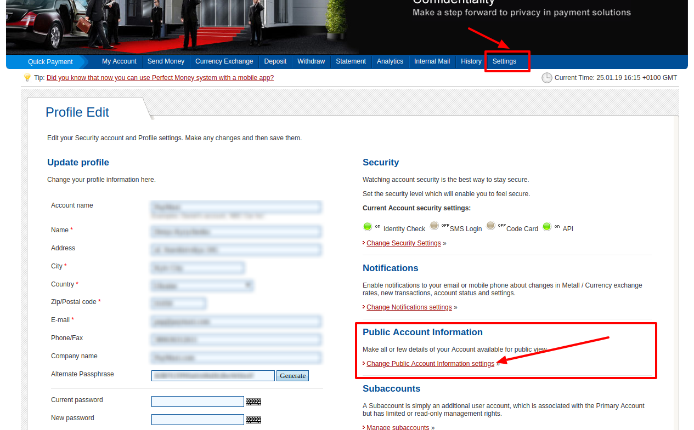

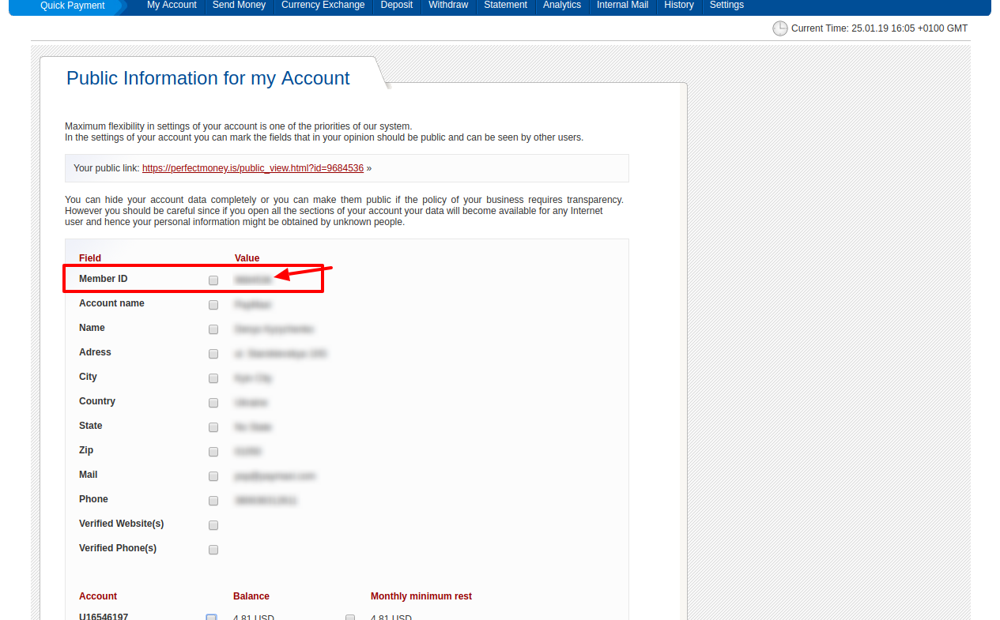
 
## Connect account

### Step 1: Copy required credentials

-  Account ID

-  Passphrase

-  Merchant Account Password
    
    !!! info
        **`Merchant Account Password`** - is the password, you use to Sign in to the [PerfectMoney Dashboard](https://perfectmoney.is/login.html)

### Step 2: Enter credentials

!!! tip
    Press **`Connect`** at PerfectMoney **`Provider Overview page`** in **`New connection`** section to open Connection form!

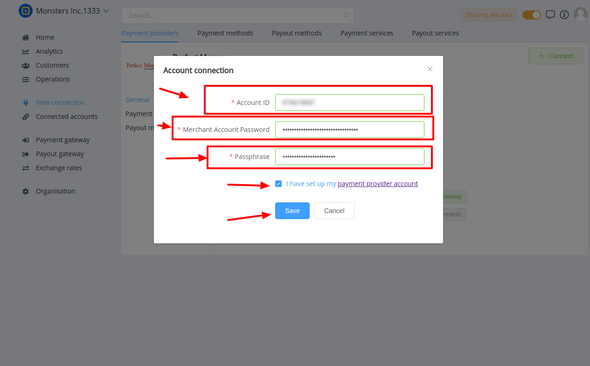

!!! success
    You have connected **PerfectMoney**!