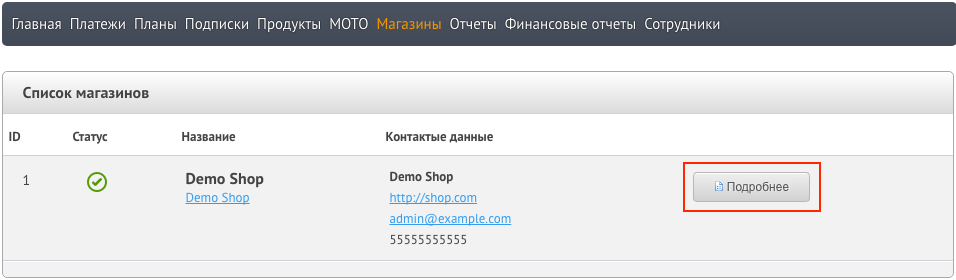
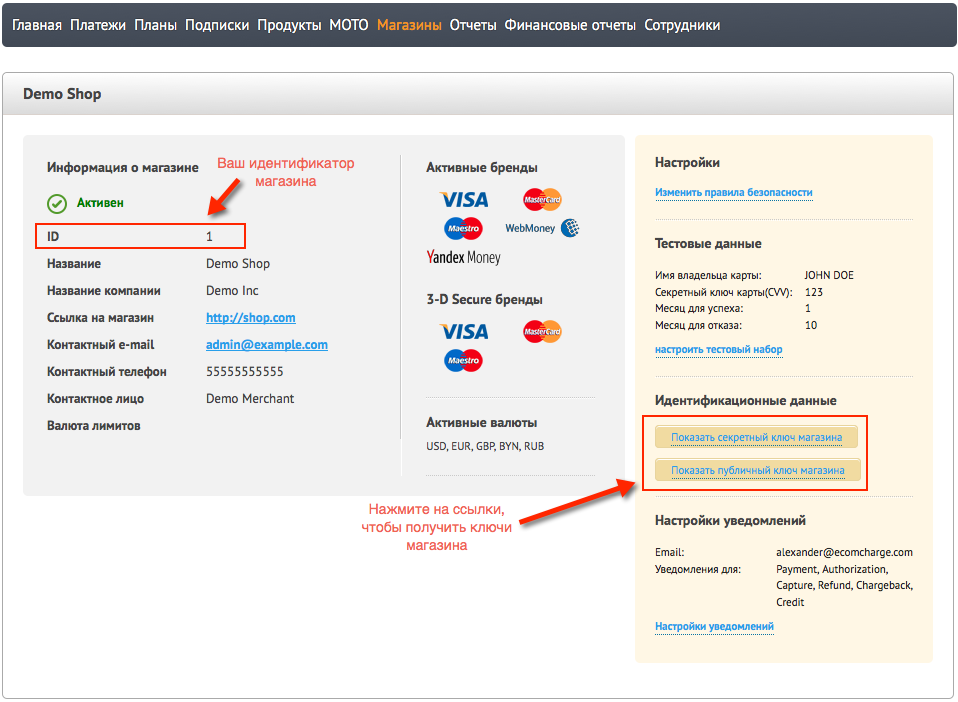
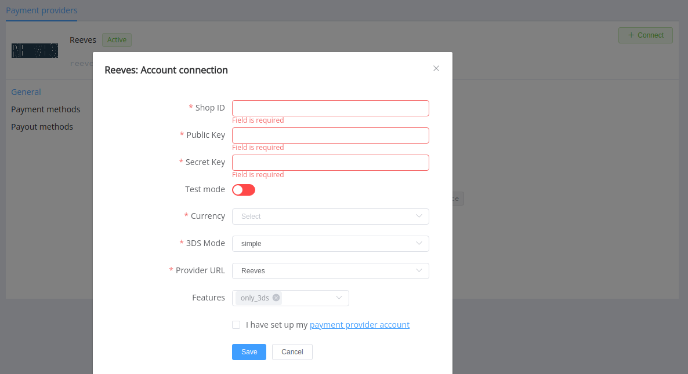

# Reeves

Follow the guidance for setting up a connection with Reeves as a payment service provider.

## Set Up Account

### Step 1: Contact Reeves support manager

Send a request to the support team. Submit the required documents to verify your account and gain access to the back-office.

### Step 2: Get credentials

Log into your back-office and go to the *Shops* section and find a Shop you want to connect. Click the *Details* button.

Find all required credentials there:

* ID
* Secret key
* Public key

!!! important
    Be sure to check with the manager if you require to provide a white list of IPs, and if so, specify IP addresses from the [Corefy list](/integration/ips/).

## Connect H2H Merchant Account

### Step 1. Connect H2H account at the {{custom.company_name}} Dashboard

Press **Connect** at [*Reeves Provider Overview*]({{custom.dashboard_base_url}}connect-directory/payment-providers/reeves/general) page in *'New connection'* and choose **H2H Merchant account** option to open Connection form.

Enter credentials:

* Shop ID
* Secret key
* Public key

Select Test or Live mode according to the type of account to connect with Reeves. Choose your 3DS mode for payments. 

Select your Provider URL for API requests (*Reeves*).

Choose Currencies and Features. You can set these parameters according to available currencies and features for your Constant Payments account, but it's necessary to verify details of the connection with your {{custom.company_name}} account manager.

!!! tip ""

    Besides all others, add the `only_3ds` parameter as a feature.

!!! success
    You have connected **Reeves** H2H merchant account!

!!! question "Still looking for help connecting your Reeves account?"
    <!--email_off-->[Please contact our support team!](mailto:{{custom.support_email}})<!--/email_off-->
