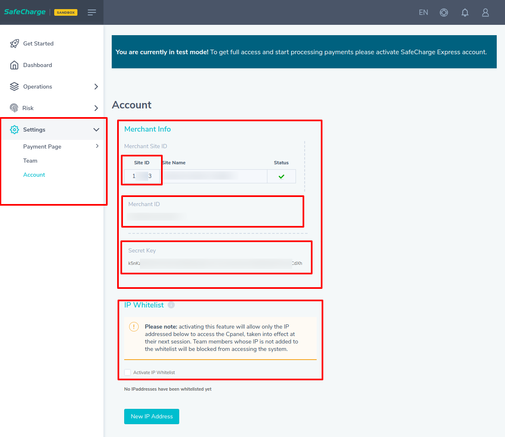
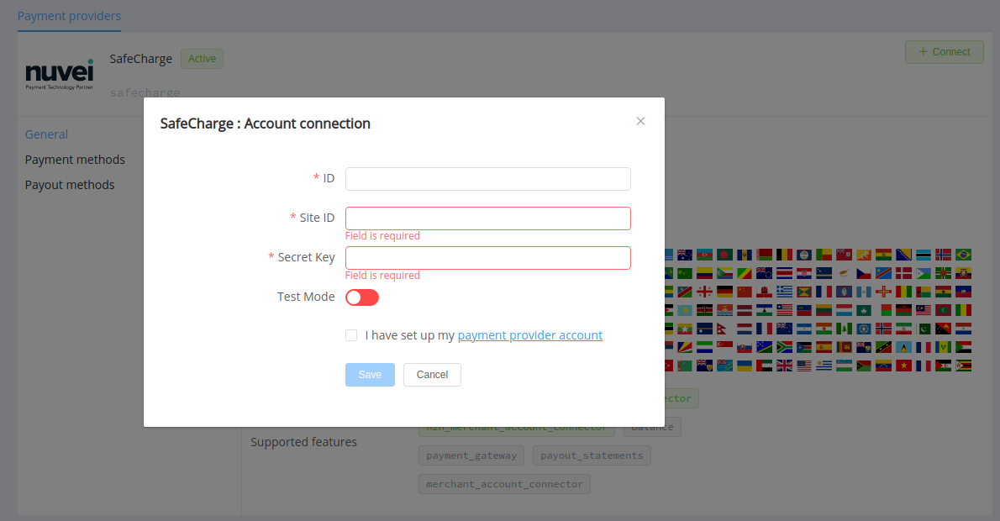
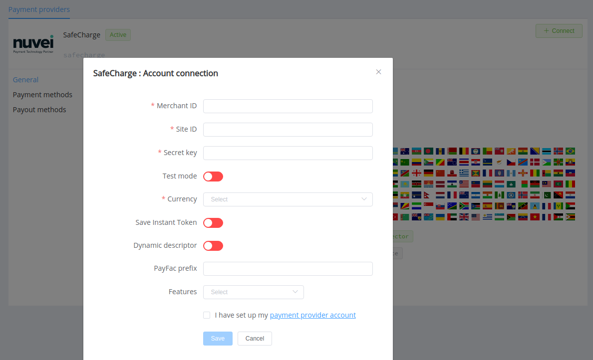

# Nuvei (SafeCharge)

**Website**: [nuvei.com](https://nuvei.com/en-us/)

**Login**: [nuvei.com](https://nuvei.com/en-us/login/)

Follow the guidance for setting up a connection with Nuvei (SafeCharge) payment service provider.

## Set up account

### Step 1: Contact Nuvei support team

Send a request on the [website](https://nuvei.com/en-us/contact/) to obtain a merchant ID. Submit the required documents to verify your account and gain full access.

### Step 2: Get credentials

Find in the *Account Settings*:

* Site ID
* Secret Key

!!! important
    If you require to provide a white list of IPs, be sure to include the [Corefy IP addresses](/integration/ips/) on the list.

## Connect Provider Account

### Step 1. Connect account at the {{custom.company_name}} Dashboard

Press **Connect** at [*Nuvei (SafeCharge) Provider Overview*]({{custom.dashboard_base_url}}connect-directory/payment-providers/safecharge/general) page in *'New connection'* and choose **Provider account** option to open Connection form.

Enter credentials:

* Merchant ID
* Site ID
* Secret key

Also, select Test or Live mode according to the type of account to connect with Nuvei (SafeCharge).

!!! success
    You have connected **Nuvei** (Safecharge) account!

## Connect H2H Merchant Account

### Step 1. Connect H2H account at the {{custom.company_name}} Dashboard

Press **Connect** at [*Nuvei (SafeCharge) Provider Overview*]({{custom.dashboard_base_url}}connect-directory/payment-providers/safecharge/general) page in *'New connection'* and choose **H2H Merchant account** option to open Connection form.

Enter credentials:

* Merchant ID
* Site ID
* Secret key

Select Test or Live mode according to the type of account to connect with Nuvei (SafeCharge).

Choose Currencies and Features. You can set these parameters according to available currencies and features for your Nuvei (SafeCharge) account, but it's necessary to verify details of the connection with your {{custom.company_name}} account manager.

If your organisation is registered in the Nuvei system as a payment facilitator, be sure to specify your PayFac prefix approved by Nuvei underwriting team connecting sub-merchants.

Choose *Save Instant Token* option if you plan to use the account for instant payments. And toggle the *Dynamic descriptor* option if you need the possibility to override payment description.

!!! success
    You have connected **Nuvei** (SafeCharge) H2H merchant account!

!!! question "Still looking for help connecting your Nuvei (SafeCharge) account?"
    <!--email_off-->[Please contact our support team!](mailto:{{custom.support_email}})<!--/email_off-->
