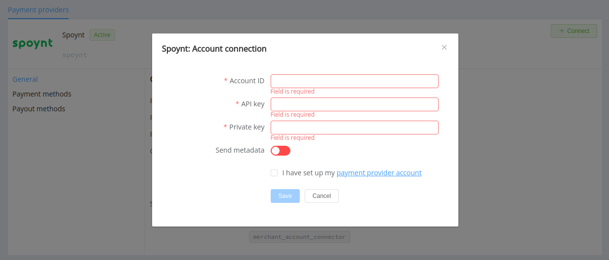
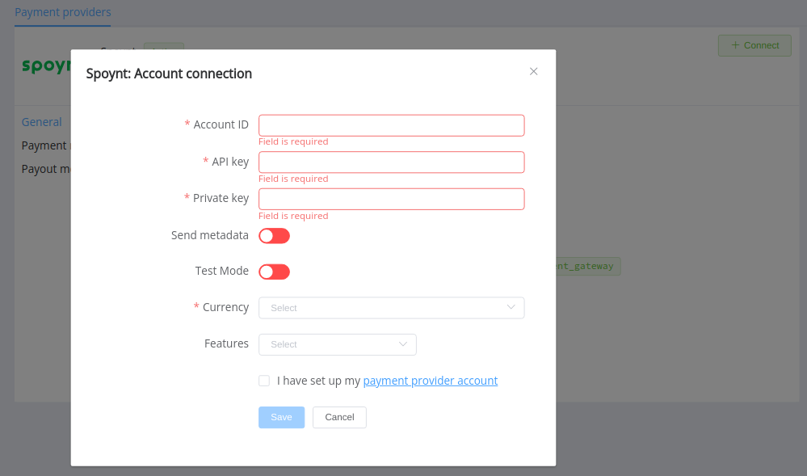

# Spoynt

> Get more from your payments

**Website**: [spoynt.com](https://spoynt.com/)

**Login**: [dash.spoynt.com](https://dash.spoynt.com/login?)

Follow the guidance for setting up a connection with Spoynt as a payment service provider.

## Set Up Account

### Step 1: Contact Spoynt support manager

Send a request on the [website](https://spoynt.com/). Sign up to the [dashboard](https://dash.spoynt.com/register) and set up created account. Then, submit the required documents to verify it and get full access.

### Step 2: Get credentials

Login to the Spoynt merchant [dashboard](https://dash.spoynt.com/login) and copy credentials:

* Account ID
* API key
* Private key

!!! important
    Be sure to check with the manager if you require to provide a white list of IPs, and if so, specify IP addresses from the [Corefy list](/integration/ips/).

## Connect Provider Account

### Step 1. Connect account at the {{custom.company_name}} Dashboard

Press **Connect** at [*Spoynt Provider Overview*]({{custom.dashboard_base_url}}connect-directory/payment-providers/spoynt/general) page in *'New connection'* and choose **Provider account** option to open Connection form.

Enter credentials:

* Account ID
* API key
* Private key

Also, choose the Send metadata option if you want to use metadata in payment invoices.

!!! success
    You have connected **Spoynt** account!

## Connect H2H Merchant Account

### Step 1. Connect H2H account at the {{custom.company_name}} Dashboard

Press **Connect** at [*Spoynt Provider Overview*]({{custom.dashboard_base_url}}connect-directory/payment-providers/spoynt/general) page in *'New connection'* and choose **H2H Merchant account** option to open Connection form.

Enter credentials:

* Account ID
* API key
* Private key

Also, select Test or Live mode according to the type of account to connect with Spoynt.

Choose Currencies and Features. You can set these parameters according to available currencies and features for your Spoynt account, but it's necessary to verify details of the connection with your {{custom.company_name}} account manager.

!!! success
    You have connected **Spoynt** H2H merchant account!

!!! question "Still looking for help connecting your Spoynt account?"
    <!--email_off-->[Please contact our support team!](mailto:{{custom.support_email}})<!--/email_off-->
