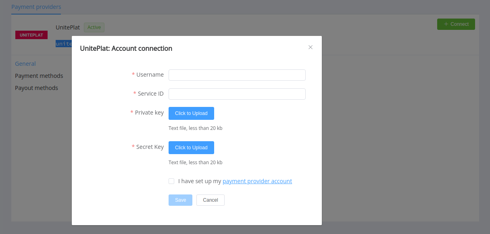

# UnitePlat


Follow the guidance for setting up a connection with UnitePlat as a payment service provider.

## Set Up Account

### Step 1: Contact UnitePlat support manager

Submit the required documents to verify your account and gain access.

### Step 2: Get credentials

Credentials that have to be issued:

- Username
- Service ID
- Secret key

You can generate an API key pair on your side and share the public key with your UnitePlat support manager.

!!! example "Example of key generating commands"

    ```
    openssl genrsa [-out secretfile] -des3 1024
    openssl rsa -in filename –pubout [-out publicfile]
    ```

!!! important
    Be sure to check with the manager if you require to provide a white list of IPs, and if so, specify IP addresses from the [Corefy list](/integration/ips/).

## Connect Provider Account

### Step 1. Connect account at the {{custom.company_name}} Dashboard

Press **Connect** at [*UnitePlat Provider Overview*]({{custom.dashboard_base_url}}connect-directory/payment-providers/uniteplat/general) page in *'New connection'* and choose **Provider account** option to open Connection form.



Enter credentials:

- Username
- Service ID
- Private key
- Secret key for private key

!!! success
    You have connected **UnitePlat** account!

!!! question "Still looking for help connecting your UnitePlat account?"
    <!--email_off-->[Please contact our support team!](mailto:{{custom.support_email}})<!--/email_off-->
