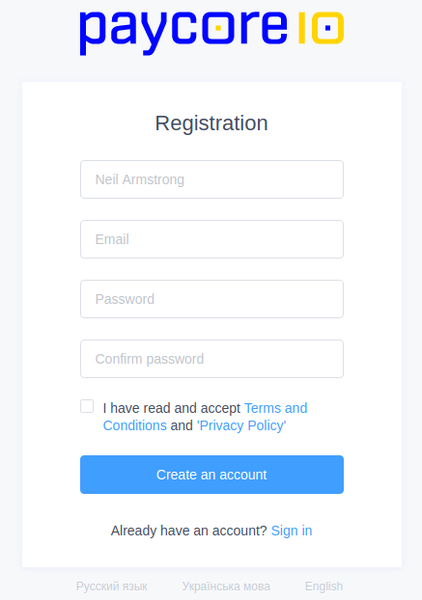
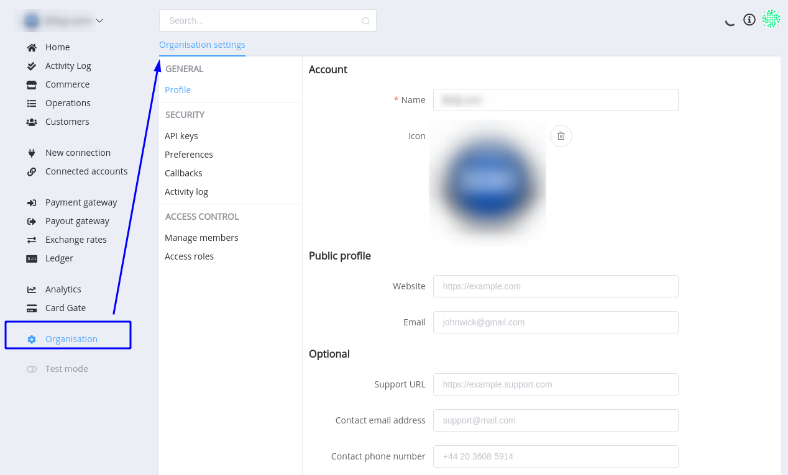
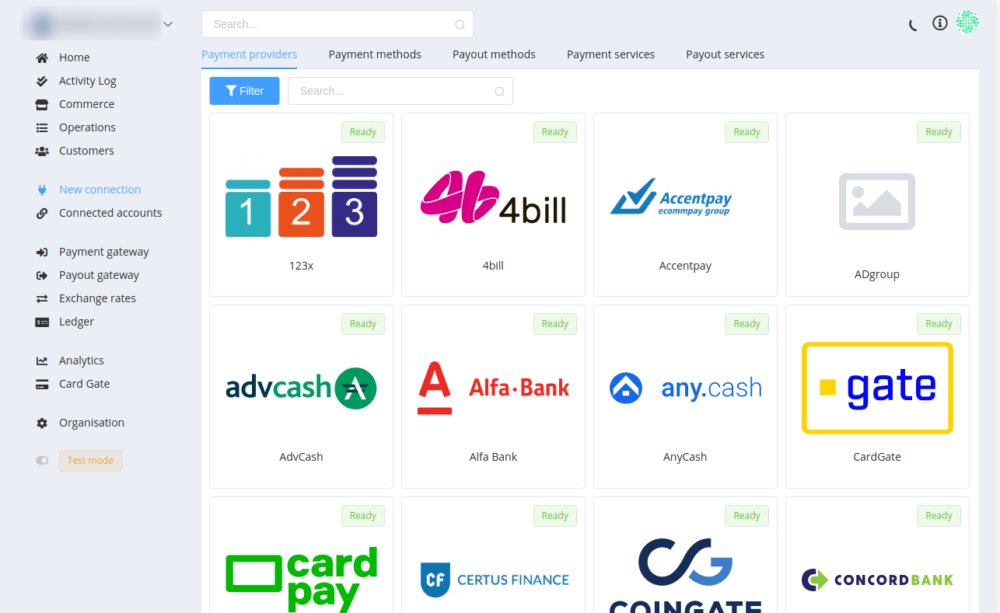
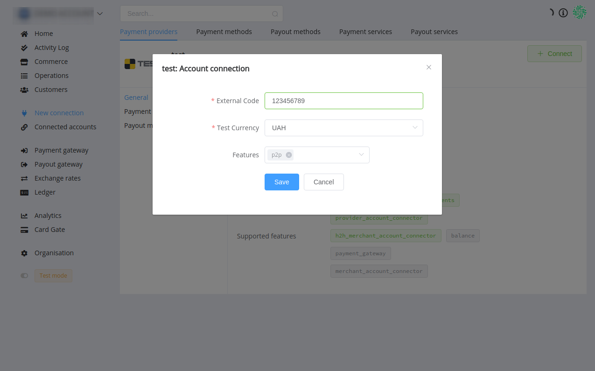
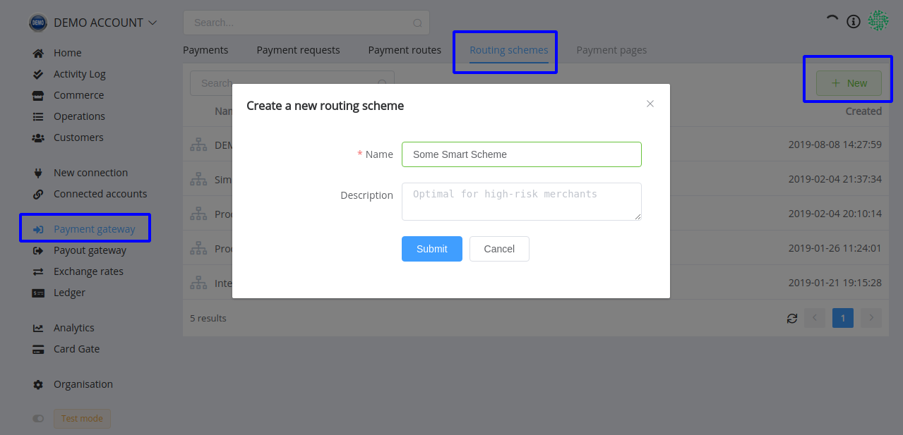
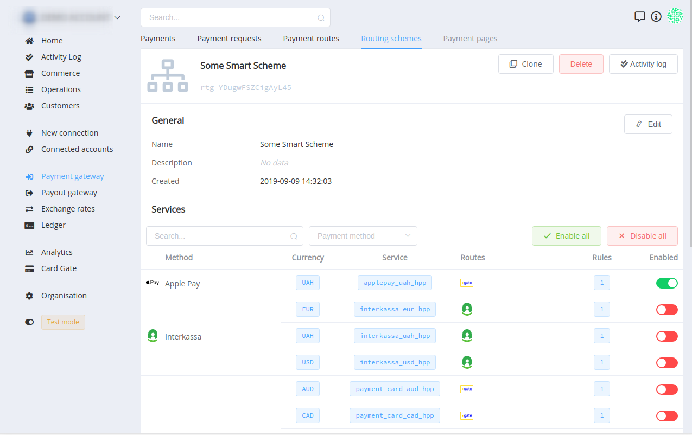
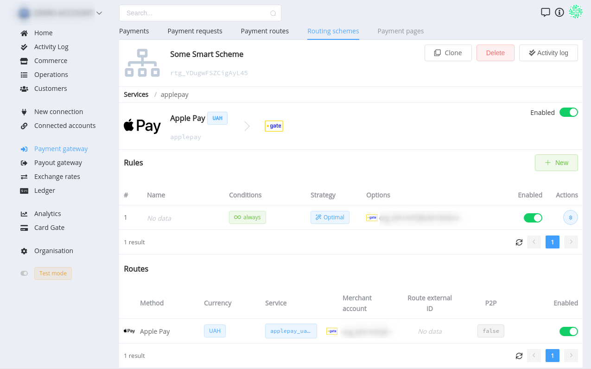
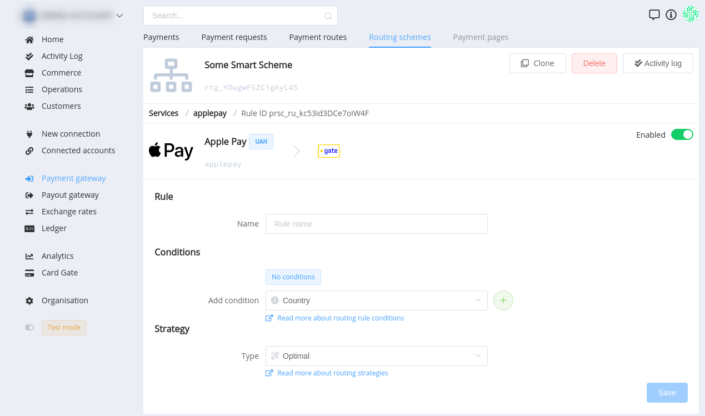
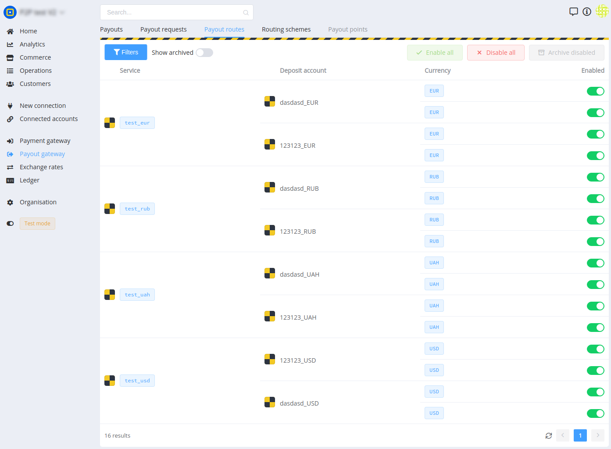
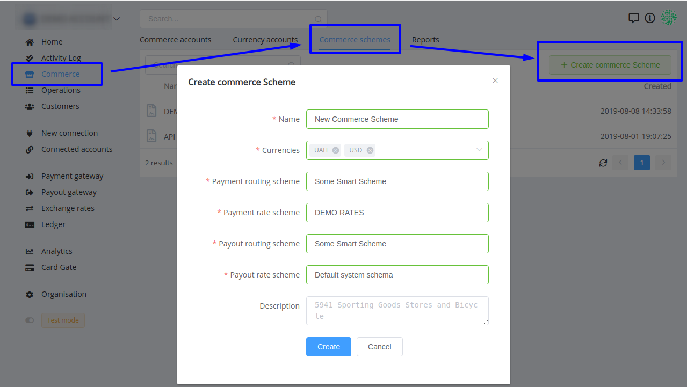

# Set up your account

## Intro

Before you start interacting with [{{custom.company_name}}](https://{{custom.company_name}}), you need to carry out a basic configuration and connect payment providers.

To get an account for the organisation just follow the steps below.

## Registration

Visit the [registration page]({{custom.dashboard_base_url}}register).

Enter an **email** address and **password**. A new account of the user and the linked organisation's account will be created automatically.

!!! note
    One user account can be a member of any number of organisations.

Click on the avatar in the top right corner and set up user profile and preferences for working with the platform.

Manage organisation settings in the Organisation section.

The first connected contact for the organisation is an **Owner** who serves as default primary contact and has all user permissions.

The next step after creating your account is to invite your team members to your organisation. A **Member** can access all **Commerce Accounts** within an **Organisation**.

Also, if you're an Account Owner, later you can transfer account ownership to any other user who has access to the account.

For more information, you can read the section [‘Account’]({{custom.dashboard_base_url}}organization/settings/access-roles).

## Connecting a payment provider

After successful registration, you need to connect your existing merchant accounts (MIDs) whether in the same or different payment providers to [{{custom.company_name}}](https://{{custom.company_name}}). You can connect any number of different merchant accounts to your [{{custom.company_name}} account]({{custom.dashboard_base_url}}commerce/accounts).

But before that, it is necessary to connect the first provider and create routing schemes for payments and payouts.  

The list of all available integrations can be found in the [Connectors](https://docs.paycore.io/connectors/).

To connect a **Payment Provider**, follow these steps:

1. Click on [New Connection]({{custom.dashboard_base_url}}connect-directory/payment-providers) section to access providers directory.
2. Select the desired provider and click on its logo. Payment providers, that are available for connection, are marked with `Ready` flag in the top right corner. Contact our [Customer Support](mailto:{{custom.support_email}}) if you don’t find a payment provider in the list of payment providers or integration is not yet implemented. We will do our best to deliver it right for you as soon as possible, generally under 7 business days.

3. Each connector has its unique properties and account credentials to connect. For more information please follow the steps of the accompanying [connection guide](https://docs.paycore.io/connectors/) for every provider to set up the connection properly. Once you set up everything, you must click **Save** to get online with the payment provider. To quickly test your integration with {{custom.company_name}}, you may connect a **Test Connector** in 2 clicks!

4. Immediately afterwards, {{custom.company_name}} will automatically check all available payment methods, payment and payout routes in supported currencies for your merchant account in the payment provider or acquirer. Now all is done!

## Creating routing schemes

After connecting to a payment provider, you need to set up **[Payment]({{custom.dashboard_base_url}}payment-gateway/payment-routes)** and **[Payout]({{custom.dashboard_base_url}}payment-gateway/payment-routes) Gateways**.

When you create a **routing scheme**, you need only to name it and all your connected payment methods will be automatically linked and enabled here. You can choose which of them you want to use in that scheme, set up routes and choose a strategy and conditions. Click on the right line to go to the level below ([Routing Scheme] &rarr; [Service] &rarr; [Rule] or [Route]).

??? info "Into the Details: Fee Optimizing"
    

    The used value of the fee is the sum of the *rate fee* (in percentage with two decimal places) and the *fixed fee* (in base currency). Also, it always lies within the *minimum* and *maximum* setpoints (in base currency).

    

    Depending on the commerce account's payment options, {{custom.company_name}} platform enables to use of 4 types of fee strategy: 

    * *Internal* strategy and *Direct* calculation:
        - Paid Amount = Input Amount;
        - Fee = Rate Fee × Input Amount + Fixed Fee;
        - Deposit Amount = Input Amount - Fee;
        - thus:
            
    * *Internal* strategy and *Reverse* calculation:
        - Deposit Amount = Input Amount;
        - Fee = Rate Fee × Paid Amount + Fixed Fee;
        - Paid Amount = Input Amount + Fee;
        - thus:
            

    * *External* Strategy and *Direct* calculation:
        - Deposit Amount = Input Amount;
        - Fee = Rate Fee × Input Amount + Fixed Fee;
        - Paid Amount = Input Amount + Fee;
        - thus:
            

    * *External* strategy and *Reverse* calculation:
        - Paid Amount = Input Amount;
        - Fee =  Rate Fee × Deposit Amount + Fixed Fee;
        - Deposit Amount = Input Amount - Fee;
        - thus: 
            
    
    where *Input Amount* — `amount` — initiated amount of the invoice;

    *Paid Amount* — `payment_amount` — value to be paid by the customer;

    *Deposit Amount* — `deposit` — amount to be charged to the account, always less than `payment_amount` by `fee`;

    *Fee* — `fee` — current fee amount (don't forget that its value lies within the minimum and maximum setpoints).

    Any set of options can be chosen as the preferred, at your discretion.

    [Check the fee calculation at Google Spreadsheets -->](https://docs.google.com/spreadsheets/d/1yvQ3kdyuB7S0DbDgqBgdXq_F_YYHDt-qeAtOo7B9kk8/edit#gid=1939885920)

**Payout schemes** are created in the same way as **Payment schemes**.

[{{custom.company_name}}](https://{{custom.company_name}}) has a **Test Mode** you should use for testing. It operates separately from live mode, so you can make changes without affecting your live data. You should use the same accounts in test and live modes when testing your integration. It makes testing more consistent across the two modes, and you don't have to maintain as many accounts.

Whether a transaction was created in the test or live mode is dictated by which API keys. ***Keep in mind*** that in Test Mode only test routes will be available.

## Connecting a commerce account

After setting up at least one payment scheme and at least one payout scheme, you can create a **Commerce scheme** to link them for commerce accounts. You also can create an [exchange rate scheme]({{custom.dashboard_base_url}}fx-rates/schemes) beforehand or use the default system scheme instead.

You can always change the Commerce scheme for a Commerce account if you wish.

A **Commerce Account** is used by the organisation to account all websites, projects, stores, storefronts, business accounts, points of sale, etc. You can set individual rules for each Commerce Account, processing transactions and payment services available in it.

To create a new [Commerce Account]({{custom.dashboard_base_url}}commerce/accounts), it is enough to simply indicate its name, the Commerce scheme used and the base currencies available for it. If you are a Business plan user, you can additionally enable a Ledger scheme for better understanding and monitoring the flow of funds.

Congratulations! Your account is set up and ready to go!

When the account is set, we offer to carry out the first operations to [receive payments and payouts](/getting-started/first-payment/).