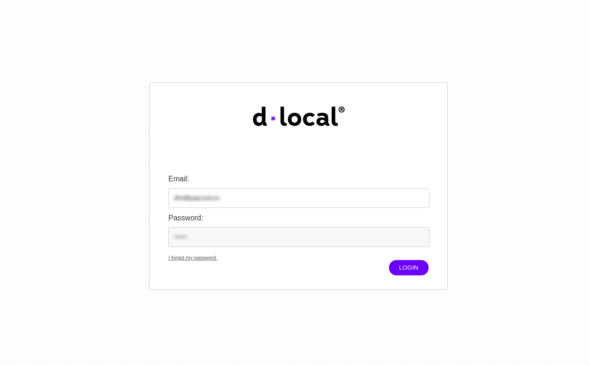
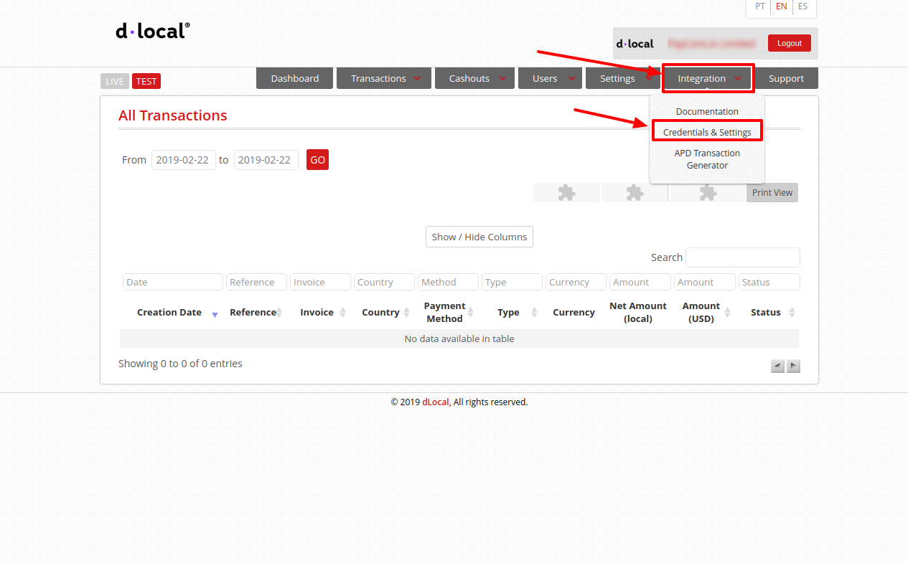

# dLocal: Connecting account

## Introduction

Here You can find  instructions for setting up **dLocal**  account.

## Setup account

#### Step 1: Contact with dLocal Support Manager

!!! note
    You can not create dLocal merchant account yourself! 
    
!!! tip    
    Ask Support manager how to get login details!


#### Step 2: Log in to the dashboard
??? info "Screenshot"
    [](images/dLocal__login.png)
#### Step 3: Go to the Integration:Credentials&Settings section

??? info "Screenshot"
    [](images/dLocal__settings.png)

#### Step 4: Get required credentials

!!! info
    Notem that  there are  **```TEST```** and **```LIVE```** mode.
    Ensure that you turn on the rught one.
    
    ??? info "Screenshot"
        [](images/dLocal__testmode.png)


- **Test (Live) Credentials**:

    - [x] x_login

    - [x] x_trans_key

    - [x] Secret Key


- **Cashout credentials:**

    - [x] Cashout secret key

??? info "Screenshot"
    [](images/dLocal__cred.png)

#### Step 5: Set up required parameters

- Add all necessary IP adressess to the White list, including  [PayСore.io white-list IP addresses](/ips/#white-list-ip-addresses)
    
??? info "Screenshot"
    [](images/dLocal__ips.png)

!!! success
    You have configured account!


## Connect account

#### Step 1: Copy required credentials
- [x] x_login

- [x] x_trans_key

- [x] Secret Key

- [x] Cashout secret key

#### Step 2: Enter credentials


!!! tip
    Press **```Connect```** at dLocal **```Provider Overview page```** in **```New connection```** section to open Connection form!


!!! tip
    **Don't forget to Save changes to confirm connection!**

??? info "Screenshot"
    [](images/dLocal-step_connect.png)


!!! success
    You have connected **dLocal**!