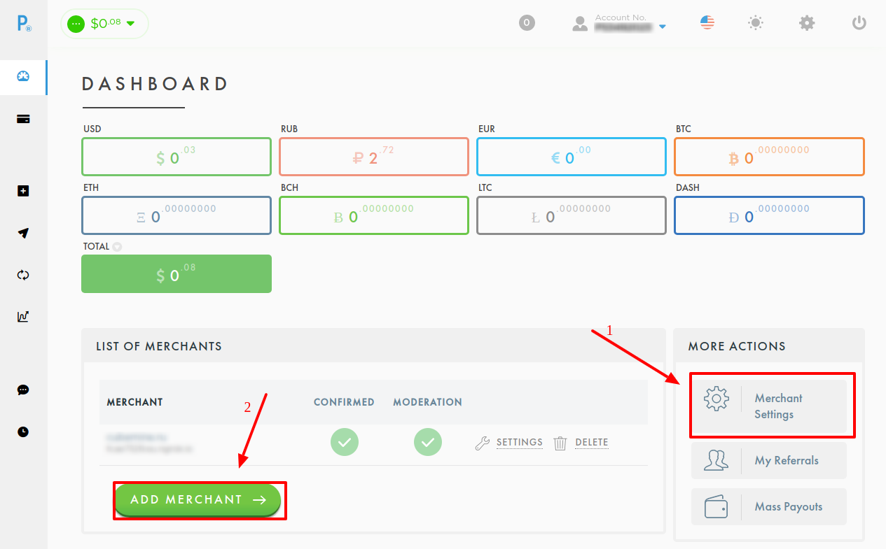
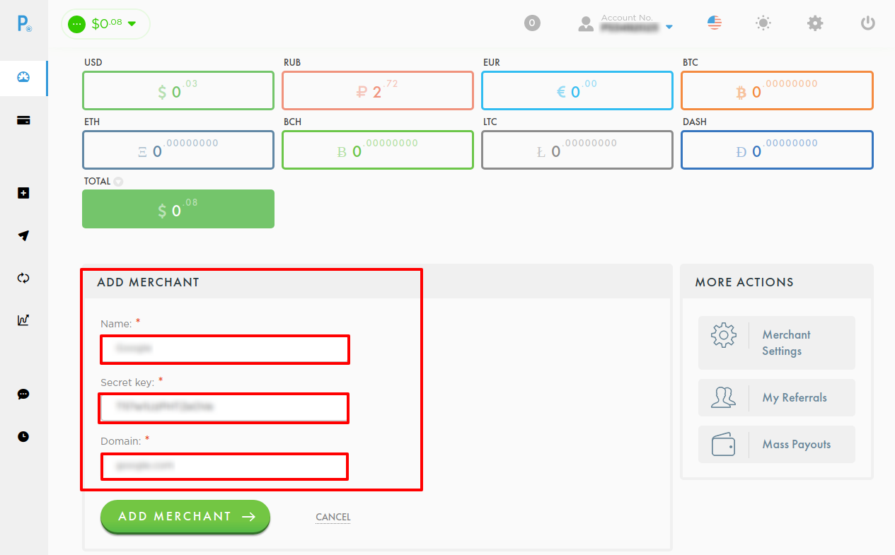
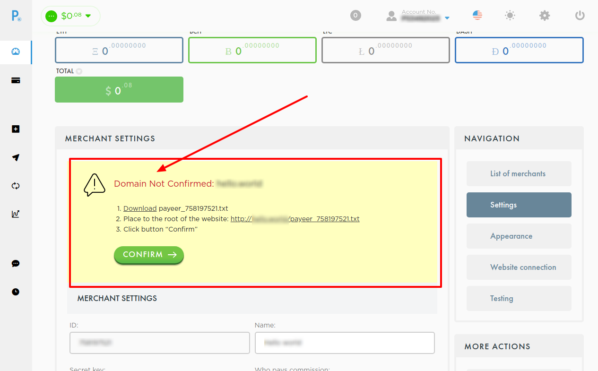
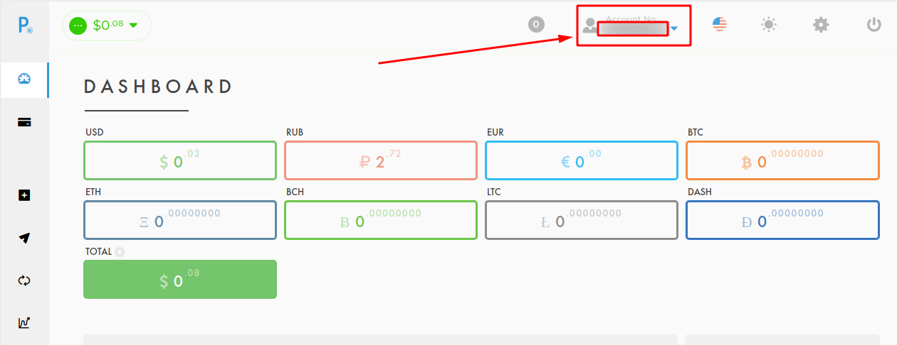
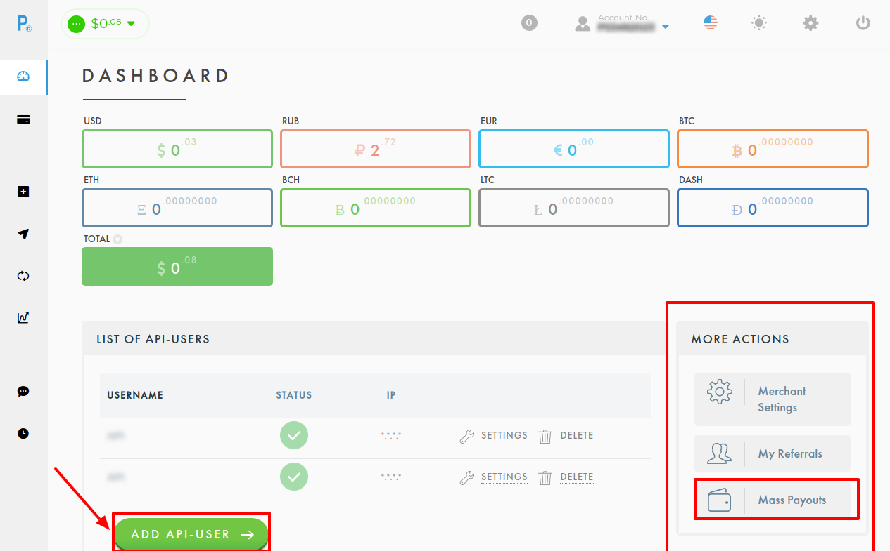
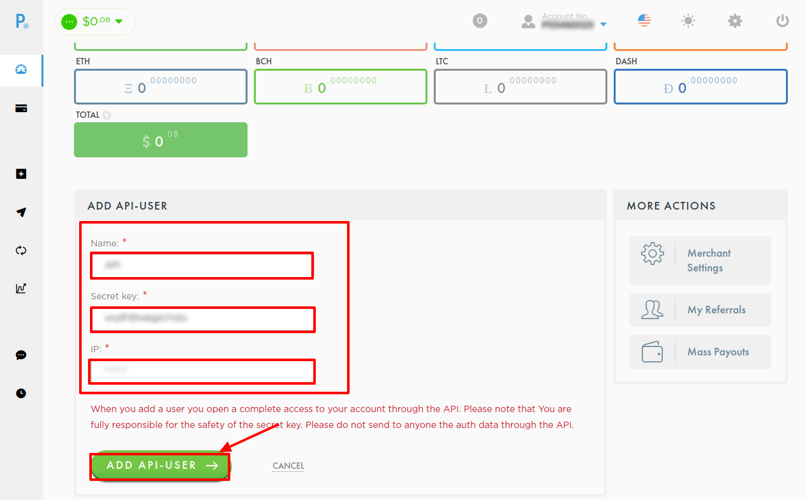

# Payeer: Connecting account

## Introduction

Here You can find  instructions for setting up <a href="https://payeer.com/en/account/" target="_blank" rel="noopener"> **Payeer**  account</a>.

## Setup account

### Step 1: Create Merchant

1. Go to the Merchant Settings
2. Press **Add merchant**
3. Set required parameters:
    - **Merchant Name**
    - **Secret key**
        
        !!! info
            Copy this parameter, whereas **this will be unavailable** henceforth!
    
    - **Domen name**: set your merchant  domen name

??? info "Screenshots"
    [](images/merchant_create_1.png)
    
    [](images/merchant_create_2.png)

### Step 2: Configure Merchant

1. Go to the created Merchant
    
    ??? info
         As default system redirects user to the Merchant configuration page automaticaly. 

2. Verify domen
    
    ??? info "Domen verification"
        [](images/merchant_verify.png)

3. Set configuration properties: 

    - **```Encryption key```**
        
        !!! tip
            It shoud consists of 32 symbols. You may generate it using any service You want.

        !!! info
            Copy this key before confirming changes, whereas **this will be unavailable** henceforth!

    - **```Success URL```**, **```Fail URL```**, **```Status URL```** : Set your URLs
        
        !!! info
            PayCore.io<sup>®</sup> will overwrite this properties in request. 

    - other properties are set at your choice

    ??? info "Screenshot"
        [](images/merchant_configure.png)

### Step 3: Get Merchant credentials

- [x] Account No.

    ??? info "Screenshot"
        [](images/account_no.png)

- [x] Merchant ID

    !!! tip
        It is located at Merchant configuration page!

- [x] Merchant Secret key
- [x] Encryption key

### Step 4: Create API User

1. Go to the Mass Payouts section
2. Press **Add API User** button
3. Set required parameters:
    - Name
    - Secret key
       
        !!! info
            Copy this parameter, whereas **this will be unavailable** henceforth!

    - IP: Add all necessary IP adressess to the White list, including  [PayСore.io white-list IP addresses](/ips/#white-list-ip-addresses)
    
        !!! tip
            IP list should contains IP adresses separated with **```;```**.

            **_For example_**: _54.36.117.30; 51.38.147.254; 54.38.139.222_

!!! note
    Note, that API User configuration can be modified at API User configuration page!


??? info "Screenshots"
    [](images/api_create_1.png)
    
    [](images/api_create_2.png)

    
### Step 5: Get API User credentials

- [x] API User ID

    !!! tip
        It is located at API User configuration page!

- [x] API User Secret key


!!! success
    You have configured account!


## Connect account

#### Step 1: Copy required credentials

- [x] Account No.
- [x] Merchant ID
- [x] Merchant Secret key
- [x] Encryption key
- [x] API User ID
- [x] API User Secret key


#### Step 2: Enter credentials


!!! tip
    Press **```Connect```** at Payeer **```Provider Overview page```** in **```New connection```** section to open Connection form!

!!! tip
    **Don't forget to Save changes to confirm connection!**

??? info "Screenshot"
    [](images/payeer-step_connect.png)


!!! success
    You have connected **Payeer**!