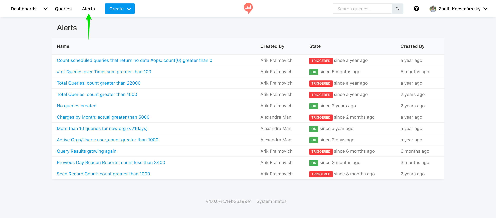
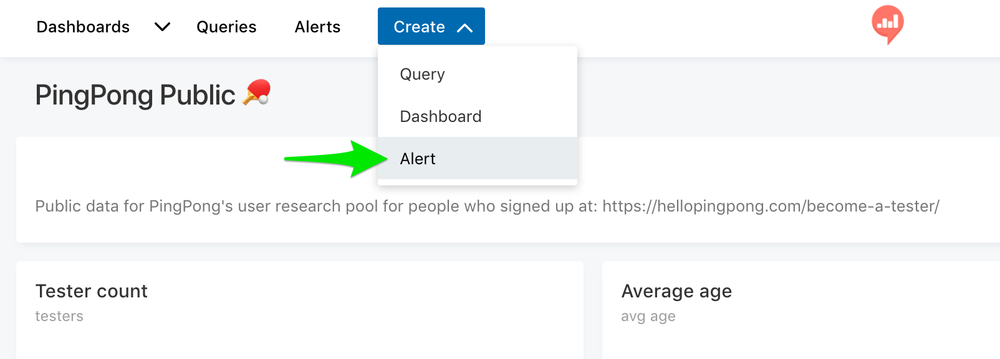
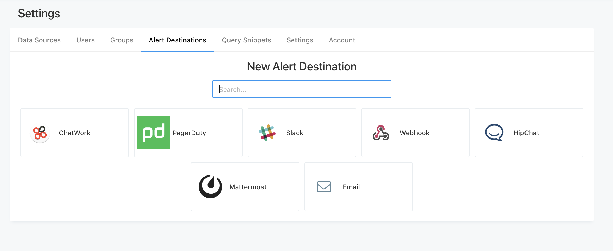
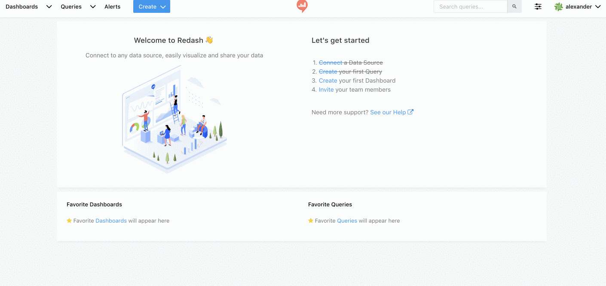

# Managing Alerts

In the Alerts view, you'll see all existing alerts.



To set up a new alert you'll need to follow these steps:

0.  First, go to Create > Alert
1.  Select the query you want to trigger an alert for (just start typing). Note that queries with parameters won't work.
2.  Select the column you want to watch.
3.  Select the trigger type (greater/less than or equals to).
4.  Select your magic number:
5.  Leave Rearm Seconds empty to get 1 alert when the status changes from Triggered to OK, enter a number to get an alert every time the query runs (by schedule) + the Rearm seconds value.
6.  Save.
7.  Define alert destinations - email is supported.


## Alert Status & Frequency

The Alert Status is checked every time the query is executed - (alerts only work with scheduled queries).

Alerts have 3 Status Types:

-   `TRIGGERED`  - the value you set the alert for is triggered (if you set your alert to trigger when the value of "cats" is greater than 1500 as long as it's above 1500 your alert is triggered)
-   `OK`  - the value you have set to trigger the alert is not reached for now (might happen after the alert was triggered or before it was ever triggered, if your "cats" value is now 1470 your alert will show as OK)
-   `UNKNOWN`  - you should see this status once you have set your alert and it wasn't yet checked. To make your alert in the know, run the query it is linked to after setting the alert.

### Get an Alert Upon Status Change

If you leave the REARM value empty alerts will only be sent when the status changes (from OK to Triggered or vice versa).

#### Get an Alert Everytime the Query Runs

To get an alert every time the query runs, set the REARM value - the value is for seconds that pass since the system detects a change until it sends the alert, a 1-minute "delay" would require entering '60' in the REARM field.

## Alert Destinations

PayCore.Analytics supports a vast amount of Alert Destinations. The latest list includes: Email, HipChat, Mattermost, PagerDuty, WebHook, Slack, ChatWork.



Prior to sending alerts to one of the above destinations, there is a need to define and configure them.

Adding Alert Destination

1.  Click on the Settings menu (top right corner)
    
2.  Select "Alert Destinations" tab.
    
3.  Click on "+ New Alert Destination"
    
4.  Choose the destination type you wish and configure it.
    



Only users with admin rights can create new destinations, but any user can use them in their alerts once created.

## Multiple Column Alert
  
There's an indirect way to set an Alert based on multiple columns of a query:

Your query can implement the alert logic and return a boolean value for the Alert to trigger on. Something like:

```sql
SELECT CASE WHEN drafts_count > 10000 AND archived_count > 5000 THEN 1 ELSE 0 END
FROM (
SELECT sum(CASE WHEN is_archived THEN 1 ELSE 0 END) AS archived_count,
sum(CASE WHEN is_draft THEN 1 ELSE 0 END) AS drafts_count
FROM queries) data

```

This query will return 1 when `drafts_count > 10000` and `archived_count > 5000`. Then you can configure the alert to trigger when the value is 1.