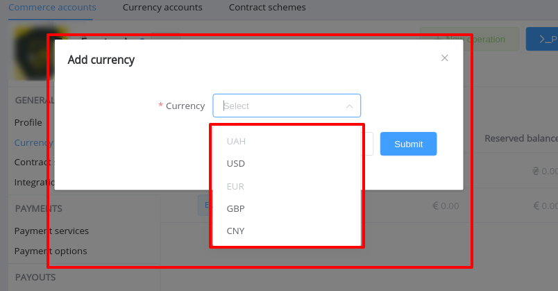
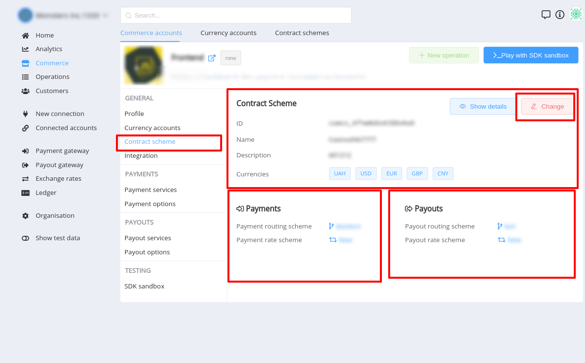
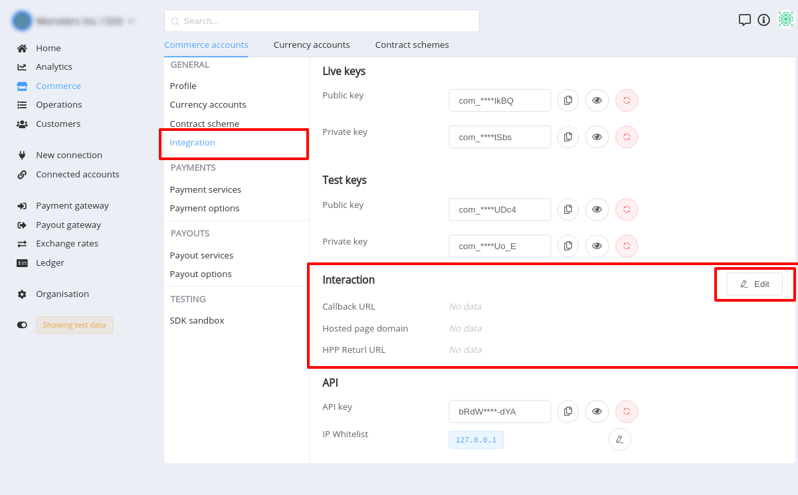
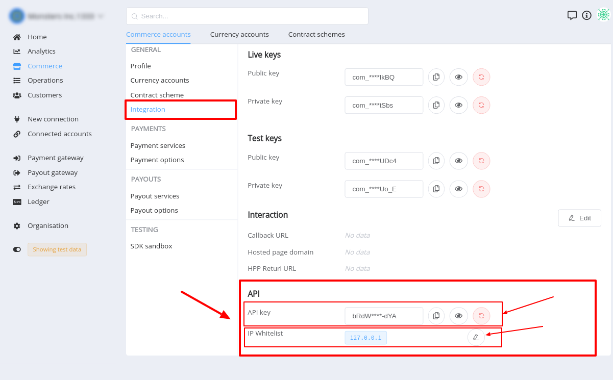

# Commerce Account

## Status

Commerce account status determines its current state. Accordingly, a set of available actions is determined!

### Account status list

Below is a list of statuses and it's descriptions:

<table>
<tr><th><b>Code</b></th><th><b>Description</b></th></tr>

<tr><td style="background-color:#c5c5c5; font-weight:bold;">new</td><td>Account was recently created. Business functionality (operations creating) is unavailable</td></tr>
<tr><td style="background-color:#67c23a; font-weight:bold;">active</td><td> All functionality is available. No additional moderation is required</td></tr>
<tr><td style="background-color:#f56c6c; font-weight:bold;">inactive</td><td>Account was deactivated by administrator. All functionality (including the access to the merchant dashboard) is unavailable</td></tr>
<tr><td style="background-color:#e6a23c; font-weight:bold;">moderation_requested</td><td>Merchant requested moderation of account. Business functionality (operations creating) is unavailable</td></tr>
<tr><td style="background-color:#e6a23c; font-weight:bold;">moderation_pending</td><td>Account moderation is in progress. Business functionality (operations creating) is unavailable</td></tr>
<tr><td style="background-color:#c5c5c5; font-weight:bold;">archived</td><td>Account was deleted (archived) by administrator. All functionality (including the access to the merchant dashboard) is unavailable</td></tr>

</table>

## General

This entity includes the next sections:

- Accounts list
- Account settings
- Account creating 

(**—>>> UPGRADE**)

## List

Commerce accounts list includes information on merchant  name and logo, contract scheme, creation date and time etc.

There is the functionality to filter list and [create a new](#creating) account.

!!! info "Screenshot"
    

## Settings

Commerce account settings is intended to configure payment and payout gateways for Organisation's  merchants.

All settings are devided into few groups:

- General: 
    - Profile:
    - Currency accounts
    - Contract scheme
    - Integration
- Payments
    - Options
    - Services
- Payouts
    - Options
    - Services
- Testing

### General:

#### Profile

This section is intended for setting (changing) account name, description, logo, status, website etc.

!!! info "Screenshots"
    

    

#### Currency accounts
    

This page includes the list [currency accounts](/products/commerce/currency-account/overview/) related to certain Commerce Account.
There is an ability to add new or remove unnecessary currencies.

A set of available currencies is limited by a [contract scheme](/products/commerce/contract-scheme/overview/) properties

!!! info "Screenshots"
    

    

- If certain currency was added previously ­— it would be disabled in **`Add currency`** selector list.
- If **All** currencies within assigned contract scheme are added, **`Add currency`** button is **`DISABLED`**!

#### Contract scheme

This page displays the contract scheme assigned to certain account. 

It also includes links on the related  Payment and Payout Rate and Routing schemes

There is an ability to **`change`** current contract scheme.

!!! danger
    Changing of the contract scheme is dangerous.
    
    This will affect the further functionality of the account!

!!! info "Screenshot"
    

    
#### Integration

This section contains settings, which determine the external interaction with commerce account.

**KEYS:**

Keys subsection relates to [Commerce Public API](https://swagger-dev.paycore.io/commerce-public/#/). 

 
**`Public`** Keys are used to: 

- initiate pre-requests,

    !!! info
        Pre-request is intended for getting a set of available services (both Payment and Payout) for Invoice initiating 

- to initiate Payment invoice,

    !!! note
        Payout Invoice can be initiated only via **`API key`**

- **`get`** Payment Invoices and Payout Invoice by ID

**`Private`** Keys are used to check the callback's signature.

!!! info "Screenshot"
    

**INTERACTION:**

This subsection contains:

- Callback URL: this property is used as default for Payment and Payout invoices. 

    !!! note
        Although, it is possible to resend callback of certain operation to another URL.

        This is available only via Dashboard (not available via API) in **`Callbacks`** section of Operation Overview page

- Hosted page domain: this property determines at what domain certain commerce account keys can be used.
- HPP Return URL

!!! info "Screenshots"
    

    

**API:**

API key relates to [Commerce Private API](https://swagger-dev.paycore.io/commerce/#/).

!!! info
    To authorize the connection **`basic auth`** is used.
    It is generated in the next way: `basic_auth = id + key`

This key is used to authorize:

- access to the Commerce Private API endpoints
- initiating of Payout Invoice 

!!! info "Screenshots"
    

### Payments

#### Services

This page contains a list of available Payment services (within assigned contract scheme) with information on amount limits, set fee (min-max, rate, fix)

!!! info "Screenshot"
    

#### Options

##### Public Access

- Public Zero-Fee badge
- Public fee details
- Allow public creation (Public Creation)

##### Fee

- Fee strategy
- Include fee

##### Processing

- Lifetime
- Attempts
- Expose internal callback data
- Descriptor

### Payouts

#### Services

This page contains a list of available Payout services (within assigned contract scheme) with information on amount limits, set fee (min-max, rate, fix)

!!! info "Screenshot"
    

#### Options

##### Public Access

- Public Zero-Fee badge
- Public fee details

##### Fee

- Fee strategy
- Include fee

##### Processing
- Parallel mode
- Split mode
- Allow partially
- Moderation required
- Lifetime
- Attempts
- Expose internal callback data
- Descriptor

### Testing

## Creating

## Currency account operations

Comerce operations are devided into 2 groups : Low- and High-level.

Low-level:

!!! info 
    Commerce Low-level operations relates to the **`ledger`** and  are direct operations with balances!

- Deposit — direct replenishment of the currency account
- Withdrawal
- Transfer — operation between two **`currency accounts`**of the same currency and different **`commerce accounts`** (within certain organisation)

!!! note
    To use these operations **`Ledger scheme`** of the certain commerce account must be **`simple`**. 
    
    If it is **`none`** — currency account balances and ledger will be **unavailable**.

    This property is set on the commerce account creation step. 

High-level:

- Payment invoice
- Payout invoice

### Operation Workflow Status
An Operation Status represents it's current state. This property is displayed in the Operation Overview section within the Dashboard. 

Workflow statuses has two  properties: 

- Final
    - Final: means that the operation processing is finished and requires no further processing.
    - Non-final: intermediate states of the workflow and there may be further status updates

- Slepping state

Payment process may also be in the **`sleeping`** state.

These status properties are displayed in the Status Table for each operation type.