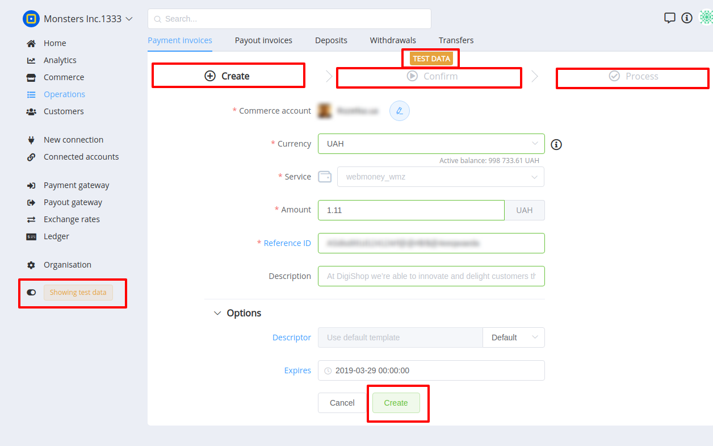

# Payment Invoice: Usage

Payment Invoice is located in Operations section. This entity includes **List**, **Overview** and **Creating** screens.

## List

This screen contains an enumeration of transactions with main properties, such as Commerce account, Payment Method, Amount, Currency, Current status, Resolution, Created time.

It also contains filters and search features to facilitate use.

!!! info "Payment Invoice Overview"
    [](images/payment_invoice_list.png)

## Creating

This action consists of 3 stages:
- Create : this stage requires the setting of Invoice proerties and parameters
- Confirm : this stage is intended to get user ensured that all data is correct 
- Process : contains processing data 

!!! info "Payment Invoice Creating"
    [](images/invoice_creating.png)

## Overview

Overview page is intended to display detailed info about:

- Operation states
- Amounts
- Service, Method, Provider
- Related entities etc. 

!!! info "Payment Invoice Overview"
    [](images/payment_invoice_overview.png)


## Configuration


To configure the payment invoice **```lifetime```** or **```attempts limit```**:

1. Navigate to the <a href =https://dashboard.paycore.io/commerce/accounts/" target="_blank" rel="noopener">Commerce accounts</a>
2. Go to the Setting of neccessary one
3. Find **Payment Options** section
4. Set property value

!!! info "Payment Options"
    [](images/payment_options1.png)

!!! tip
    Do not forget to Save changes!

### Payment options table

<table >
<tr><th><b>Option</b></th><th><b>Description</b></th></tr>

<tr><td style="font-weight:bold;">Allow public creation</td><td>Allow payment creation through the Public API. Used to create payments through HPP.</td></tr>
<tr><td style="font-weight:bold;">Public Zero-Fee badge</td><td>Wheather to give a sign "without commission" for each service through the Public API.</td></tr>
<tr><td style="font-weight:bold;">Public fee details</td><td>Wheather to give detailed commission values for each service through the Public API.</td></tr>
<tr><td style="font-weight:bold;">Include commission</td><td>Put the commission in the payment amount and calculate it from the amount of the write-off</td></tr>
<tr><td style="font-weight:bold;">Expose internal callback data</td><td>Expose internal callback data</td></tr>
<tr><td style="font-weight:bold;">Invoice lifetime</td><td>Set operation expiration time based on creation. Expires = created + lifetime</td></tr>
<tr><td style="font-weight:bold;">Attempts limit</td><td>How many times processor will try to create new operation based on failed status</td></tr>
<tr><td style="font-weight:bold;">Descriptor template</td><td>Operation descriptor generation template for processing provider</td></tr>