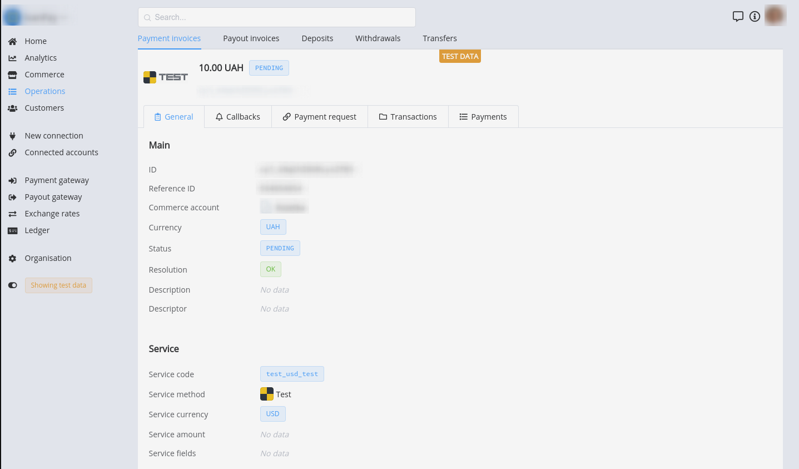

# Payment Invoice

## General

There are three types of **incoming** transactions that occur in PayCore.io:

- Payment 

    > A **Payment** is a low-level operation that initiates a financial transaction in the defined payment provider using the specified payment method, it simply provides communication with an external provider and the mapping of statuses.

- Request

    > A **Payment Request** is an operation with rich functionality that initiates one or many payments depending on the conditions set in the routing and exchange rate schemes.

- Invoice

    > A **Payment Invoice** is a high-level operation that initiates accompanying Payment Request and Ledger account transactions.

The Payment Invoice includes information on the **_`amount`_**, **_`currency`_**, **_`service`_**, **_`commission`_**, **_`exchange rate`_** and other properties. 

!!! info
    The full list of properties can be found in the [ API Reference <i class="md-icon">launch</i> ](http://apidoc.paycore.io/).

## Flow

!!! info "Payment Invoice Flow"
    

## Status list

Below is a list of statuses and it's descriptions:

|Code|Final|Description|
|--- |--- |--- |
|created|No|Initial status after a Payment Invoice is created, processing has not started.  If PayCore.io will not return response 201 (Created) HTTP status code on your request, you should consider that the payment invoice was failed to be created|
|expired|Yes|Means the Payment Invoice hit the lifetime limit (configurable in the 'Invoice lifetime' property) without being successfully processed, but also did not either cancelled or terminated, e.g. your customer has abandoned the payment|
|terminated|Yes|Means that the payment process was terminated by a payer prior to the payment invoice lifetime limit|
|processing|No|Signifies that the payment invoice is processing by PayCore.io but its processing is not finished and there will be further status updates|
|process_pending|No|Means that the result of the payment process still being unknown and may not be known for an extended period of time|
|processed|No|Confirms the payment has been processed successfully.  This isn't a final status since the payment can be refunded for different reasons|
|partially_processed|No|Means that the amount paid is less than the payment invoice amount and that amount is successfully processed, e.g. your customer has entered an amount less than the invoice amount while making an online payment|
|process_error|No||
|process_failed|Yes|Signifies that the Payment Invoice processing has failed, may be set when an error occurs and the corresponding payment request has failed.  This status is considered final due to the maximum number of attempts has been reached (default – 5 attempts)|
|refunding|No|Means the payment invoice is refunding and the result of the payment invoice refunding still being unknown|
|refund_pending|No|Means that the result of the payment refunding still being unknown and may not be known for an extended period of time|
|partially_refunded|Yes|Means that the amount refunded is less than the payment invoice amount and that amount is successfully refunded.|
|refunded|Yes|Means the payment invoice is successfully refunded in full|
|refund_error|No||
|refund_failed|Yes|Means that the payment invoice refunding has been failed or cannot be completed|

## Payment Invoice: Guide

Payment Invoice is located in Operations section. This entity includes **List**, **Overview** and **Creating** screens.

### List

This screen contains an enumeration of transactions with main properties, such as Commerce account, Payment Method, Amount, Currency, Current status, Resolution, Created time.

It also contains filters and search features to facilitate use.

!!! info "Payment Invoice Overview"
    

### Creating

This action consists of 3 stages:
- Create : this stage requires the setting of Invoice proerties and parameters
- Confirm : this stage is intended to get user ensured that all data is correct 
- Process : contains processing data 

!!! info "Payment Invoice Creating"
    

### Overview

Overview page is intended to display detailed info about:

- Operation states
- Amounts
- Service, Method, Provider
- Related entities etc. 

!!! info "Payment Invoice Overview"
    

### Configuration

To configure the payment invoice **`lifetime`** or **`attempts limit`**:

1. Navigate to the [Commerce accounts](https://dashboard.paycore.io/commerce/accounts/)
2. Go to the Setting of neccessary one
3. Find **Payment Options** section
4. Set property value

!!! info "Payment Options"
    

!!! tip
    Do not forget to Save changes!

### Payment options table

|Option|Description|
|--- |--- |
|Allow public creation|Allow payment creation through the Public API. Used to create payments through HPP.|
|Public Zero-Fee badge|Wheather to give a sign "without commission" for each service through the Public API.|
|Public fee details|Wheather to give detailed commission values for each service through the Public API.|
|Include commission|Put the commission in the payment amount and calculate it from the amount of the write-off|
|Expose internal callback data|Expose internal callback data|
|Invoice lifetime|Set operation expiration time based on creation. Expires = created + lifetime|
|Attempts limit|How many times processor will try to create new operation based on failed status|
|Descriptor template|Operation descriptor generation template for processing provider|
