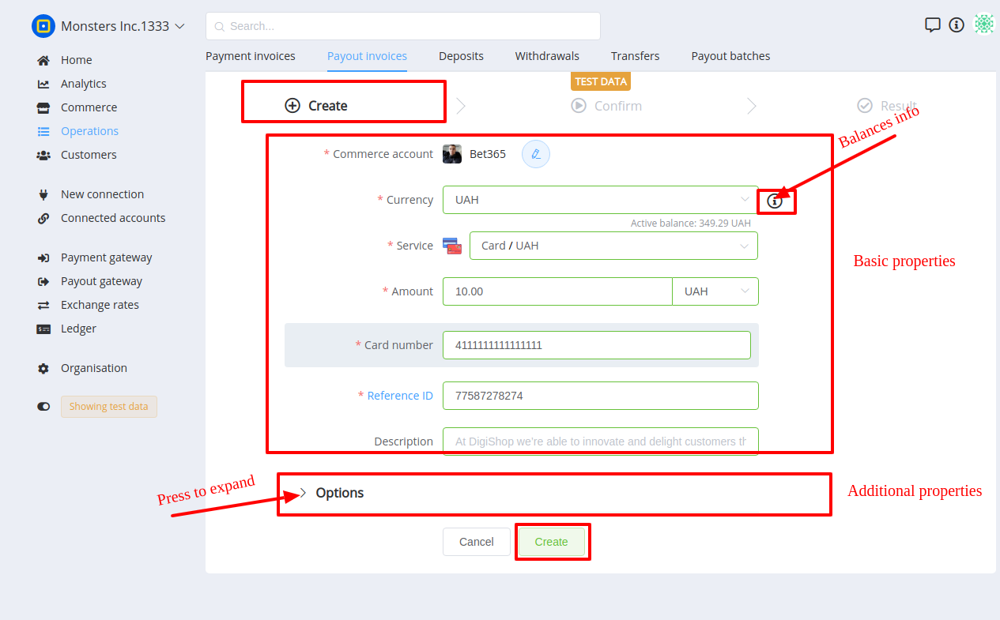

# Payout Invoice

## General

There are three types of **outgoing** transactions that occur in PayCore.io:

- Payout 

    > A **Payout** is a low-level operation that initiates a financial transaction in the defined payment provider using the specified payout method, it simply provides communication with an external provider and the mapping of statuses. Payout refers to the financial return or monetary disbursement of investment or annuity.

- Request

    > A **Payout Request** is an operation with rich functionality that initiates one or many payouts depending on the conditions set in the routing and exchange rate schemes.

- Invoice

    > A **Payout Invoice** is a high-level operation that initiates accompanying Payout Request and Ledger account transactions.


The Payout Invoice includes information on the **_```amount```_**, **_```currency```_**, **_```service```_**, **_```commission```_**, **_```exchange rate```_** and other properties. 

In contradistinction to Payment Invoice — Payout Invoice has **```AUTOPROCESS```** property.
It means that this type of commerce operations can be processed as **automaticaly** as **manualy**.

!!! info
    The full list of properties can be found in the <a href="http://apidoc.paycore.io/" target="_blank" rel="noopener"> API Reference <i class="md-icon">launch</i> </a>.

## Flow

!!! info "Payout Invoice Flow"
    [](images/payout_invoice_flow.png)

## Status list

Below is a list of statuses and it's descriptions:
<table>
<tr ><th><b>Code</b></th><th><b>Final</b></th><th><b>Sleeping State</b></th><th><b>Description</b></th></tr>

<tr><td>created</td><td>No</td><td>No</td><td>Initial status after a Payout Invoice is created, processing has not started. <br> If PayCore.io will not return response 201 (Created) HTTP status code on your request, you should consider that the payout invoice was failed to be created</td></tr>
<tr style="background-color:#ff8787"><td>expired</td><td><b>Yes</b></td><td>No</td><td>Means the Payout Invoice hit the lifetime limit (configurable in the 'Invoice lifetime' property) without being successfully processed, but also did not either cancelled or terminated, e.g. your customer has abandoned the payout</td></tr>
<tr style="background-color:#ff8787"><td>terminated</td><td><b>Yes</b></td><td>No</td><td>Means that the payout process was terminated by a payer prior to the payout invoice lifetime limit</td></tr>
<tr><td>processing</td><td>No</td><td><b>Yes</b></td><td>Signifies that the payout invoice is processing by PayCore.io but its processing is not finished and there will be further status updates</td></tr>
<tr><td>process_pending</td><td>No</td><td><b>Yes</b></td><td>Means that the result of the payout process still being unknown and may not be known for an extended period of time</td></tr>
<tr style="background-color:#79f99b"><td>processed</td><td>No</td><td>No</td><td>Confirms the payout has been processed successfully. <br> This isn't a final status since the payout can be refunded for different reasons</td></tr>
<tr style="background-color:#79f99b"><td>partially_processed</td><td>No</td><td>No</td><td>Means that the amount paid is less than the payout invoice amount and that amount is successfully processed, e.g. your customer has entered an amount less than the invoice amount while making an online payout</td></tr>
<tr style="background-color:#ff8787"><td>process_failed</td><td><b>Yes</b></td><td>No</td><td>Signifies that the Payout Invoice processing has failed, may be set when an error occurs and the corresponding payout request has failed. <br> This status is considered final due to the maximum number of attempts has been reached (default – 5 attempts)</td></tr>
<tr><td>refunding</td><td>No</td><td><b>Yes</b></td><td> Means the payout invoice is refunding and the result of the payout invoice refunding still being unknown</td></tr>
<tr><td>refund_pending</td><td>No</td><td><b>Yes</b></td><td> Means that the result of the payout refunding still being unknown and may not be known for an extended period of time</td></tr>
<tr style="background-color:#79f99b"><td>partially_refunded</td><td><b>Yes</b></td><td>No</td><td>Means that the amount refunded is less than the payout invoice amount and that amount is successfully refunded.</td></tr>
<tr style="background-color:#79f99b"><td>refunded</td><td><b>Yes</b></td><td>No</td><td>Means the payout invoice is successfully refunded in full</td></tr>
<tr style="background-color:#ff8787"><td>refund_failed</td><td><b>Yes</b></td><td>No</td><td>Means that the payout invoice refunding has been failed or cannot be completed</td></tr>


</table>

## Guide

Payout Invoice is located in Operations section. This entity includes **List**, **Overview** and **Creating** screens.

### List

This screen contains an enumeration of transactions with main properties, such as Commerce account, Payout Method, Amount, Currency, Current status, Resolution, Created time.

It also contains filters and search features to facilitate use.

!!! info "Payout Invoice Overview"
    [](images/payout_invoice_list.png)

### Creating

This action consists of 3 stages:

- Create : this stage requires the setting of Invoice proerties and parameters. It contains **basic** properties and **options**.

    !!! tip
        Hover over the option label to see info tooltip!

    ??? info "Payout Invoice Creating: Create"
        [](images/payout_invoice_creating1.png)

        [](images/payout_invoice_creating1_1.png)

- Confirm : this stage is intended to get user ensured that all data is correct and functionality for **manual** process

    ??? info "Payout Invoice Creating: Confirm"
        [](images/payout_invoice_creating2.png)

- Result : contains processing data 

    ??? info "Payout Invoice Creating: Result"
        [](images/payout_invoice_creating3.png)


### Overview

Overview page is intended to display detailed info about:

- Operation states
- Amounts
- Service, Method, Provider
- Related entities etc. 

!!! info "Payout Invoice Overview"
    [](images/payout_invoice_overview.png)


### Configuration


To configure the payout invoice set necessary properties at Commerce Account **```Payout options```** page:

1. Navigate to the <a href =https://dashboard.paycore.io/commerce/accounts/" target="_blank" rel="noopener">Commerce accounts</a>
2. Go to the Setting of neccessary one
3. Find **Payout Options** section
4. Set property value

!!! info "Payout Options"
    [](images/payout_options1.png)

!!! tip
    Do not forget to Save changes!

### Payout options table

<table>
<tr><th><b>Option</b></th><th><b>Description</b></th></tr>
<tr><td style="font-weight:bold;">Public Zero-Fee badge</td><td>Wheather to give a sign "without commission" for each service through the Public API.</td></tr>
<tr><td style="font-weight:bold;">Public fee details</td><td>Wheather to give detailed commission values for each service through the Public API.</td></tr>
<tr><td style="font-weight:bold;">Moderation required</td><td>Do not perform an operation without manual moderation</td></tr>
<tr><td style="font-weight:bold;">Allow partially</td><td>Partial processing allowed</td></tr>
<tr><td style="font-weight:bold;">Parallel mode</td><td>Parallel or sequential processing strategy</td></tr>
<tr><td style="font-weight:bold;">Split mode</td><td>Allow the splitting of operation when exceeding the amount limit</td></tr>
<tr><td style="font-weight:bold;">Include commission</td><td>Put the commission in the payout amount and calculate it from the amount of the write-off</td></tr>
<tr><td style="font-weight:bold;">Expose internal callback data</td><td>Expose internal callback data</td></tr>
<tr><td style="font-weight:bold;">Invoice lifetime</td><td>Set operation expiration time based on creation. Expires = created + lifetime</td></tr>
<tr><td style="font-weight:bold;">Attempts limit</td><td>How many times processor will try to create new operation based on failed status</td></tr>
<tr><td style="font-weight:bold;">Descriptor template</td><td>Operation descriptor generation template for processing provider</td></tr>
</table>
