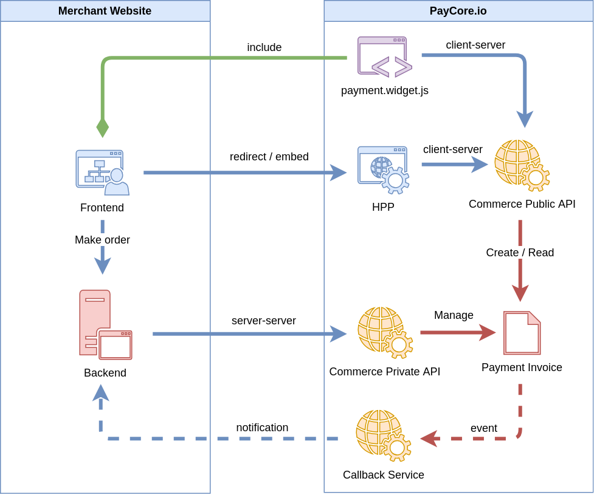
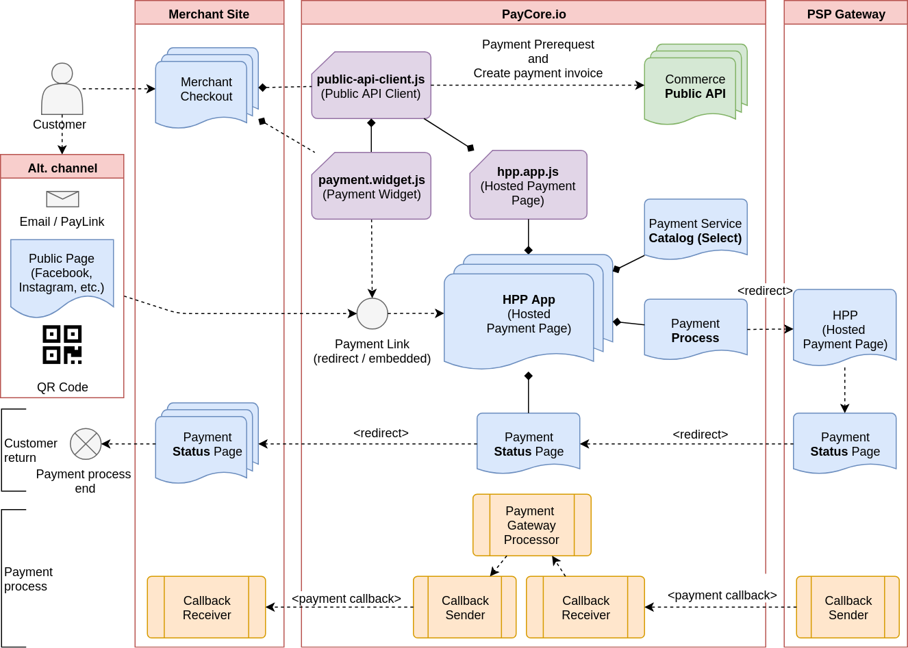

# HPP Guide: Integration Overview

This page will take you through the  _Hosted Payment Page API_  and explain how to interact with it and its concepts. Please make sure to understand why you should use the Hosted Payment Page and the Overview of the system before reading this documentation. The Hosted Payment Page works with a  _Commerce_  from the PayCore.io ecosystem. 

## Diagrams

### Ecosystem overview

**Commerce’s Hosted Payment Page**  (_HPP_) requires that you integrate different server-side REST APIs from the PayCore.io environment and thus requires no client-side integration. The different APIs correspond to different PayCore.io products and have some defined objects that interact with each other.

### Interaction overview

## Actors

### Payment Widget

[//]: # (Платежный виджет встраивается в Merchant Checkout и позволяет легко инициировать платеж. Виджет взаимодействует с Commerce Public API для получения списка доступных платежных методов и получения статуса платежа.)

Commerce Public API is responsible for providing payment services, payment methods available to a Commerce Account, creating Payment Invoice and obtaining general information about its status.

### HPP

[//]: # (Платежная страница — это готовое frontend application, который использует Commerce Public API для визуализации доступных платежных сервисов и создания Payment Invoice. После успешного создания Payment Invoice в зависимости от payment flow происходит перенаправление клиента на оплату на конечный платежный шлюз. Также, HPP принимает клиента после оплаты и отображает ему статус платежа, после чего перенаправляет обратно на сайт мерчанта.)

The payment page is a ready-made frontend application that uses the Commerce Public API to visualize available payment services and create a Payment Invoice. After successful creation of Payment Invoice, depending on the payment flow, the client is redirected to payment to the final payment gateway. 

Also, HPP accepts the client after payment and displays the status of the payment to him, and then redirects him back to the merchant's website.

### Commerce Public API

[//]: # (Commerce Public API отвечает за предоставление доступных для Commerce Account платежных сервисов, платежных методов, созданию Payment Invoice и получению общей информации о его статусе.)

Commerce Public API is responsible for providing payment services, payment methods available to a Commerce Account, creating Payment Invoice and obtaining general information about its status.

### Commerce Private API

[//]: # (Commerce Private API предоставляет полный функционал для управления Payment Invoice, получению полной информации о нем, произвелению refund и cancel.)

Commerce Private API provides full functionality for managing Payment Invoice, obtaining full information about it, producing a refund and cancel.

### Callback Service

[//]: # (Callback Service отвечает за доставку моментального уведомления на Merchant Backend при смене статуса Payment Invoice. Данное уведомление может быть обработано на стороне Merchant Backend для запуска дальнейшей бизнес-логики оработки оплаченного заказа.)

Callback Service is responsible for delivering instant notification to Merchant Backend when changing the status of Payment Invoice. This notification can be processed on the Merchant Backend side to launch further business logic for processing a paid order.

### Merchant Frontend

[//]: # (На стороне мерчанта на шаге оплаты заказа инициируется Payment Invoice. Это делается как через Payment Widget, так и через простое перенаправление на HPP с необходимыми параметрами платежа для оплаты заказа.)

On the merchant side, Payment Invoice is initiated on the order payment step. This is done both through Payment Widget, and through a simple redirection to HPP with the necessary payment parameters for paying for the order.

### Merchant Backend

[//]: # (На backend мерчанта проиходит управление заказом, инициация платежа и обработка уведомлений о смене статуса Payment Invoice.)

On the merchant backend, the order is managed, payment is initiated and Payment Invoice status changes are processed.

## How does it work

Technically, HPP is a companion service to  _PayCore.io Commerce_ that uses  _PayCore.io Payment Gateway_, which can both be referred as a  _Payment Provider_. You will have to integrate one of these APIs to create a  _Payment Invoice_, and then use HPP to deliver the Payment experience to merchant customers.

A complete payment process will involve three of PayCore.io services:

1.  **Commerce HPP API**  - Hosted Payment Page to distribute the Payment Invoice to merchant Customer.
2.  **Commerce Public API**  - Public API to integrate to create a Payment Invoice.
3.  **Commerce Private API**  - Private API to capture payment or refund the order that was created.

## Next

Learn more about  [integration methods](/products/hpp/guide/integration-methods/): payment widget and payment link.