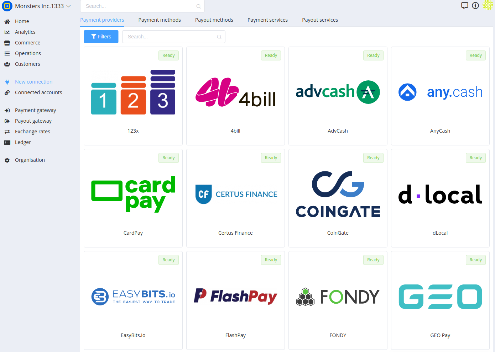
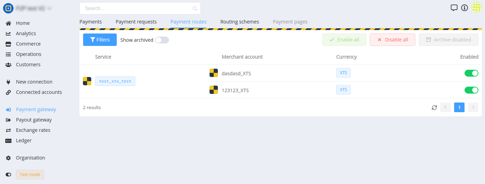

# Accounts Hierarchy

## Что такое коннектор?

Коннектор платежного провайдера — это модуль инеграции платежного провайдера в платежный хаб.

Данный модуль приводит все взаимодействие с к унифицированному и стандартизированному виду адаптируя сервисы и шлюзы платежного провайдера.

Коннектор позволяет подключать различные типы аккаунтов платежных провайдеров, о которых мы поговорим чуть ниже.

## Каталог коннекторов

Сразу после регистрации новой организации в {{custom.company_name}} вы можете подключить платежные провайдеры в каталоге коннекторов.

A complete list of already implemented integrations with payment providers can be found  [here](#).

There are more than 900 payment providers in the world. Even if you do not find the provider you are interested in, you can always  [request its implementation](#)  from us at any time.

## Функциональность коннектора

Основной задачей PSP Connector является обеспечение интеграции платежного провайдера (PSP) и платежного хаба.

Connector **должен**:

-   Устанавливаться в систему через согласованные интерфейсы интеграции с сервисами и ядром.
-   Использовать заранее определенную доменную модель для Connector.
-   Предоставлять интерфейсы для подключения мерчант-аккаунта, аккаунта провайдра, проведения платежей, выплат, сверок и др. сервисов и сущностей.
-   Унифицировать — приводить внешную домен платежного провайдера к системному домену (валюты, платежные методы, методы выплат, статусы, резолюции и т.п.).
-   Реализовывать интерфейсы взаимодействия с системными сервисами для платежного шлюза, шлюза выплат, карточного шлюза.
-   Реализовывать интеграцию и прием callback (webhook) от PSP.

## Какие фичи поддерживают коннекторы?

Основые фичи, которые может поддерживать коннектор это:

-   `provider_account_connector` — поддержка подключения главного аккаунта платежного провайдера.
-   `merchant_account_connector` — поддержка подключения мерчант аккаунта изолированного от главного аккаунта платежного провайдера.
-   `balance` — сервис синхронизации балансов депозитных счетов.
-   `payout_gateway` — отвечает за инициацию, проведение и контроль выплат.
-   `payout_statements` — отвечает за реконсиляцию по выплатам.
-   `payment_gateway` — отвечает за инициацию, проведение и контроль платежей.

## Типы аккаунтов провайдеров

В {{custom.company_name}} предусмотрено 3 типа аккантов платежных провайдеров.

Каждый из них выполняет свою функцию и имеет уникальные свойства.

### Provider Account

**Provider Account** — главный аккаунт платежного провайдера, как правило аккаунт оранизации в провайдере, самая верхнеуровневая сущность в платежном аккаунте.

**Provider Account** включает в себя **Deposit Accounts**, **Merchant Accounts**, если они есть в иерархии конкретного платежного провайдера.

При подключении **Provider Account** могут быть автоматически подключены **Deposit Accounts, Merchant Accounts**

**Deposit Account** всегда связан с **Provider Account**, так как по сути основное его предназначение это обеспечение выплат через **Provider Account** который требуют платежные провайдеры для проведения выплат.

**Как определить:** сущности даного типа самые верхнеуровневые, содержат креденшелсы для доступа к апи.

**Пример****:**  FourBill(point_id, api_key), SatchelPay(account_number, api_key, test_mode)

### Deposit Account

**Deposit Account** — аккаунт отвечающий за баланс в Provider Account.

В рамках одного **Provider Account** может быть один и более **Deposit Account**, в зависимости от колиства валют поддерживаемых провайдером.

C баланса **Deposit Account** выводятся деньги при выплатах, и идентификатор **Deposit Account** является одным из параметров запроса на выплату.

Также, актуальные балансы **Deposit Account** могут быть синхронизированы с **Payment Provider** и использованы для маршрутизации выплат.

**Deposit Account** невозможно подключить напрямую. Они всегда инициализируются при подключении **Provider Account**.

**Deposit Account** всегда может быть только одной валюты. То есть если в **Provider Account** несколько валютных балансов, то под каждую валюту будет отдельный **Deposit Account** со своим балансом.

**Как определить:** сущность которая обладает балансом.

**Пример:** в WebMoney - кошельки, в FlashPay - основной счет.

### Merchant Account

**Merchant Account** — аккаунт который отвечает за прием платежей. В контексте платежного провайдера его часто называют **MID**.

**Merchant Account** может быть подключен без привязки к **Deposit Account** (к примеру LiqPay) или может создаваться автоматически при подключении Provider Account (FourBill).

**Merchant Account** содержит в себе данные, необходимые для генерации платежной формы (в случае payment flow "**hpp**").

Как правило, доступ к **Merchant Account** состоит из идентификатора **Merchant Account (MID)** и секретного ключа, который используется для проверки уведомлений от платежного провайдера и формировании цифровой подписи.

В зависимости от платежного провайдера **Merchant Account** может принимать платежи в одной либо в нескольких валютах.

**Как определить:**  содержит данные, необходимые для генерации платежной формы или деталей платежа.

**Примеры:**  в WebMoney - кошельки, в Interkassa - кассы.

### Иерархия аккаунтов

**Provider Account** может включать в себя **Deposit Account** и **Merchant Account**.

**Deposit Account** всегда ссылается на конкретный **Provider Account.**

**Merchant Account** может не иметь связей с **Provider Account**, если подключается напрямую.

В некоторых случаях **Deposit Account** кроме с **Provider Account** могут иметь связь с **Deposit Account**.

## Connecting accounts

Каждый коннектор платежного провайдера дает возможности подключать **Provider Account** и/или **Merchant Account**.

Главным кретерием успешного подключения является создание в организации данных подключенных аккаунтов.

В результате подключения их, в платежном шлюзе и шлюзе выплат будут добавлены соотведствующие платежные маршруты и маршруты выплат.

Для подключения платежного провайдера выполните следующие действия:

-   Откройте каталог подключений платежных провайдеров.
-   Выберите необходимый провайдер и нажмите "Подключить".
-   Каждый коннектор имеет уникальные свойства и список необходимых параметров для подключения, с котороыми вы можете ознакомится в его инструкции подлючения.
-   В момент подключения аккаунта, система проверит их валидность, проведет синхронизацию доступных для него платежных маршрутов, маршрутов выплат, балансов и опций.

Что бы убедится, что аккаунт правильно сконфигурирован, вам необходимо проверить наличие активных платежных маршрутов в каждом из шлюзов соответственно:

-   Для платежного шлюза — [{{custom.dashboard_base_url}}payment-gateway/payment-routes](https://dashboard-dev.paycore.io/payment-gateway/payment-routes)
-   Для шлюза выплат — [{{custom.dashboard_base_url}}payment-gateway/payment-routes](https://dashboard-dev.paycore.io/payment-gateway/payment-routes)

**Внимание!** Учитывайте, что для тестового режима отображения данных отображаются только тестовые маршруты.

## Test connector

Для быстрого тестирования системы мы предлагаем подключить тестовое подключение (Test connector) в 2 клика! После подключения, для вас будут доступны тестовые платежные маршруты и маршруты выплат.

Детальнее о тестовом режиме вы можете ознакомится в разделе "[Тестирование](#)" ([https://docs.paycore.io/connectors/test/](https://docs.paycore.io/connectors/test/)).

## Next

Как управлять подключенными аккаунтами предлагаем ознакомится в [следующей статье](#).