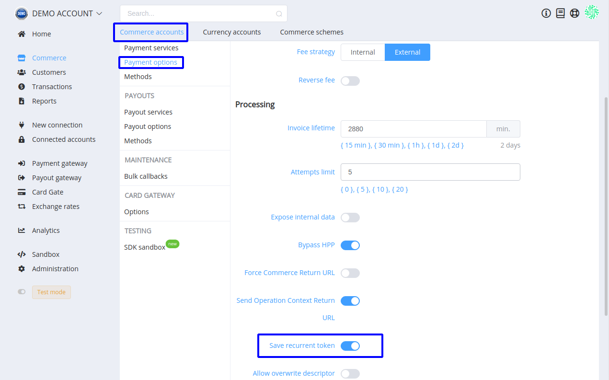
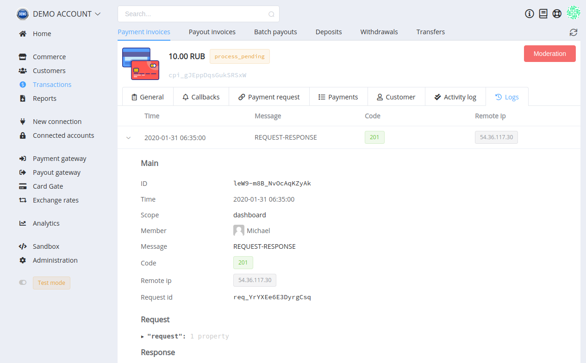
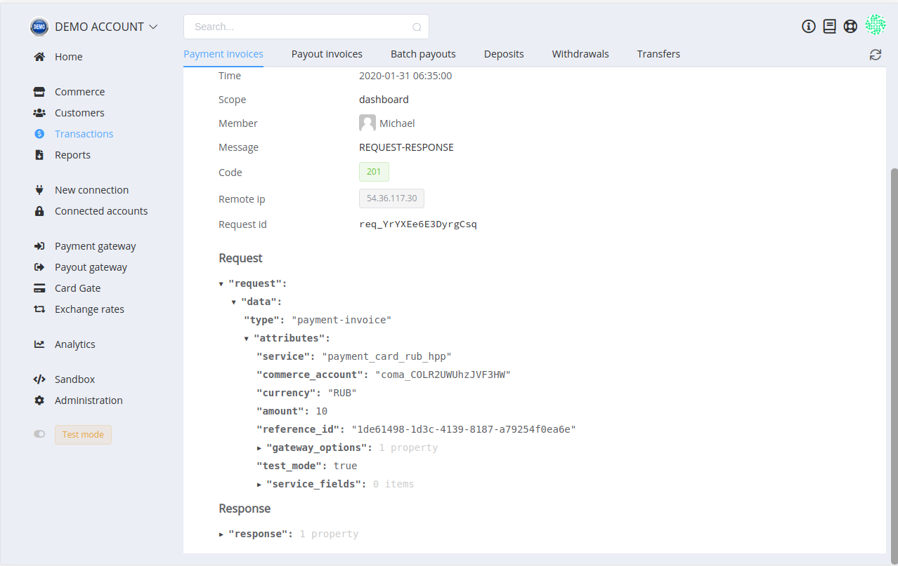
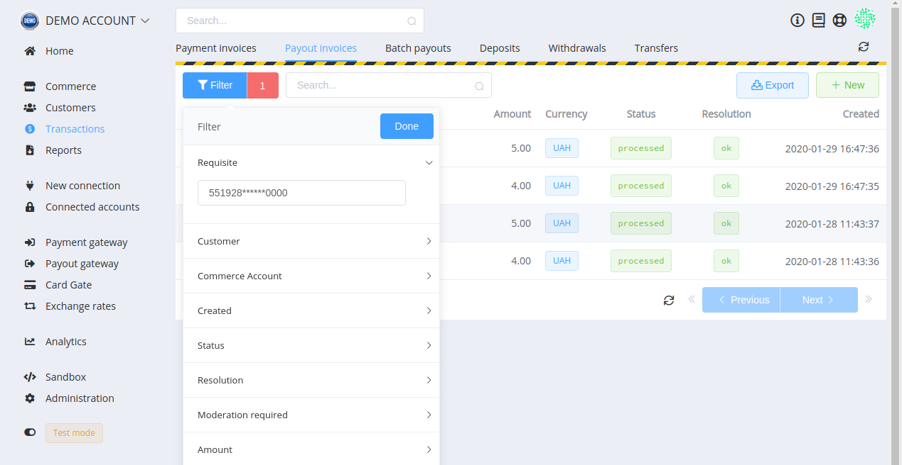

# **PayCore.io v1.7.1 (January 31, 2020)**

*By Dmytro Dziubenko, Chief Technology Officer*

Happy Friday mood from [PayCore.io](https://paycore.io/)!

We continue improving our platform. For this week release, we are delivering features focused in two areas: usability betterment and strengthen security.

## Highlights

* [Commerce update](#commerce-update): added possibility to save recurrent tokens as a general payment option
* [Layout upgrade](#layout-upgrade): added Logs tab in Transactions and the filter by details for payouts
* [Bug fixes](#bug-fixes)

## List of Changes

### Commerce Update

As the subsequent update to the [Tokenization feature](/release-notes/archive/2019/v1.3.17/#card-data-tokenization), we added a relevant property to the general payments options. So you can turn on it for all card payments to the chosen Commerce account, avoiding your having to check every creating invoice.

### Layout Upgrade

#### Logs in Transactions

From now on, you can check interaction with merchant back-end applications and view details of sent requests and responses in the Logs list. Find this possibility in the Transactions' overviews.

#### New Filter for Payouts

If you need to search quickly all payout invoices for the specified payee, use a new filter. You can examine all possible payout details, such as card or phone numbers, account IDs, and so on.

### Bug Fixes

It's taken a few tries of fixing especially annoying bugs, but now [PayCore.io](https://paycore.io/) Payment Hub is better than it was.

Stay tuned!
