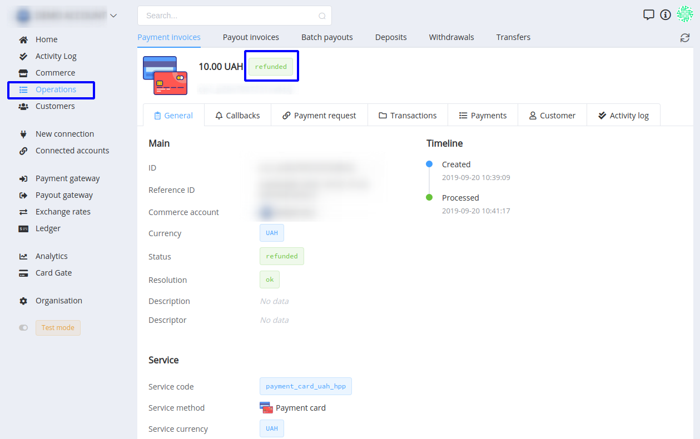
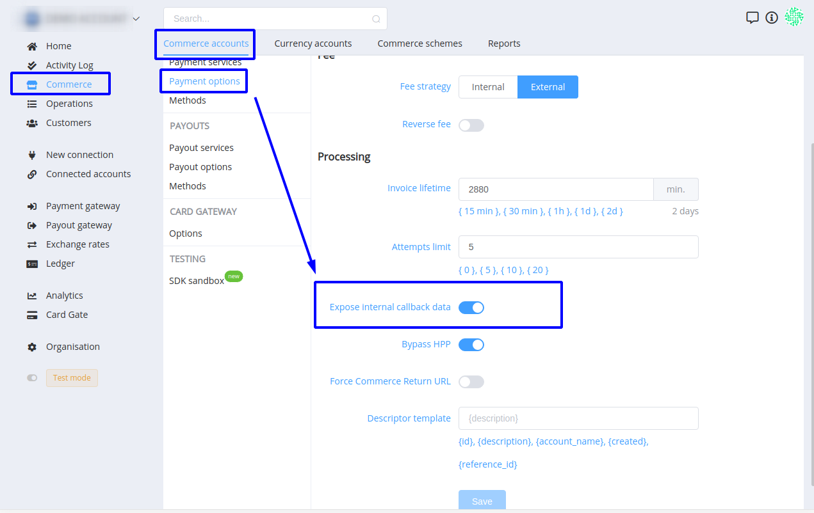

# **PayCore.io v1.1.0 (September 20, 2019)**

*By Dmytro Dziubenko, Chief Technology Officer*

Happy Friday mood from [PayCore.io](http://paycore.io/)!

Our dev team continues working on system enhancements and here are the highlights of our weekly updates! 

## Highlights
* [Refund Feasibility](#refund-a-payment): Refund option is available now.
* [System Updates](#system-updates): streamlined routes for sending Description and Descriptor of a payment. Also, added Original Data as expanded data in Callbacks.
* [UI/UX Improvements](#ui-improvements): Setup a theme for Card Gate HPP.
* [New Integration](#new-integration): Mercuryo.
* [Bug Fixes](#bug-fixes).

## All Updates
### Refund a Payment
Use Refund option when you have charged a payer, and need to cancel the payment and return the funds to the payer, partially or fully.

Review the *Payment details* in the '*Operations*', which shows payment history, including the amount paid and the type of payment. Then click the *Refund* button in the top right corner and submit the amount of money in the payment currency that you want to send back to the payer.

If the provider of the payment enables this option, funds will be returned to the payer. The payment status will be changed to the '`Refunded`' or '`Partially refunded`' (other statuses that connected with refunds are '`Refunding`', '`Refund pending`', '`Refund error`' and '`Refund failed`').

You can refund a payment multiple times until its amount reaches 0.00.
Once payment is refunded, it cannot be undone. You will have to issue a new payment request to chargeback that amount.

!!! note
    It is the merchant’s responsibility to post their refund policy.

### System Updates

We streamlined methods for sending '`description`' and '`descriptor`' data. From now on, '`descriptor`' doesn't replace '`description`' in the payment request operation, both attributes are sent alongside.

Set up '*Descriptor template*' in the '*Commerce account*' settings &rarr; '*Payments*' &rarr; '*Payment options*' for using it.

Collect extended data in callbacks if you toggle 'Expose internal callback data' in the '*Commerce account*' settings. The internal object '`Original data`' contains attributes '`External ID`' (Payment ID of the next step's payment provider) and '`Original ID`' (Payment ID of the last stage's payment provider).

### UI/UX Improvements

Set up theme in the '*Commerce account*' settings &rarr; '*Card Gateway
Options*' and change a basic view of Card Gate HPP 

It looks much more cooler now, isn't it?

!!! question
    [Ask our support team](https://support.paycore.io/) if you interest in but haven't chosen any theme yet.

### New Integration
This release includes new integration with:

| Provider | Name  | New features | How to connect |
|:-:|:-:|:-:|:-:|
|  | Mercuryo | Payment gateway | [Step-by-Step](/connectors/mercuryo/)

### Bug Fixes
We also made general performance improvements and various bug fixes.