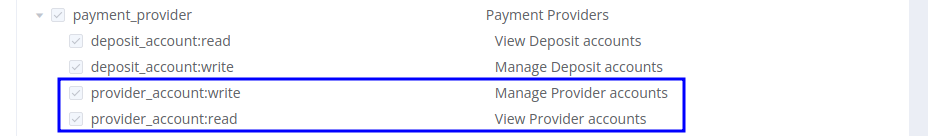

# October 12, 2021

<span style="font-size: 115%">[Corefy](https://corefy.com/) versions:<br>
**1.112**, **1.111**, **1.110**, **1.109**, **1.108**, **1.107**, **1.106**, **1.105**, **1.104**, & **1.103**</span>
<hr>
<div style="text-align: right; font-size: 85%; font-style: italic;">by Dmytro Dziubenko, Chief Technology Officer</div>

Cheery Greetings from the [Corefy](https://corefy.com/) team!

We keep enhancing our products. This month we've focused on boosting their efficiency and adaptability.

## Highlights

* [Provider accounts update](#provider-accounts-update): added possibility to check account credentials from the Dashboard
* [Commerce updates](#commerce-updates): added the *Auto-approve* option for transactions  within an organisation, added the *Resolution message* attribute for payment invoices
* [Card gate HPP update](#card-gate-hpp-update): added the theme option for customer redirection only after final statuses
* Performance improvements

## List of changes

### Provider accounts update

#### Connected provider account's credentials 

From now on, if the organisation have several connections to one provider, users with relevant permissions can check account credentials directly from the *Dashboard*. Go to the *Provider accounts* -> *Account's overview* and review parameters under the *Details* section.

!!! example ""

    

!!! attention "Permissions required to gain access to the feature"

    *Payment Providers* --> *View* and *Manage provider accounts* (Owner, Administrators by default).

    

### Commerce updates

#### Auto-approve for transactions within an organisation

We expanded capability of managing transactions within an organisation, and now users with relevant permissions can choose the *Auto-approve* option and process the transaction right after creation.

!!! example ""

    

In case, you use API requests to handle these types' transactions, we recommend to pre-test the feature with your account manager.

!!! attention "Permissions required to gain access to the feature"
    
    *Commerce Transactions* --> *Manage* and *Process Deposits*/*Transfers*/*Withdrawals* (Owner, Administrators by default).

    

#### Resolution messages for payment invoices

A resolution is a transaction status clarification and may inform about possible errors during processing. So for these purposes, we added `resolution_message` as an attribute for payment invoices reconciliation.

You can find it in the payment invoice's overview on the Merchant Portal (also, as a tooltip for resolutions) and get in the API response.

!!! example ""


!!! example ""

    API: Commerce Public | Commerce Private

    Endpoints:

    - `/payment-invoices`
    - `/payment-invoices/{id}`

    Methods: GET | POST

!!! example "Response sample"

    ```json hl_lines="16"
    {
    "data": {
        "type": "payment-invoices",
        "id": "cpi_6fzCJVMboIhHEEqp",
        "attributes": {
            "serial_number": "6fzCJVMboIhHEEqp",
            "status": "process_failed",
            "resolution": "invalid_details",
            "moderation_required": false,
            "amount": 100,
            "currency": "USD",
            "reference_id": "f51da85f-7d21-48ba-876c-65356c08d9d8",
            "test_mode": true,
            "processed": 1635338082,
            "description": "Test",
            "resolution_message": "Incorrect transaction details",
        },
        "relationships": [],
        "links": []
        }
    }
    ```

!!! note

    The detailed level of the transaction's failure reason depends on the information openness of payment service providers (PSP) and issuer banks (for card transactions). And the finality and success of the transaction processing are determined solely by the payment status (`status`).

### Card gate HPP update

#### Redirect only after final statuses obtained

To fix several troubles with iFrame and lightbox pages, we've reviewed the redirection logic for the Card Gateway HPP. Moreover, we've added a new option, `redirect_only_final`, that you're able to use with your themes and keep your customers on status page until the transaction's final status is obtained.


The HPP checks transaction status every 2 seconds and, if the `redirect_only_final` value is `true`, redirects a customer to specified Redirect URLs only after getting one of the final statuses (like `processed` or `process_failed`).

Otherwise, it redirects after getting final or transitional statuses (`process_pending`) as by default.

### Performance Improvements

Of course, we fixed a bunch of bugs and now hope, you mentioned the enhancement of the platform's productivity.

Stay tuned!
