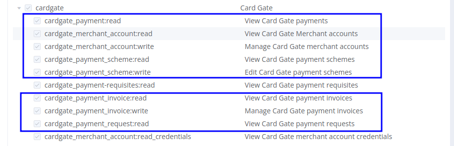
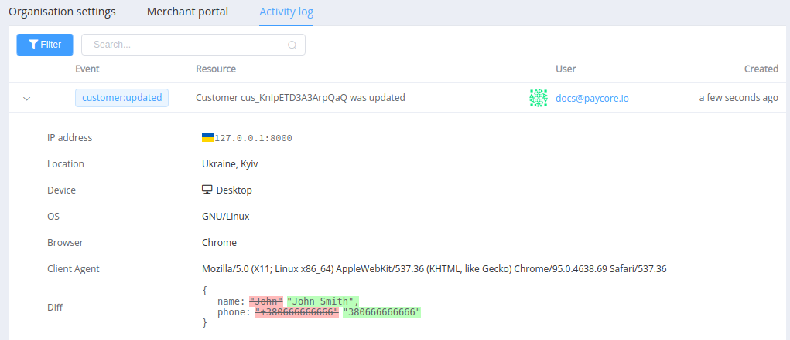

# November 11, 2021

<span style="font-size: 115%">[Corefy](https://corefy.com/) versions:<br>
**1.121**, **1.120**, **1.119**, **1.118**, **1.117**, **1.116**, **1.115**, **1.114**, & **1.113**</span>
<hr>
<div style="text-align: right; font-size: 85%; font-style: italic;">by Dmytro Dziubenko, Chief Technology Officer</div>

Cheery Greetings from the [Corefy](https://corefy.com/) team!

These notes provide a brief overview of the new features, enhancements, and other significant changes introduced in the recent product releases.

## Highlights

* [Card Gateway updates](#card-gateway-updates): added invoice reference ID (`commerce_invoice_reference_id`) to invoice data for use on HPP, updated card gateway user permissions
* [Payouts update](#payouts-update):  made payout invoice reference ID optional, so now generate UUID for batch items randomly
* [Dashboard activity log update](#activity-log-update): added info about editing customer entries
* And other improvements

## List of changes

### Card gateway updates

#### Invoice reference ID 

We added a new string attribute for the card gateway invoice: `commerce_invoice_reference_id`. It's connected with the payment invoice reference ID that commerce API uses for invoice creation—you may specify it to synchronise with your shop database. Thus, the value obtained from the card payment page can be displayed to a customer as the cross-reference to order ID.

!!! example "Invoice status response samples"

    === "Corefy commerce API" 

        ``` json hl_lines="13"
        {
            "data": {
                "type": "payment-invoices",
                "id": "cpi_3Mv11oPUX4cCtlYi",
                "attributes": {
                    "serial_number": "3Mv11oPUX4cCtlYi",
                    "status": "processed",
                    "resolution": "ok",
                    "amount": 1,
                    "payment_amount": 1,
                    "currency": "USD",
                    "service_currency": "USD",
                    "reference_id": "Test order 111",
                    "test_mode": true,
                    "fee": 0
                    <...>
                },
                "relationships": {
                    "payment-service": {
                        "data": {
                            "type": "payment-services",
                            "id": "payment_card_usd_hpp"
                        }
                    },
                    "payment-method": {
                        "data": {
                            "type": "payment-methods",
                            "id": "payment_card"
                        }
                    },
                },
            }
        }
        ```

    === "Cardgate API"

        ``` json hl_lines="5"
        {
            "data": {
                "id": "cgi_Ye8LPpi3RfddFYSn",
                "attributes": {
                    "commerce_invoice_reference_id": "Test Order 111",
                    "amount": 1,
                    "currency": "USD",
                    "description": "Test",
                    "service": "payment_card",
                    "options": [],
                    "customer": [],
                    "repeatable": false,
                    "flow": "charge",
                    "status": "processed",
                    "resolution": "ok"
                    <...>
                }
            }
        }
        ``` 

#### Permissions update

We've updated Organisation permission settings and added rules that affected user access to interaction with card gateway.

!!! warning "Would you mind checking the set of user access roles and related permissions?"

    Added specific permissions to view and manage Card gateway:

    - merchant accounts
    - payment schemes
    - payment invoices
    - payment requests
    - payments

    

### Batch payouts update

As the follow-up for [previous updates](http://127.0.0.1:8000/release-notes/v1.94-1.103/#commerce-updates), we've made batch payouts creation easier. Now you can skip specifying single payouts' reference_id if you don't need their connection with your database. After uploading the batch payouts' file, the platform fills in missed fields with randomly generated IDs.

### Dashboard activity log update

We've added updates of customer entries to the list of tracked user activities, and from now on, you can find out all changes made in the entire section.

!!! example ""

    

### System improvements

We also made general performance improvements, a bunch of connectors updates and various bug fixes.

Stay tuned for future updates!
