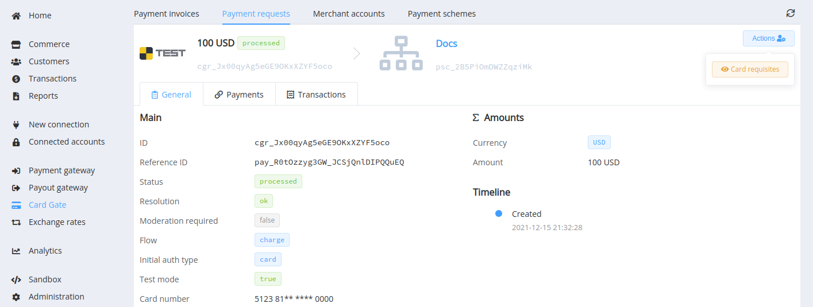

# December 9, 2021

<span style="font-size: 115%">[Corefy](https://corefy.com/) versions:<br>
**1.129**, **1.128**, **1.127**, **1.126**, **1.125**, **1.124**, **1.123**, & **1.122**</span>
<hr>
<div style="text-align: right; font-size: 85%; font-style: italic;">by Dmytro Dziubenko, Chief Technology Officer</div>

Cheery Greetings from the [Corefy](https://corefy.com/) team!

This month we've worked on making our platform faster and more usable for you: just like we always do. We cleaned up behind the curtain, optimised processes, killed bugs, and added little extra things that made our platform more user-friendly.

Let's check it all out!

## Highlights

!!! warning ""

    We're terminating supporting requests to the Commerce API endpoint `/account` from January 1, 2022. If you still obtain your balance data from these requests, we advise you to switch to `/account/balances` as soon as possible.
    
    Get more details about in the [Merchant Documentation](https://merchant-docs.paycore.io/en/integration/account/).

* [Commerce updates](#commerce-updates): added basic HPP URL to responses, got rid of legacy payout schemes
* [Card Gateway updates](#card-gateway-updates): upgraded routing scheme revisions, added a feature to view full card details
* [Customer entries update](#customer-entries-update): added the `address` object
* [Dashboard UX updates](#dashboard-ux-updates): added a multi-selection to dashboard's filters
* Bug fixes and other overall improvements

## List of changes

### Commerce updates

#### Basic HPP URL in responses

We've improved the creating process for payment invoices from the Dashboard and the Commerce API. We added a new parameter `hpp_url` that contains a link to the payment page in the basic format: `{commerce_site_url}/hpp?cpi={payment_invoice_id}`. You obtain it in the API response for invoice creation and also can check how it looks and feels on the *Dashboard* --> [*Create new payment invoice*](https://dashboard.paycore.io/transactions/payment-invoices/create) page.


#### Got rid of legacy payout schemes

We've been planning to get rid of old payout schemes for quite some time. Now we've seen that all our clients have gone to new ones and eliminated the ability to create them in old patterns with a bit of tidying up the general user view of the *Commerce scheme creating/editing* window.

??? tip "What changed"

    | How it was previously | | And now |
    |------|----|-----|
    |<a href="/release-notes/images/v1.122-1.129/legacy.png"></a> | --> | <a href="/release-notes/images/v1.122-1.129/edit-new-scheme.png"></a> |

### Card Gateway updates

#### Routing scheme revisions UX upgrade

We've revised the entire approach to saving edits of routing schemes called *Revisions*. Besides other things, our development team's optimised displaying saved revision entries and added possibilities to search them by the name of revision or by description.

You also may see the description (if it's filled in) and creation date as tooltips near the revision's name.


#### Full card details view (for PCI DSS certified organisations)

If you need to decrypt fuller details of the payer's card, you can now do it in the *Card Gate* --> *Payment request* overview. Use the Card requisites button, be sure to specify a significant reason for the action, and view the whole card number, expiry date, and cardholder name (if the issuer hands it over).




!!! warning

    Remember that these are sensitive data, so assess the risks when assigning related permission to your associates. 

### Customer entries update

We've revised Customer data and extended the list of attributes that you can send in requests and save to the record from the *Dashboard*.

The object `address` is for storing this information in the API requests.

!!! example ""
    ```json
    "address" {
        "full_address": "test address",
        "country": "GB",
        "region": "London",
        "city": "London",
        "street": "25 Cabot Square",
        "postcode": "E144QZ"
        }
    ```


!!! note ""

    We are gradually updating integrations with payment service providers so that you will be able to use these fields when transferring payment data.

### Dashboard UX updates

We've added a multi-selection to all filters except those containing boolean and DateTime parameters' formats. And we also attached the *Not in* option for excluding irrelevant parameters' values.

So, use updated filters to view, analyse, and export transaction and accounts data.


### Bug fixes and overall improvements

Whereas we continue growing platform quality and performance, we made several fixes for our products.

We also set up the feedback widget that you might notice in the *Dashboard*'s footer. Our dev team asks for your help and advice to get an honest assessment of our product (without evaluation of support service or management) to improve its quality.  

We don't want to be intrusive, so we only show it once a month. But if you choose to ignore it, the message will also not be repeated until the following month.

Thank you in advance, and stay tuned for the next updates!
